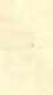

# VIOLIIST TONE-PECULIARITIES BY- FREDERICK CASTLE, M. D.

## FIRST EDITION.

## LOWELL, INDIANA. Alfred H, Miller

## Copyrighted 1906, By Frederick Castle, M. D.

## H. H. RAGON&SON, Printers, Lowell, Indiana. 1906. IV

## DR. FREDERICK CASTLE.

oe } SS Figs
