# .VIOLIN TONE-PECULIARITIES.

beneath my chin. ) This phenomenon consisted in a large number of crater-like openings, or upheavals, in the oil var- nish I had just put on. Some of those openings were 3-16 in diameter, and running from that di- ameter down to mere points. The crater-like open- ings were so near together that the edge of each touched that of its neighbor. In this varnish phe- nomenon, the point of greatest interest is its locat- ion. Doubtless you are familiar with the theory of the French philosopher, Savart, upon the quest- ion, "How the violin operates to produce sound." You remember those elaborate, scientific experi- ments, and his conclusion therefrom; that the top- plate, back-plate, and ribs, all join at once in strik- ing those blows upon contained air resulting in the production of sound? (From N. E. Simoutre's book, 1885, I infer that Savart is yet regarded in France, as an auth- ority upon this question. From other sources, I learn that Savart 's theories are considered as ex- ploded. Up to the moment of this varnish phe- nomenon, I was a follower of Savart. His drafts on science looked genuine, and, in no guide book could I find either affirmation or denial of his posit- ion. I therefore fell in with his conclusions with- out attempting any demonstration myself. Really, after German and English philosophers dismissed violin tone with sui generis, (self-generating,) thereby practically abandoning the problem as unsolvable, I had no hope of ever finding, or see- ing such solution. I do not claim such solution to

104

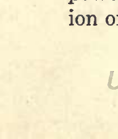

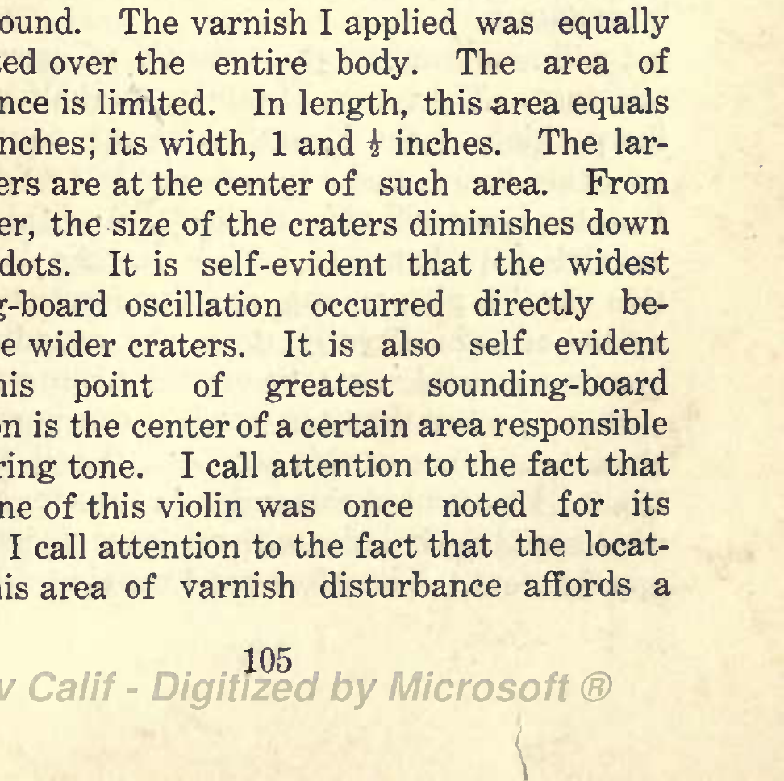

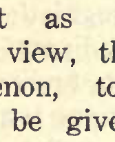

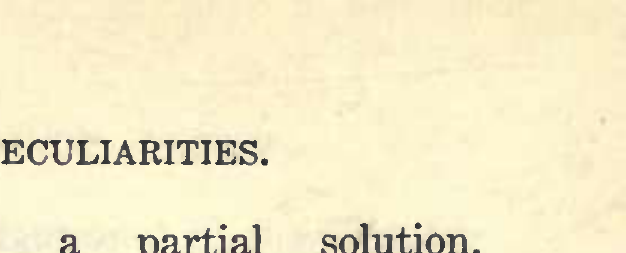

## VIOLIN TONE-PECULIARITIES.

exist now except as a partial solution. From my point of view, the evidence afforded by this phenomenon, together with other demonstrations, to be given later, are ample proof of error in Savart's theory of how the violin operates to produce sound. ) There is not a shadow of doubt about the cause of this varnish disturbance. The upheaval of this soft mass is wholly due to oscillations, or vibratory movements, (synonymous terms, ) of the sounding- board. I applied the bow only upon the G string. The point is, can you, or I, or anyone whatever, pre-determine the location of this disturbance by any existing theory of how the violin operates to produce sound? It is at once self-evident that such disturbance must exist over the entire violin body, did the entire body act with equal energy in pro- ducing sound. The varnish I applied was equally distributed over the entire body. The area of disturbance is limited. In length, this area equals 2 and inches; its width, 1 and i inches. The lar- ger craters are at the center of such area. From the center, the size of the craters diminishes down to mere dots. It is self-evident that the widest sounding-board oscillation occurred directly be- neath the wider craters. It is also self evident that this point of greatest sounding-board oscillation is the center of a certain area responsible for G-string tone. I call attention to the fact that the G-tone of this violin was once noted for its power. I call attention to the fact that the locat- ion of this area of varnish disturbance affords a

105

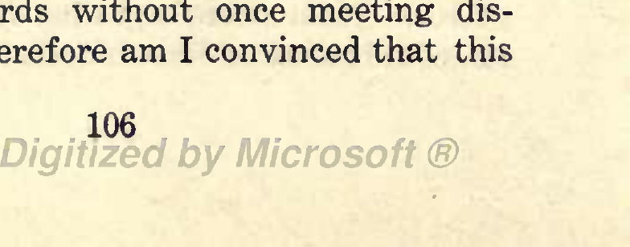

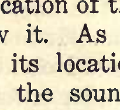

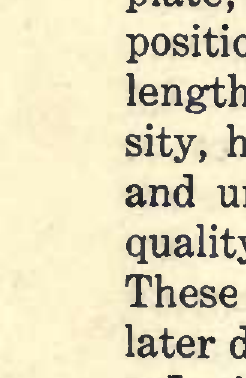

VIOLIN TONE-PECULIARITIES.
valuable cue in tone-regulation of the violin; also, to the fact that the finding of the area responsible for G-string tone led to finding the areas responsi- ble for D, A, and E-string tone; also, to my conclu- sion that the violin sounding-board is wholly re- sponsible for violin tone. I mean that to the blows delivered by the sounding-board upon contained air do I now attribute violin tone. (This statement does not include violin tone- modifiers; as the strong back-plate; the weak back- plate; imperfect inner surface of the back plate; position and area of exits; model of violin; position, length, density and diameter of post; position, den- sity, height, and mass of bridge; height weight, and under surface of finger-board; diameter and quality of strings; amount and quality of varnish. These modifiers of tone will be considered at a later date.) I will now consider the location of varnish dis- turbance. The center of this area is half-way from the position or the bridge to upper edge of the sounding-board, and I inch to the left of the bar. Possibly none will view the location of this area of varnish disturbance as I view it. As I view it, this varnish phenomena, and its location, turned a flood of light directly upon the sounding-board areas responsible for tone of each violin string. During more than ten years of continuous work, since occurrence of this accident, (I call it accident No. 2.) I have used this index in tone-regulation of used sounding-boards without once meeting dis- appointment. Therefore am I convinced that this
106

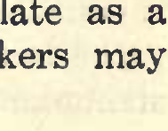

VIOLIN TONE-PECULIARITIES.
index is reliable. From this index I learned where to find, and how to correct sounding-board errors injurious to tone of all strings, or only injurious to any single string. Therefore I consider this index of exceeding value to the violin. I also acknow- ledge this index to be the triumph of accident. Science has no part whatever in its existence. Sci- ence can only come along with a post facto explana- tion. It is my belief yet, that science cannot build a violin. I mean that by no scientific formula can you, nor I, nor any person whatever, pre-determine violin tone throughout the list of violin tone-pecul- iarities. I call attention to the fact that this index great- ly simplifies the work of tone-regulation; also, to the fact that such regulation may be directed wholly to, and upon, the sounding-board. In this matter, the evidence afforded by accident No. 2 may be accepted as corroboration of the facts many years known to violin students. In the last ten years of my work, the back-plate has been wholly ignored as a tone-producing agent. I have only treated the back as a tone-modifier during the time mentioned. All I now ask of the back-plate is that its inner surface be absolutely perfect for the re- flection of sound-waves, and that its rigidity be suf- ficient to withstand, without a tremor, the charge of molecular movement originating at the sounding- board. I am aware of the fact that many good vi- olin makers continue to treat the back-plate as a tone-producing agent. Such violin makers may continue to produce good violins.
107

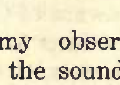

## VIOLIN TONE-PECULIARITIES.

(This question seems to possess a tenacity to life equal to the tenacity in the question of planting potatoes. The enterprising Circassian, although finding the American aborigine enjoying potatoes, failed to find traditional authority pertaining to the proper phase of the moon for planting potatoes. Such omission entailed a seemingly perpetual di- vision in Circassian ranks. Yet, strangely, both sides to the controversy grow good potatoes. ) As I view the location of this varnish disturbance, it also affords a demonstration for the power of sympathetic action. Briefly, as a law in physics, it may be stated that the power of sympathetic action diminishes inversely as the square of the distance. Therefore, that part of the sounding- board nearest the string must receive greater im- petus from string-action than the part farthest from the strings. Therefore we might pre-sup- pose the greater varnish disturbance to be located upon the upper-half of the sounding-board. As I held the violin beneath my chin I could plainly feel sounding-board vibration at that point, as was us- ual. Therefore, I know that the sounding-board acted in nearly its entire length at the moment of causing the varnish disturbance. But, that such action was of less power in the lower-half of the sounding-board is proven by the fact that no var- nish disturbance whatever appeared on the lower- half. (Within the limits of my observation, sym- pathetic action, excited in the sounding-board by string-action, has not heretofore received atten-

108

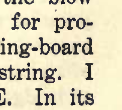

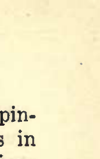

## VIOLIN TONE-PECULIARITIES.

tion. For that reason I am desirous of your opin- ion thereon. Indeed, in giving my conclusions in this matter, I expect to be favored by the opinions of other students of violin tone. Because this new question is brought before us by accident, I there- fore entertain no feelings of proprietorship. It is yours as much as mine. Nothing but the presen- tation of the question happens to belong to me. ) I do not find the laws governing sympathetic ac- tion to be complex. On the contrary, such laws are easy of comprehension. Up to this moment I can call up only two facts as bases for such laws: (1) Equal susceptibility to force. (2) Proximity of bodies. That equal susceptibility to force is a con- dition necessary to sympathetic action may be demonstrated by attempting to excite such action in bodies possessing widely varying mass, density, and rigidity. Such attempts are failures because such widely varying bodies are not excited to vibra- tory action by an identical force. As a ready-to- hand means for demonstrating unequal susceptibil- ity to force, I employ this violin. As you observe, each string on this violin yields powerful tone. These strings are carefully selected guage 2. The rigidity of sounding-board beneath each string has been carefully reduced until the force in the blow of each string, at concert pitch, is ample for pro- duction of vibratory action in the sounding-board and corresponding to the action of each string. I remove this G and replace it with this E. In its new position the E-tone is weak. Now, the sound-

109

## VIOLIN TONE-PECULIARITIES.

ing-board beneath the E is not susceptible to iden- tical force with the E. Hence there is no sym- pathetic action between these two bodies. In its proper position, the tone from this E is powerful; and such tone-power is due to the fact that the E, and the sounding-board beneath the E, are suscep- tible to an identical force. Hence sympathetic action exists, and its existence augments tone- power. (Often in re-toning work I demonstrated the value in "Let well enough alone." Thus, after deter- mining length of strings to be used, after deter- ming length by position of bridge, after adjusting length, mass, and position of post, after determin- ing mass and height of bridge, after testing the tone and finding slight weaknesses here and there, and positively knowing such weakness to be due to too much sounding-board wood here and there, after reducing thickness in such places with my utmost precaution, after securing even power for all strings, then idiotic-like, instead V)f letting well enough alone, I have lost my work by trying to do better than "well enough." The ' 'Elgin," adjusted to temperature, position, isochronism, and running "well enough," is not more susceptible to idiotic treatment than the finely adjusted violin. With not more safety can we file off metal at any point on the periphery of the Elgin balance wheel, than we can change the pitch of strings, diameter of strings, length of strings, height of bridge, mass of bridge, density of bridge, length of post, mass of post, position of post, and sounding-board rigid-

110

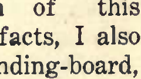

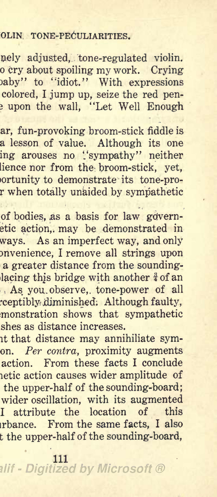

## VIOLIN TONE-PECULIARITIES.

ity of the ..finely adjusted, tone-regulated violin. "Tis no use to cry about spoiling my work. Crying but adds "baby" to ''idiot." With expressions more or less colored, I jump up, seize the red pen- cil and write upon the wall, "Let Well Enough Alone.") The familiar, fun-provoking broom-stick fiddle is not without a lesson of value. Although its one vipjin D-string arouses no '.'sympathy" neither from the audience nor from the broom-stick, yet, it has an opportunity to demonstrate its tone-pro- ducing power when totally unaided by sympathetic action. ' K '^'t-. Proximity, of bodies, .as a basis for law gdvern- ing sympatKetic action,, may be demonstrated in a variety of ways. As an imperfect way, and only because of Convenience, I remove all strings upon this violin to a greater distance from the sounding- board by replacing thjs bridge with another of an inch higher. As you. observe,, tone-power of all strings is perceptibly diminished. Although faulty, yet, this demonstration shows that sympathetic action diminishes as distance increases. It is evident that distance may annihiliate sym- pathetic action. Per contra, proximity augments sympathetic action. From these facts I conclude that sympathetic action causes wider amplitude of oscillation in the upper-half of the sounding-board; and, to such wider oscillation, with its augmented power, do I attribute the location of this varnish disturbance. From the same facts, I also conclude that the upper-half of the sounding-board,

111

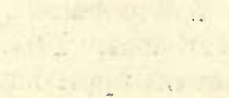

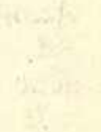

VIOLIN TONE-PECULIARITIES. to a limited distance either side of the bar, is re- sponsible for G-string tone-power. From the same facts do I conclude that rigidity should be less in the lower-half than in the upper-half of the sound- ing-board. Distance certainly diminishes the force of sympathetic action as the square of the distance. (Knowing that every sentence in the description of this varnish phenomenon, together with my conclusions therefrom, will be subjected to the limits of scrutiny, I have therefore called upon my utmost ability for clearness of diction. Should you find lack of clearness upon any point, and should you desire further elucidation thereon, you need only to notify me. In advance, I request your opinions on my conclusions. I admit the fact that "two heads are better than one." I admit that your opinions may be better than mine; therefore your opinions will be received with pleasure. ) I have now completed the presentation of varn- ish phenomenon No. 1. Varnish phenomenon No. 2 will be presented upon a later occasion.

112

## VIOLIN TONE-PECULIARITIES.

LECTURE VII. GENTLEMEN: At this hour I present varnish phenomenon No. 2. As you remember var- nish phenomenon No. 1 occurred on the exterior surface of my violin. Varnish phenomenon No. 2 occurred upon the interior surface of another vio- lin. The latter violin is the first in a list of sixty wherein I applied an interior surface protection, and the latter phenomenon is due to two errors: (1) Crudity in application of material. (2) Assem- bling and testing tone before the material becomes dry. [Thinking that some reader may wish to do in- terior surface work upon the used violin, and de- siring that such person may not meet with disap- pointment, I am therefore careful to note my own mistakes. It is quite safe to assume that, in all lines of human activity, mistakes are made. In knowing . such mistakes, they may be avoided. Aft- er ten years of effort in protecting interior violin surfaces from disintegration and thinking that I succeeded in affecting such protection without in- jury to tone, yet, I do not know or claim, that the details of my surfacing work cannot be improved. I shall be heartily glad to know that my own efforts have received improvement.] Crudity in application of material is shown thus: (a) By failure in preparation of wood-surface, (b) By application of an excess of material. After my experience in this interior surfacing work after observing the intensity and brilliance of tone with- out loss of sweetness whatever, I find myself won-

113

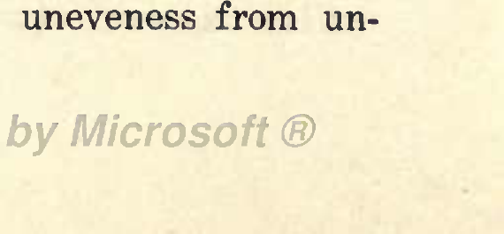

## VIOLIN TONE-PECULIARITIES.

dering why I did not sooner understand that inter- ior surfaces of the violin ought to be equally per- fect with interior surfaces of the flute, clarinet and horn. In the latter instruments, intensity and brilliance of tone are modified, for better or worse, by the degree of interior surface perfection. I am now fully satisfied that the same condition affects violin tone. In every method of applying trans- parent finish to wood, swelling of grain is a diffi- culty to be met. Coming directly to the point, I know of nothing causing less swelling of grain than boiled linseed oil. But, I find there is a right and wrong way to apply oil. I do not find that oil alone, or in mixture with the slowest drying gums, pene- trates even the softest pine or white cedar when applied in such attenuated layers as is possible to the "rubbing process." I find that wood surfaces must be carefully prepared in order to secure the greatest attenuation of oil, either alone or in mix- tures. In used violins I have never found interior surfaces ready for the reception of finishing mater- ial. The interior surface of the used sounding- board usually presents a series of ridges and val- leys caused by the swelling of the connective tis- sues between the denser fibers. The depth and heighth of these ridges and valleys varies with the amount of water vapor absorbed. As previously shown, different samples of sounding-board wood absorb different amounts of moisture owing to variations in the caliber of sap carrying capiDary tubes. The interior surface of the hard wood back and ribs very often present uneveness from un-

114

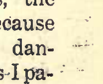

## VIOLIN TONE-PECULIARITIES.

equal shrinkage in the transverse markings; the denser part standing as a low ridge, the tubular part as a shallow depression. The point is to level down all such ridges and remove all moisture be- fore applying any protecting material whatever. I find artificial heat quite often a necessity for re- moval of moisture from used violin wood; also a necessity for continuing the employment of artific- ial heat until after surface work and the applica- tion of finishing material becomes accomplished facts. For leveling down ridges, I prefer to use sand- paper over a block of wood rather than held over the fingers. The finger palps, being soft will cushion more or less, and thus continue cutting away valley surfaces, whereas, the block, being rigid, only cuts away the ridges. For such block H I employ any firm wood, i inch thick, inches in width and 2i in length, having one edge curved and slightly oval. Upon the sounding-board, the ridges are leveled down by -working across the transverse markings. Sometimes ^ this work upon the back plate requires considerable time to cut down the dense ridges. But, in my hands, the scraper is a dangerous tool for such work- because of tearing out pieces of wood, and especially dan- gerous in old,' brittle wood. For such reasons -I pa- tiently continue with the sandpaper until the brown surface of the valleys appears new. I next remove sandpaper marks with powdered pumice and pol- ishing pad of felt having one surface slightly moistened with boiled oil, only using sufficient oil

115

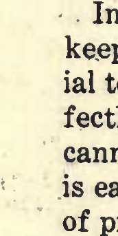

## VIOLIN TONE-PECULIARITIES.

to hold pumice to its work. The final preparatory work is done with the "bone. " The "bone" is a piece of hard ebony, of a size convenient to hold, having one end, or edge, slightly curved and oval, and polished to the limit. With this 4 'bone' ' the sur- faces are rubbed until they are of a mirror-like smoothness, whereafter they are ready to receive the protecting material. Upon surfaces thus pre- pared, oil, alone, or in mixture, may be rubbed on in coats of the greatest possible attenuation, and with imperceptible swelling of grain. The inner surface of the ribs, the blocks, and the linings, receive the same careful attention. In this work there are two important objects to keep in view. First to only apply sufficient mater- ial to cover the wood. Second: To produce a per- fectly smooth surface. For this work, the brush cannot secure the attenuation of the material that is easily secured by the rubbing process. Fluidity of protective material is something to avoid, espec- ially in the first coat. The dry wood will absorb moisture from the fluid applied by the brush, thus defeating the object of hermetically sealing up DRY WOOD. The case is different from that of ap- plying protection to the outside surface of the vio- lin plates. Should absorption of fluid occur at the outside surface, it may escape from the interior surface, and no precaution against admission of moisture into the wood can be too great. When hermetically sealed, moisture can neither enter nor escape from the wood. Hence the necessity for doing this work in a dry atmosphere and the

116

VIOLIN TONE-PECULIARITIES. employment of a material containing the minimum of fluid. I know of no protecting material afford- ing less of moisture absorption than boiled linseed oil. That this oil does not penetrate the softest wood, when applied by the rubbing process, and in attenuated coats, will be shown at a later moment. But, after observing that when a mixture of oil and gum copal, tempered down with softer gums, is employed, the oil, drying with less rapidity, and being largely forced out of the mixture, and lying upon the surface, I have since employed this mix- ture for interior surface-protection to the exclus- ion of all other agents. With the oil thus forced out, I have tried two methods for its disposal. First: Allowing it to remain and dry as part of the finish. Second: Removing it with a soft cloth at the expiration of twelve hours after application. The gums, then being semi-solid are not roughen- ed by careful removal of oil. The latter method has an advantage in greater smoothness of surface, and greater rapidity in drying. With surface oil removed, the gum will dry in 24 hours. With sur- face oil remaining, time required for drying will vary as to the amount of oil, from 4 to 7 days. For application of protecting material, the de- tails are as follows: In my experience, heavy, fine, long-knap cotton flannel has proven the best ma- terial for the rubbing pad. I cut out a piece 2x4 inches and fold it once, end to end and knap out- side. To insure the use of but a small quantity each of varnish and oil at one time, I resort to the following means: One 2 oz. phial is filled two-

117

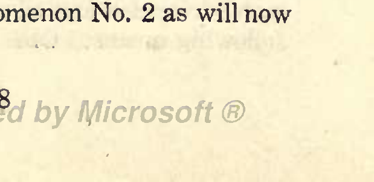

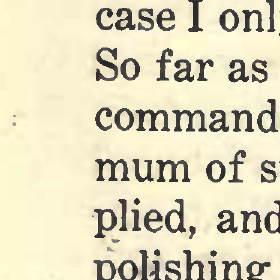

VIOLIN TONE-PECULIARITIES.
thirds with varnish; one 2 oz. phial is filled two- thirds with boiled oil. Slightly moisten one sur- face of the pad with oil, (allowing no swimming whatever of either oil or varnish,) then hold the center of pad over the mouth of the varnish phial, invert the latter, then rub the pad on the wood with a circular motion to avoid sticking and conse- quent roughness of the varnishing surface. The pad should be firmly held and with the end of the index finger pressing down upon its center. When this amount of material has become spread to its limits, then return the phials for more oil and var- nish, thus continuing until the surface of the plate is coated. The amount of material used for one coat may appear surprisingly small. It is small. It ought to be small. It ought also to be small up- on the exterior surface of the violin. In either case I only use sufficient material to cover the wood. So far as I am aware, this method of application commands the minimum of material and the maxi- mum of surface perfection. When carefully ap- plied, and the last coat becomes dry, then do final polishing with dry, powdered pumice stone, using a fresh pad of the same cotton flannel. Of course ex- perience is necessary for skillfulness in this work. I have placed correct details before erroneous de- tails for the purpose of making such errors stand out in glaring colors. To crudity in application of material is due the failure at my first attempt to protect interior violin surfaces; and to the same cause is due varnish phenomenon No. 2 as will now appear.
118

## VIOLIN TONE-PECULIARITIES.

Varnish phenomenon No. 2 contributes nothing to the value of the violin, and nothing of interest to the violin student further than a description of erroneous details in the work of interior surface protection. Knowing the amount of prejudice ex- isting towards protection of any kind whatever, for interior surfaces of the violin, I am therefore care- ful to minutely describe both the correct and in- correct methods of applying such protection. Af- ter ten years of experience in this work, I am fully convinced that existing prejudice against violin in- terior surface protection is due to erroneous details in application of protection material. As an argu- ment against protection, I remember hearing that it "sharps" tone. I now offer evidence that such protection may be applied in a manner causing "dead" tone. [Than the violin, I know of no historical subject offering greater confusion of evidence. For some occult reason, the violin neither seems nor sounds alike to two different persons. This fact is a phe- nomenon without explanation.] Rated upon tone value, the violin, in which var- nish phenomenon No. 2 occurred was worth $25. This violin had been used five years at the time I selected it for application of interior-surface pro- tection. For access to its interior surfaces, the sounding board was removed. No preparation other than brushing off the dust, was given to those surfaces. Upon them I poured a quantity of boil- ed oil and transparent, tempered copal varnish. I spread these materials about with a mop. As is

119

## VIOLIN TONE-PECULIARITIES.

well known in housekeeping physics, the mop is caused to act by reciprocal motion; circular motion being employed only upon parties tracking the floor." Not having to contend with the latter dif- ficulty, I brought my mop into action by reciprocal motion. Of course the mop "stuck" at each re- verse of motion, while I "stuck" to my job by pour- ing on more oil and varnish. After "mixing it" thus until the mass looked as if it were "laid on" (oh!) I pronounced those surfaces amply protect- ed. My glue being hot, assembling work was quickly accomplished. Two hours thereafter, ' 'quick return fever germs had driven me to insan- ity. That 'can't wait" feeling soon became mast- erI applied the bow. [Sheridan's ride to Winchester his changing defeat into victory, has been pictured by able his- torianseven poets have tuned their lyres to the tatoo of his horse's feet. Sheridan's fame spread around the world in a few hours. In my case, sev- eral years elapsed before I dared look into the face of either historian or poet.] I can't say much for the tone of this violin. Truthfully, it has not any tone worth mentioning. Its tone is not only "dead" but 'tis "buried. " The only value in its tone is an example of how not to do interior surface work and as a warning against quick return fever. To apply the bow before protecting mater- ial upon either surface of the violin plates becomes dry is an act of insanity. Had the historian re- ceived access to the "sticky" facts clinging to the inside of this violin, then the violin student today

120

## VIOLIN TONE-PECULIARITIES.

would be reading that interior-surface protection for the violin is a failure. Had I myself abandon- ed effort after this disaster, I would now believe that such protection causes "dead" tone. I did believe it during the next half-year. Then in a moment of idleness I picked up this discarded vio- lin and again applied the bow. Surprise was lying in wait for me. In the qualities of intensity and brilliance, its tone now surpassed former rating. Quickly I again removed the sounding-board. You who have read the description of varnish phenomenon No. 1 may think yourselves prepared for a description of varnish phenomenon No. 2. Let me warn you that you are not pre- pared. You remember that the varnish dis- turbance in No. 1 took the form of crater-like openings. Only in one point is there similarity be- tween these two phenomena both are located up- on the sounding-board. As I view this fact, it af- fords further proof of the dominant part taken by the violin sounding-board in the production of sound. Both of these varnish disturbances point to greater amplitude, and greater power in sound- ing-board oscillation as the cause for their exist- ence. Varnish phenomenon No. 2 is in the form of pen- dant drops, and hanging from the inner surface of the sounding-board like stalacities from the dome of Mammoth Cave. These drops are not found ov- er the entire sounding-board. They only exist in the central area, and within lines drawn over the center of the exits. The graduation of this sound-

121

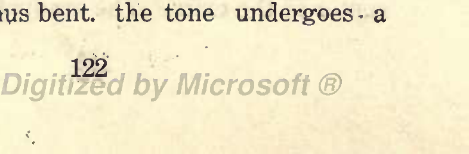

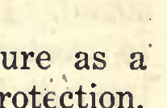

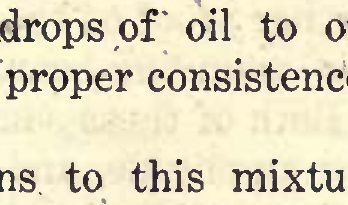

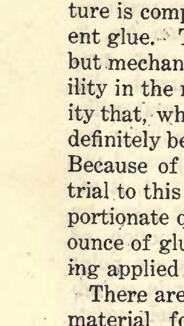

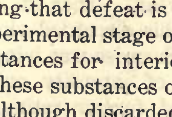

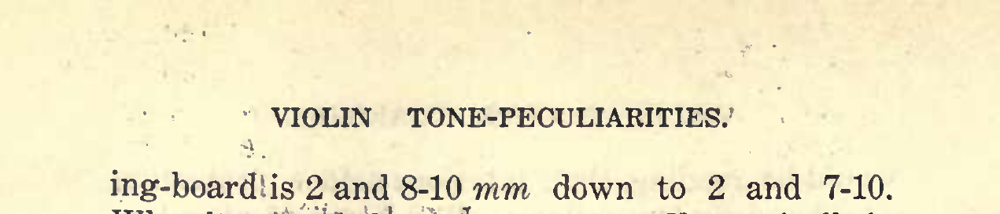

## VIOLIN TONE-PECULIARITIES.

ing-board! is 2 and 8-10 mm down to 2 and 7-10. Why these' tv/6 phenomena vary so diametrically in physical appearance is beyond my understanding. From this crude beginning I continued until feel- ing^that defeat is turned 'into victory. In the ex- perimental stage of this work I tried various sub- stances for- interior surface protection. One of these substances or combination of two substances, although discarded as valueless, yet possesses in- terest because of showing the effect upon violin tone from bending the sounding-board. This mix- ture is composed of boiled linseed oil and transpar- ent glue. The union of these two substances is but mechanical. The presence of oil causes flexib- ility in the mass when dry. So great is the flexibil- ity that, when dried in thin lamina, they may be in- definitely bent upon themselves without fracture.' Because of such physical quality, I gave extended trial to this mixture. In this combination the pro- portipnate quantity is 25 drops of oil to one fluid ounce of glue,.having the proper consistence for be- ing applied with a brush. There are two .objections to this mixture as a material for violin interior-surface protection. Either of these objections is sufficient to condemn its use upon the vioffru- First: Moisture from- the glue is drawn into the- wood. Second: , In drying, this mixture shrinks with sufficient power to bend the sounding-beard. By repeated coatings, the -"cuppings" of the sounding-board may be deepen- .ed until arching is raised 1-4 inch. With the ) sounding-board thus bent, the tone undergoes- a

122

## VIOLIN TONE-PECULIARITIES.

a surprising change. Such changes are manifest- ed by short duration and, by strident quality, (as the croupy voice, ) and, by increased brilliance, or distinctness in passage played rapidament. There are violinists pleased with the shortened duration of tone from the bent sounding board. These are players whose forte lies in rapidity of execution. As is well known, there are violins on- ly producing a confused jumble of sound in rapid passages. Comparing such violins with those hav- ing this strident, but brilliant tone I prefer the lat- ter. But, the strident and brilliant tone, by no means, compares with the natural and brilliant tone, as I view this matter. The strident is a thin tone, and therefore an unnatural tone. For some occult reason, different violin tone- tastes more nearly approach infinity than tone-tastes for any other musical instrument. My amateur violin-making friend, J. D. O'Brien, Pittsburg, Pa., during his last European tour, had the pleasure, or rather the pain of seeing five worn out Stradivari left in care of Hammeg, violin mak- er, Berlin. One of these violins was once present- ed to Dr. Joachim, by his London 'Why admirers. In late years I have asked, 4 do we never read of the worn out Amati, or the worn out Gua- neri, or the worn out Maggini, or even the worn out Da Salo?" I receive no answer thereto. Sup- position seems to be the only source for an an- swer. As heretofore stated, that sounding-board yielding the most agreeable tone is the first in suc- cumbing to the disintegrating forces of heat and

123

## VIOLIN TONE-PECULIARITIES.

moisture. Of course the violin yielding the more agreeable tone is likely to receive the greater amount of use in any given period of time. But alone, legitimate use cannot account for rapidity of disintegration. Were my name Hammeg, before one hour older, those worn out sounding-boards would be subjected to tests for density of hard fibre and connective tissue between. Today I entertain conviction that every worn out sounding-board, taken in time and given correct interior-surface protection, might have retained all original tone- value to an indefinite period. Upon this point, I have made ample, 'practical demonstra- tion, and have satisfied myself that such conclusion is based on safe reasons. I have given both correct and erroneous details for interior-surface protection that you may satisfy yourself with much less trouble. You may ask yourself the question, "What logic is there in protecting one surface of violin plates while leaving one surface without any protection whatever?" You will receive various answers to this question. In all probability you will receive positive replies from parties who prac- tically know nothing about this subject of interior- surface protection for violins, that such protection locks up secretions in the wood. Certainly it does lock them up that is, if there is any secretion therein. If you have read me closely, you observ- ed that I am careful to repeat the fact of only ap- plying interior-surface protection to used violins violins having had time to complete the process of shrinking after leaving the builder's hands; and

124

## VIOLIN TONE-PECULIARITIES*

that I am careful to further dry out the wood with artificial heat when necessary. Should you do interior-surface protection work* carefully following correct details, surprise will lie in wait for your bow. Augmented intensity and brilliance of tone will be something new to your old violin; and, if its tone was valuable before the in- terior surfaces were protected and made perfectly and permanently smooth, you will enjoy the fact of knowing such increased tone-value to be also permanent. Permanence of violin tone-value is a very desir- able quality. It is yours for the asking. Possibly you may not entertain sentiments iden- tical with mine regarding the inanity in certain statements concerning the Cremona violin varnish. As students of the violin, your attention has been called many times to this subject. You have read of it in books; in booklets; and in periodicals; even in newspaper ' Interviews. ' ' Possibly, such reading did not make the same impression upon you as up- on me. Nothing in life is more patent than the fact that mental impressions may vary as the num- ber of minds. In early life I read something about the beauty of Cremona violin varnish. I then thought the writer re ally, referred to gums com- posing, the varnish. In middle life, I began to read that to Cremona varnish is due the superiority of Cremona violin tone. In advanced life, I began to read that Cremona varnish, in some way, permeat- ed the wood; also, that Cremona violin varnish sud-

125

## VIOLIN TONE-PECULIARITIES.

denly, mysteriously, disappeared from commercial channels. Strangely, I've read nothing about the disappearance of other furniture varnish. Tis passing strange that fate should select violin var- nish for annihilation! Beyond all degrees of strangeness is the fact that but a limited number of Cremona violins are, or ever were celebrated for superiority of tone. Pointing directly to the two most famous Cremonese violin builders, Stradivar- ius and Joseph Guarnerius, They reliable "experts" have said to me. ' did not make every violin of equal tone- value. ' ' "Why not?" They had access to Cremona varnish! Really~we may now expect an "interview" from some London "expert" (trade promoter rather,) wherein he states that Cremona varnish was so dear (oh!) that none could afford to use it except in a limited way. . , Perhaps he's right. . The use of a varnish which soaks into the wood must require a lot of it. Italians are now, and for a long time have been meritoriously noted for superiority of color-sense. But, even in violin color-work, they did not make all violins equally beautiful. I by no means pose as a color artist, but, from my experience in color- work upon wood, I am confident that no one can make what.is called a beautiful violin without hav- ing beautiful wood as a pre-requisite. Even then failure is easy. Six times have I removed color- work from a single violin before finding the right

126

## VIOLIN TONE-PECULIARITIES.

combination to match that particular sample of wood; and a long interval may elapse before that combination will be equally effective upon another sample. People exclaim, "What beautiful varnish!" The beauty is not all in the gums. 'Tis all in the combination of colors. Not one iota would I subtract from the rightful merits earned by the "old masters." Neither can I give them unearned credit. For those empty statements, intended only for "trade promotion" in Cremona violins, I entertain nothing but con- tempt. Doubtless my contempt for those London ' 'inter- views" and for those London authors whose ani- mus is plainly "trade" is quite paralleled by their contempt for the Americans. The Londoners es- timate of the Americans is clearly shown in the fol- lowing words credited to Kipling. 'Twas on board a sailing vessel from Calcutta to London. One morn- ing, when off the west coast of Africa, the watch re- ported being passed at daybreak by the largest sea- serpent on record. The watch stated that their attention was first attracted to the monster by a steam-like hissing as it came up under the lee counter. Its forked tongue was eight feet long. Its head was ten feet in length from the point of the jaw to the single fiery headlight eye. Its head was carried fifteen feet above water. Its body was longer than the ship. While listening to this sailor yarn, a New York newspaper man, busy with pencil and note-book, remarked to Kipling

127

## VIOLIN TONE-PECULIARITIES.

that upon arrival at London he would report this remarkable incident to the press. "Don't," said Kipling. "Why not," replied the New Yorker. "My friend," replied Kipling, "let me tell you something which you don't seem to know. England was gray headed before you were born. Keep this story until you reach home. ' ' We must admit the truth in Kipling's remark. England does hold a monopoly of gray heads. 'Twill not be her fault should a single gray head ever appear in any other country. Something ov- er a hundred years ago she received a hint from Americans that we desired to live our natural lives whether or not that life might be long enough to reach the gray head stage. From signs of the present, there is hope for us. From Portland to Seattle, from New Orleans to Duluth, there are those who no longer swallow the London expert's "varnish permeation-of- the- wood" story. Today the London expert, "interviewing" himself bewails (!) the prohibitive prices for the few old violins permeated by the lost Cremona varnish. Judging by the past, what harm in prophecy for the fut- ure? Entertaining conviction, I confidently pre- dict that, within the present century, for the best violin, Europeans will search throughout America. Why not? Cremona violins, penetrated by varnish applied only upon a single surface, will soon be out of the market. It is certain that a few American violins, penetrated by varnish applied to both surfaces, will then be on the market. Why not picture de-

128

VIOLIN TONE-PECULIARITIES. scendants of the present London expert as then interviewing themselves about prohibitive prices for American double-permeated violins? There is one American gray- head who would immensely en- joy that picture.

129

## VIOLIN TONE-PECULIARITIES.

LECTURE VIII. GENTLEMEN: We are approaching problems in violin tone which are not only difficult of solution, but are also difficult of enunciation. Silently I sat at my bench many years, thinking, working, but never writing. During these years I was favored at long and brief intervals only by the companion- ship of persons who cared for the philosophy in- volved in violin tone. As is well known, much talking on any subject greatly facilitates the selec- tion of precise words to make our meaning stand out in a clear light. Being deprived of such bene- fit, and receiving little or no direct benefit from either text-books of philosophy, or from books of general reading, I therefore find this task of precise diction to be a matter of difficulty. My age and infirmities also handicap my pen. Therefore, should I fail in the matter of precision, 'twill cause no surprise to myself. I am comforted by the as- surance that each succeeding generation becomes brighter in intellect, hence more capable of precis- ion in enunciation of both principles and solutions. Because that problem in the arching of violin plates securing maximum concentration of molecular movement at the exits is abandoned by physicists as insolvable, by no means do I lean back and say that this problem never will be solved. I firmly believe a solution for this problem yet will be forthcoming. To deny such possibility is equally as absurd as saying that the violin reached perfec- tion 200 years ago. Within my observation, violins are made today of greater tone power, and greater

130

## VIOLIN TONE-PECULIARITIES.

evenness of tone than at any other period in violin history. [Galilleo did not discover the Americas, but, Galilleo's enunciation of principles made their discovery possible. After Columbus had demon- strated that Galilleo's principles were correct, it is related that a vaporous party at the dinner table jumped up to remark that this discovery was an easy matter any one could have made it nothing in it except the matter of sailing west until stop- ped by land, then sailing back again. Calling for an egg, Columbus asked each person present to make the egg stand upon its smaller end. After all had failed, Columbus, striking the egg upon the table with sufficient force to partly crush the shell, made the egg stand firmly upon its smaller end. This mythical story is here told for a purpose. Should I succeed in even cracking the shell of some difficult problem in violin tone, then that party who later succeeds in making such problem "stand on end" I shall designate as Columbus if he but hints that my name is Galilleo.] 'Tis well enough to smile while having a chance, for soon we shall enter a territory wherein dryness precludes the possibility of smiles. _ After crossing this "dry district" we will try to find moisture for our parched lips and duly celebrate our "passover." Uniformity in violin tone- values is considered one of the unsolvabe problems. We can truthfully say that this problem has successfully defied solution during 400 years. That this problem ever will be solved, we can only hope. In attempting a solu-

131

## VIOLIN TONE-PECULIARITIES.

tion of this problem, I accomplished something, but not enough. Only in a limited number of violins have I succeeded in securing such uniformity of tone- values as to prevent me from determining the tone of each one when played while hidden from sight. In this respect, violin tone is as the voice of singers. Only at rare intervals do we hear two singers possessing identical vocal qualities. In the solution of this problem, what immeasur- able value to the violin! Tis a value defying arithmetic. Feeling certain that this problem is of interest to the violin student, I therefore describe details in my work for the production of uniformity of tone- values. First, I select violins as nearly uniform in dimension as possible. It is at once apparent that much lack of uniformity in cubic capacity must defeat uniformity of tone qualities. Thus, when two violins vary much in length of perpendicular air columns within the body, it is a difficult matter to bring their tone to uniformity in pitch. [I do not mean difficulty in tuning the strings to what is called "unison," but do mean the difficulty in preventing the ear from distinguishing the pres- ence of two sounds varying in tone-pitch.] Second, I select violins having wood as nearly uniform as possible in maturity, density, and width of grain. These latter points exert much influence in the the quality of violin tone. After thus selecting a half-dozen violins, I remove the varnish therefrom. Such removal is necessary be- cause both quality and quantity of varnish operate

132

## VIOLIN TONE-PECULIARITIES.

to raise tone-pitch and to diminish volume of tone. These violins are next opened and necessary work is applied to their interior surfaces. This work may vary in each violin. Some of them may need re-barring; some need re-graduation; some need both re-barring and re-graduation; possibly some may need heavier linings and corner blocks; and in all, the interior surface is made perfectly and per- manently smooth by means of elastic varnish ap- plied in such attenuation as is only possible to the ' 'rubbing' ' process previously described. Of course in the re-barring and re-graduation, account of varying degrees of density in sounding-board fiber must be considered. After assembling, comes ad- justment of the finger-board. Its hollow under surface, beginning at the base of the neck, is made so straight that the straight-edge touches at all points in the length of the hollow. [The philosophy for thus fashioning the under surface of the finger-board will appear later in the discussion of tone-modifiers.] The under surface of the finger-board is placed at a uniform height throughout the half-dozen in- struments. The weight and density of the finger- boards are as uniform as possible. While these violins are yet in "the white," bridges of equal maturity, density, and width of grain, and guage 2, six-strand, hard-twisted strings, each of even diameter are adjusted, and the preliminary test for uniformity in tone values is made. This test is made prior to varnishing the exterior surface for the purpose of retaining the opportunity for work-

133

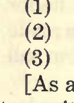

## VIOLIN TONE-PECULIARITIES.

ing upon such surface to lower the tone-pitch where found necessary. Thus, after applying the bow upon each violin, I select one having an aver- age tone-pitchnot highest nor lowest in the lot then raise the tone-pitch of those below, and lower the tone-pitch of those above this selection. In the work of raising tone-pitch, I now have three, or, counting varnish, four means for assistance, thus: (1) Enlarging the exits. (2) Position of bridge. (3) Position of post. (4) Quantity of varnish. For the work of lowering tone-pitch, I have three means, thus: (1) Diminishing sounding-board thickness. (2) Position of bridge. (3) Position of post. [As a matter of fact, a fifth means for raising tone-pitch may be found by counting diminished depth of ribs; (See Rule VI) but, being unncessary, work except in extreme cases, I do not here find myself compelled to employ it.] The philosophy involved in this work of lower- ing tone-pitch is reserved for a later date; there- fore at the present moment it is sufficient to state that after the tone-pitch of these violins becomes so nearly identical that my sense of hearing fails to distinguish the pitch of one from another when played while hidden from view, they are then dis- mantled and varnish, of equal quality and quanti- ty, is applied upon the exterior surface and by the "rubbing" process. When again ready for use,

134

## VIOLIN TONE-PECULIARITIES.

they are taken to the open field for their intensity test heretofore described. Before giving results of the long-distance test for intensity, (carrying power) I will mention the fact that in the qualities of tone-pitch and intensity of tone is shown the nearest proximity to equality of tone- values in these violins as now prepared. At near-by dis- tances there is yet a notable difference of harmon- ics a bassa and consonant harmonic overtones. Thus, their tone varies in ' 'richness." Again, there is a difference in response to bow-pressure; and particularly observable in greater or less dis- tinctness of tones played rapidament. I now return to the long distance test in the open. Prior to the herein described treatment, the record shows intensity of tone in these violins as straggling along from 400 to 800 feet. After prep- aration, as described, the record shows an increase in intensity of tone up to 1,100 and 1,200 feet, av- eraging 1,175 feet an increase of 80 per cent in distance; and an increase, in uniformity of tone- value upon this isolated tone-quality, of 62 per cent. I know of no way to describe precisely the per cent of increase for such tone-quali- ties as volume, evenness, richness, freedom from dissonant overtones, sympathy in concert, response to bow, agreeability of double-stop tones, brilliance of tone, and power of harmonic tones. In a gener- al way, and in my opinion, the latter tone qualities are increased equally with intensity, and in the majority, I believe the per cent of increase to be greater than the increase of intensity.

135

## VIOLIN TONE-PECULIARITIES.

There is yet another tone-value in this lot of violins. It is a value difficult of accurate descrip- tion. I refer to the effect produced by playing these violins in unison. I believe that my experi- ence in listening to violins thus prepared has no parallel. This belief causes me to hesitate before attempting a description of such effect. In this description, I cannot find support by way of com- parison. I am obliged to find words descriptive of a new impression upon both the sense of hearing and the sense of feeling. The first word to come out of the mist is solidity. When saying that any certain object is "solid," we mean that such object possesses weight. As a rule, the word solid is used only to describe objects which can be seen. Yet, I am inclined to use that word in describing the combin- ed tone of this half-dozen violins. Certain it is that while listening thereto, and while at a distance of more than 1,000 feet, I seemed to feel sound- waves striking against my person. As you remem- ber, the long-distance test is made in open air, under a cloudless sky, winds at rest, temperature from 70 to 90 degrees Fah. water vapor at, or be- low the normal point, (never , above) and at the hours between 10 a. m. and 4 p. m., (hours where- in sound-waves are propagated with the greatest difficulty upon any given date) and, upon level ground, and with no surrounding objects capable of reflecting lines of molecular movement. Under such circumstances, you at once observe that the position occupied by these violins, during such

136

## VIOLIN TONE-PECULIARITIES.

tone-test is at the center of a circle whose radius is greater than 1,000 feet. You also understand that, under the above conditions, sound-waves from these violins reach the periphery of this circle at all points. I fully realize at the present moment, that my statement concerning the "solidity" of the tone from these violins, prepared as herein set forth, has no corrobation. I therefore ask you to make such trial yourselves. In all matters of practical appli- cation to violin tone, my work is finished. Your- selves, being alive to the fact that in certain con- ditions where sound-waves are propagated only with difficulty, and knowing the complaint of not hearing first-violin tone, will take up this work where I leave it and demonstrate its value in both the small and large orchestra. In this work, I cannot give assurance that any one can succeed without experience. As I glance backwards at the years I've devoted to violin tone- peculiarities, and note the difficulties upon either hand of the violin-builder's path, I am constrained to say that success depends largely upon experi- ence. The spirited horse can be goaded into mad action by a galling ill-fitting harness. The violin sounding-board can also be driven into mad action by an ill-fitting sound-post, by an ill-adjusted fing- er-board, by an ill adjusted bridge, by an ill-assort- ed set of strings, and, by a worthless bow. When all of these ills combine, imagination fails. So long as one-hundredth of an inch in variation of sounding-board thickness, in string diameter, in

137

## VIOLIN TONE-PECULIARITIES.

bridge-thickness and position, in sound-post thick- ness and position, in area and position of exits, in depth of rib, in diameter of bow-hair, affects violin tone, so long will success defy the hand-ax. Not more can a carpenter succeed in violin-making than a blacksmith can succeed in watch-making. Do not understand me to say that a carpenter may not become a violin maker, nor that a blacksmith may not become a watch maker. That is another prop- osition. But, I do say, emphatically, that both must serve an apprenticeship. To illustrate the truthfulness in the latter state- ment, it is necessary only to call up a single diffi- culty encountered by the violin builder. This dif- ficulty lies in variations in sensitiveness of sound- ing-board wood. These variations are wide enough to cause not only profound surprise, but also, profound disappointment. I know of one sounding- board, and but one for that matter, which is not affected by five times the amount of varnish neces- sary for mere protection. Again, I have handled sounding-boards so sensitive that but a single atten- uated coat of varnish plainly caused damaging ef- fects upon tone. In view of these facts, it is evident that only such judgement as must come from ex- perience can secure best results. My experience causes me to believe that every good violin, built upon hard-and-fast rules, is but an accident. It is my desire to be of assistance to all such as attempt the work of violin tone-regulation. To this end, I can think of no way more effective than pointing to such facts as endanger success. 'Tis of

138

## VIOLIN TONE-PECULIARITIES.

value to know how not to do .any certain kind of work. In the matter of applying protecting material to interior surfaces of new violins, I have no experi- ence to offer. In my judgement, this matter hinges upon the degree of dryness and completion of the shrinking process existing in each sample of wood. Manifestly, it is inadvisable to hermetically seal up violin wood prior to the completion of dry- ing and shrinkage. In our climate, the presence of water vapor in air. operates to prevent both com- plete shrinkage and drying of wood. When sur- rounded by water vapor* the capillaries of violin wood are bound to draw in and hold more or less water. It is also manifest that the presence of water in the capillaries diminishes resonance of every violin. No other conclusion is possible. Again, it is manifest that hermetical sealing up of violin wood effectively prevents further entrance of water. Thus, violin interior-surface protection, aside from its value as a perfect reflecting medium, is also valuable in permanently maintaining reson- ance, c I repeat the statement that, prior to her- metical sealing, violin wood should be absolutely dry by artificial means. In our climate, we may not expect absolute dryness of wood when left to nature. Observation of unequal shrinkage in vio- lin plates, subsequent to leaving the builder's hands, leads me to the opinion that, for the reason of certainty in new violins, the plates, nearly re- duced to correct thickness, should thereafter be allowed one or more years to complete the process

139

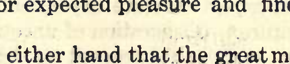

## VIOLIN TONE-PECULIARITIES.

of shrinkage before being assembled. By no means do I desire that you understand me as advising uninterrupted effort to produce violin- tone of maximum volume and intensity of tone. The necessity for .violins ,of "big tone" only exists in a limited way. The total number of auditoria, creat- ing necessity for "big tone," is a small number in comparison. As the object of all musical interpre- tation is the pleasure of the listening ear, it there- fore follows that both disagreeable tone quality, and the tone so feeble as not to be heard at all, de- feat the object of musical effort. Thus, the mis- take of employing the violin possessing "big tone" for. studio, parlor, or the small auditoria is only parallelled by the mistake of employing the weak tone for the large auditoria. In small rooms, the ."big" tone is painful; in the large room, the weak tone is disappointing. This proposition has two sides; one, aesthetic, the other, "business." It is quite safe to assume that all patrons of music halls. expect pleasure from first-violin tone. It is also quite safe to assume that either disagreeable first- violin tone, or inability to hear first- violin tone operate to reduce patronage. In this matter, the patron is nowise to be blamed for withdrawal. He parts with wealth for expected pleasure and finds but disappointment. H It .is evident upon either hand that the great ma- jority of violins are used only in comparatively small rooms; In view of this fact, 'tis wisdom to build and tone-regulate the great majority of vio- lins minus maximum volume and intensity

140

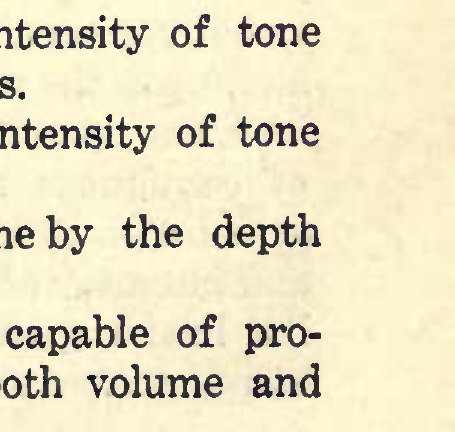

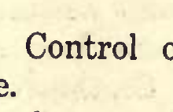

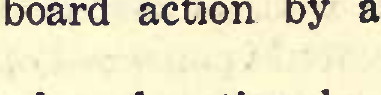

## VIOLIN TONE-PECULIARITIES.

of tone. To-day the skillful violin maker can come nearer producing violin tone "to order" than at any other period. I present the following factors as proving them- selves reliable in diminishing both volume and in- tensity of violin tone: (1) Control of sounding-board action by var- nish.

(2) Control of sounding-board action by bend- ing.

(3) Control of sounding-board action by thick- ness of wood. (4) Control of sounding-board action by arch- ing of plates. (5) Control of sounding-board action by the bar.

(6) Control of sounding-board action by the post. (7) Control of sounding-board action by the bridge. (8) Control of sounding-board action by the finger-board. (9) Control of sounding-board action by the di- ameter of strings. (10) Diminishing volume and intensity of tone by the condition of interior surfaces. (11) 2 Diminishing volume and intensity of tone by the area and position of exits. (12) ^Diminishing volume of tone by the depth of ribs. Either of these factors, alone, is capable of pro- ducing perceptible diminution of both volume and

141

## VIOLIN TONE-PECULIARITIES.

intensity of violin tone. ( 1 ) Control of sounding-board action by varnish , in all cases except the one case herein mentioned, has proven to be possible, and quite easy of accom- plishment. The only difficulty that I have found in diminishing volume and intensity of violin tone by means of elastic varnish was wholly due to in- herent variations in the action of sounding-board wood. These variations are so wide as often to defeat tone-regulation by "hard-and-fast" rules. In my hands, the greatest effect from varnish, in controlling sounding-board action, has been shown upon wood of soft fiber; and the least effect has appeared upon wood of dense fiber. Thus, in the employment of a certain quantity of varnish upon each violin, its effect upon tone varies as the de- grees of density in sounding-board wood. I have not found that any amount whatever of varnish, applied upon the back, operates to dimin- ish tone in any degree whatever. On the contrary I have observed a slight increase in tone-power from heavy coats of varnish applied upon back plates whose thickness had been reduced to that point causing tone-weakness. Without doubt, any amount of varnish increases rigidity of violin plates; and, upon the sounding-board, any amount of var- nish also operates to diminish independent action of contiguous fibers. Thus, varnish, upon the sounding-board, operates to diminish both volume and intensity of tone. Often have I observed vio- lins having greater power in single, than in double- stop tones. In all such cases, I have found increase

142

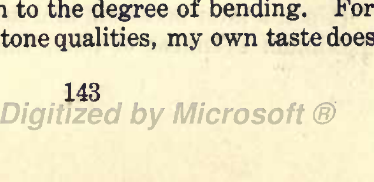

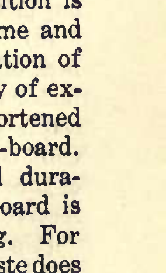

## VIOLIN TONE-PECULIARITIES.

of power in double-stop tone following removal of varnish from the sounding-board. To demonstrate that varnish, upon the violin sounding-board, oper- ates to diminish both volume and intensity of tone is a matter easy of accomplishment. In its effect upon violin tone, varnish possesses an esthetic side. There are many musicians who prefer the natural tone from untrammeled wood. When such tone possesses beautiful quality, there can be no objection from any one. The beauty in such sound is impossible of enhancement by any means known to me. But, herein lies the difficulty. Inherent capriciousness in the action of sounding- board wood produces tone from the extreme of beautiful down to the extreme of coarseness. This matter wholly lies in the domain of nature. Man can only modify it. There are a limited number of musicians who profess pleasure in coarseness of violin tone; but, the great majority prefer such coarseness to be modified by varnish, and content themselves for the loss in volume and intensity by the loss in disagreeable tone-quality. (2) Bending the sounding-board into position is a powerful factor to diminish, not only volume and intensity of tone, but also, to diminish duration of tone. Violinists, whose forte lies in rapidity of ex- ecution, are sometimes satisfied with the shortened and lifeless tone from the bent sounding-board. The influence upon volume, intensity, and dura- tion of tone from bending the sounding-board is in exact proportion to the degree of bending. For diminishing these tone qualities, my own taste does

143

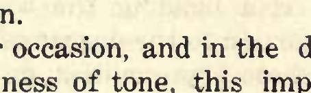

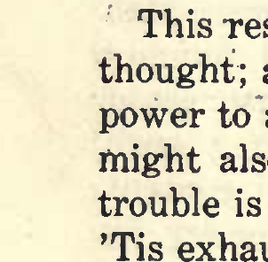

## VIOLIN TONE-PECULIARITIES.

not approve of the bent sounding-board, because of a certain "dead" tone-quality. I prefer to di- minish the area of the exits, while leaving the ac- tion of the sounding-board free; thus, preserving liveliness of tone. The difference in tone-value is vastly in favor of the latter method. I do not find that bending the back into position operates in any degree whatever to diminish power of tone; but, on the contrary, bending a back plate, already too light in wood, increases the tone-pow- er. But, such increase in tone-power does not hold good indefinitely. Here is the reason. Upon opening the violin with bent back, and within but a few years after leaving the builder's hands, I find the bending transferred to the sounding-board. This result might be expected did we but give it- thought; and the two factors, causing loss of tone- power to accompany such transference of bending, might also became apparent with thought. The trouble is to keep up to the point of hard thinking. 'Tis exhausting. Facts are easiest made known by stumbling upoir them. Stumbling costs nothing but picking one's self up, and remarking. (3) Control of sounding-board action by thick- ness of wood is a factor of great importance. This factor has received more attention than any other single item in the list of violin tone modifiers. Only the effect of diminishing volume and intensity of tone by thickness of sounding-board wood will receive attention. [Upon a later occasion, and in the discussion of maximum evenness of tone, this important tone-

## ^ 144

## VIOLIN TONE-PECULIARITIES.

modifier will be given further attention.] It is evident that the thickness of the violin sounding-board must be governed by the diameter of strings to be employed. When not otherwise specifically mentioned, I refer only to guage-2 strings. [As previously stated, my experience compels me to the belief that the function of the violin sounding-board is to originate those sound-waves eventually reaching the ear as musical tone. Pre- vious to varnish phenomenon No. 1, I directed work upon the back plate as if it also were a tone-pro- ducing agent. To such work I now attribute ruin of tone- value to a number of violins. After confin- ing the work of tonerregulation wholly upon the sounding-board, I met with no failure attributable to my work. By placing new, strong back , plates upon violins having suffered serious injury to tone from attempted tone-regulation upon that plate, I succeeded, to a satisfactory degree, in restoring lost tone- value. I do not wish to be understood as saying that loss of tone-value may not also follow erroneous work upon the sounding- board. On the contrary, I do say that that tone- value may be easily lost by erroneous work upon the sounding-board. What I do say with positive- ness is that, after confining the work of tone-regu- lation to the sounding-board, I met with vastly greater success in securing tone-value in such tone qualities as intensity, brilliance, and sweetness. Volume of tone, at nearby distances, I could ob- tain with certainty by work upon the back plates

145

## VIOLIN TONE-PECULIARITIES.

alone; but, such tone invariably fell far short in the long-distance test out in the open; whereas, with a strong, unyielding back plate, I could se- cure equal volume of tone and vastly greater in- tensity and brilliance of tone by work directed to the sounding-board. This fact I have demonstrat- ed by many repetitions of the long-distance out-of- doors test. As previously stated, this test affords evidence based upon actual measurement, in lineal feet, of intensity (carrying power) of violin tone. It is a test settling this question beyond the shad- ow of doubt. ii , In diminishing volume and intensity of tone by thickness of sounding-board by no means have I found the same difficulty as is presented in the work of securing the maximum of those tone qual- ities. In securing the maximum of volume and in- tensity of tone, the work, from a certain point of thickness, must proceed with caution in the mat- ter of measurements of thickness, and removal of wood; and because of the reason that in every sam- ple of sounding-board wood there is a certain degree of thickness yielding such maximum, and, below this degree of thickness means weakness of tone, whereas, for the production of diminished volume and intensity of tone, the thickness may run from 16-64> down to 10-64, or even lower with wood of dense fibre. These great thicknesses invariably operate to diminish both volume and intensity of tone, but not in equal degrees; the greater diminu- tion appearing in volume of tone. These great thicknesses also operate to raise tone-pitch.

146

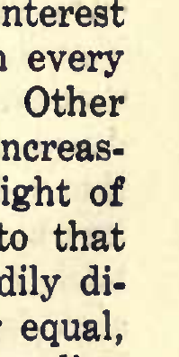

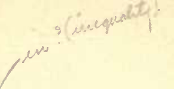

## VIOLIN TONE-PECULIARITIES.

It is a fact in my observation, that every inherent disagreeable tone-equality in sounding- board wood developes and becomes apparent as thickness of wood diminishes to the point produc- tive of maximum volume of tone. I regard the knowledge and consideration of this fact to be of value to both the violin builder and those violin us- ers who prefer quality of violin tone before quantity of tone. In my observation, there are many violin users who entertain such preference. It is also a fact in my observation, that for all occasions and circumstances, a violinist can become equipped only by having at command a number of violins possessing varying degrees of volume and intensi- ty of tone. (4). The arching given to violin plates defies the pencil of that physicist who would write down its solution. Yet, 'tis an easy matter to demon- strate the fact that such arching may add to, or diminish both volume and intensity of tone. I know of no single item in the list of violin tone- modifiers affording greater interests to the violin student than the item of plate-arching. In practi- cal application, there is no diminution of interest from the perfectly flat plate on up through every degree to a height of arch equaling 1 inch. Other dimensions remaining equal, power of tone increas- es, from no arch at all, up to a certain height of arch; and from this certain point on up to that height equaling 1 inch, power of tone steadily di- minishes. Other dimensions not remaining equal, as increasing the area of exits, increasing sounding

147

## VIOLIN TONE-PECULIARITIES.

board thickness together with an increase of string diameter, power of tone may follow to a higher de- gree of arching than in the first proposition. It is apparent that the diameter of strings may safely govern the height of arching. In my obser- vation, using the guage-2 string, and distributing the arching equally from either end of the plates to the position of the bridge, the greatest volume of tone is reached at that height of arch equalling f inch, while the greatest intensity of tone is reached at that height of arching equalling i inch. I desire that the above statement be taken with the understanding that the area of exits, in either of the above heights of arching remains pre- cisely equal, and that such area is neither large nor small, and that the width and length of the body and the depth of ribs be not greater than that of "full size"; also, that the distance between the ex- its, at their upper extremities, be exactly 1 and 4 inches. These conditions are absolutely necessary in determining the influence of arching upon vol- ume and intensity of tone. - I present this violin as an example of the influ- ence exerted upon tone-power by plate arching. You observe that the exits are of medium area; and that their position is> neither "high", nor "low." As you look at this violin in profile, you observe that its waist line is aldermanic; that its height of arch, at the position of the bridge equals & inch; that the distribution of the arch is equal from the ends of the plates to the bridge; that the quality of wood, varnish andwork-

148

## VIOLIN TONE-PECULIARITIES.

manship is good. As I apply the bow, you observe that it has a tone-power equalling the tone-power of a pewee; and even that tone is "all inside". In attempting an explanation for this great loss of tone-power, due to such formidable height of arch, we are left with nothing but supposition. We know the fact, but positive assertion can go no further. Although knowing mere surmise to be uninteresting, yet, I'll take the risk of presenting my surmise for an explanation of this defiant prob- lem if you'll not charge me with positive assertion in the matter. I fully understand that assertion, without corroboration, proves nothing. Therefore, I begin by saying thus: I think loss of tone-power from high-arched violin plates, other dimensions remaining equal, is due to the fact that the exits are not in the line of wave sound movement.

"Well, now comes the defiance." If, by possible means, we could place ourselves within the body of this violin while the bow excites the strings to action, and if our vision were quick enough to follow the line of travel taken, by any single wave-movement as it originates upon the in- terior surface of the sounding board, then we would know why such movement indefinitely con- tinues to travel "all inside;" then we would know why the great majority of such movements fail to pass out through the exits made and provided, especially for the egress of sound waves. I can safely say that those "if's" have used up the last grain of plumbago in many a pencil.

149

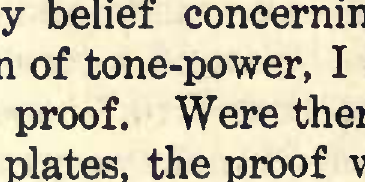

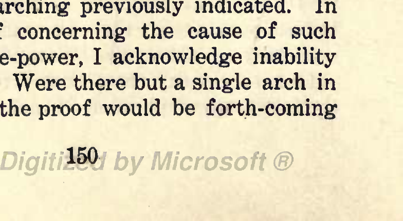

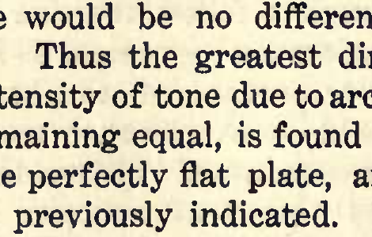

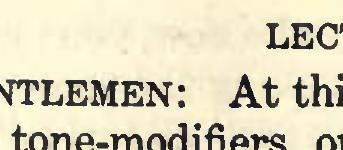

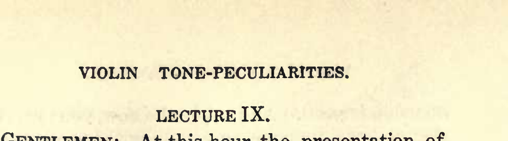

## VIOLIN TONE-PECULIARITIES.

LECTURE IX. GENTLEMEN: At this hour the presentation of violin tone-modifiers, operating to diminish volume and intensity of tone, is resumed. At the close of the preceding hour we were yet considering the great influence upon tone from the arching given to the plates. In continuation, I present this violin as another example of arching, which invariably operates to diminish tone-power. As you view this violin in profile, you observe that the entire rise of the arch is given to the first two inches at either end of the plate; that between such abrupt elevations, the plates present a straight line; that other dimensions remain as usual. Application of the bow demonstrates the fact that the tone-power of this violin, while perceptibly greater than the tone-power of the higher arched violin, yet lacks much of the maximum. As I view this model of arch for violin plates, it is a model affording but a a few degrees of greater tone-power than no arch at all. Were it not for the slight concentration of sound-waves at the exits due to the lateral, or cross-section arch, there would be no difference whatever in tone-power. Thus the greatest dim- inution in volume and intensity of tone due to arch- ing, other dimensions remaining equal, is found at the extremes; that is, the perfectly flat plate, and the enormorous arching previously indicated. In stating my belief concerning the cause of such diminution of tone-power, I acknowledge inability to furnish proof. Were there but a single arch in the violin plates, the proof would be forth-coming

150

## VIOLIN TONE-PECULIARITIES.

in but a few moments. Tis the presence of the lateral arch that adds complication to this problem. With but the greater arch, (from end to end of plates) to contend with, the line of travel followed by sound-waves, originating at the sounding-board, could be accurately traced on paper. The physical laws explaining sound-wave movements, are easily comprehended. > The two laws concerning this problem are: ; (a) Sound-waves, at the moment of origin, travel at a right angle from the agent producing them, (b) Sound-waves, after striking a reflecting surface, travel therefrom at an angle equal to the angle of incidence. It is obviously an easy matter to draw on paper a line at a right angle to any given point upon the interior surface of any given arch. It is also obvious that a line of sound-wave movement, originating from any point on the arched violin sounding-board, will not strike upon the back at a point perpendicular to its origin,, but, will strike the back at a points nearer the exits. So far 'tis .easy.; but, the next move o the sound-wave is wherein lies the difficulty. 'Tis now the lateral arch makes its presence known. 'Tis plain, that rafter striking the back, the wave will be reflected; but, in what direction will the reflection travel? It is the intention of the arches to direct and con- centrate wave movement at the exits. It is also the intention to place the exits in the line of wave movement. It is evident that such intentions are defeated by enormorous degrees of lateral arching, and also by no arching at all. It is apparent that

151

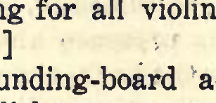

## VIOLIN TONE-PECULIARITIES.

when no arch whatever is given to the plates, there can be no direct progression whatever of wave movement toward the exits. Hence, the tone from such plates is diminished in power. It is evident that sound-wave lines of travel, within the high- arched violin are directed away from the exits to a 'Where great extent. In this case the question is, ' should the exits be located?" [Inasmuch as the violin is but a product of exper- ience, therefore we may continue expecting violin tone-improvement only to follow experience. With this idea uppermost in my mind, I call up some experience connected with a barrel of new cider inadvertently left out in the hot sunshine dur- a whole day. Being employed as an inspector of this particular barrel, and, the barrel being tightly closed up, I directed a moderate tap from a ham- mer to the vicinity of the bung; whereupon, and without warning, that bung flew into my face aUegro con fuoco et cider-o-so. ftow (vengefully) I do suggest cutting a bung hole in the sounding-board between bridge- feet as the proper thing for all violins having an aldermanic waist-line.] (5) Control of sounding-board action by the bar is easy of accomplishment, very easy; I feel like saying, "Too easy." Experience in wrestling with the problem of the violin bar may cause equal disappointment with experience at any other "bar" whatever. In either case, "loading up" to^heavily is bound to prove disap- pointing. The violin bar is a powerful factor in

152

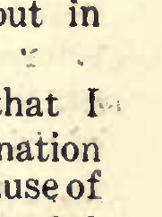

## VIOLIN TONE-PECULIARITIES.

modifying G, and D-string tone. The bar may be too great in length, too great in thickness, too great in depth, and of too great density in fiber, and too light in mass. The G and D-string tone, from the finest sounding-board, may be easily marred by; any one of these faults, and completely ruined by their combination. The position of the bar also may seriously injure G and D-string tone. [Desiring that my statements carry proof with them, and also desiring that benefit may follow such statement, I therefore call up the case of a certain violin suffering loss in tone-value from un- bearable "wolf" on open G, and caused by mal-po- sition of the bar. This violin is made of valuable , wood, and, in all other respects, its tone-value is high. Its builder is A. F. Anderson. In my opin- ion the mechanical work on this violin cannot be excelled. The varnish is of the toughest, and most elastic variety. In my opinion, . judging from the mal-position of bar, and the graduation of the plates, Mr. Anderson tljs builds violins upon hard-and- fast rules. As Mr. Anderson is a high-class work- man, therefore it is hoped #nd expected that he will be pleased at having an error pointed out in his otherwise faultless work.] Details are premised by the statement that I objected to opening this violin. My disinclination was due to the fact of uncertainty as to the cause of this ' 'wolf' ' tone. By no means could I assume a cure in this case. Never before had I encountered a wolf on the fundamental tone of the G-string as an isolated tone-fault. Many times I had been suc- cessful in driving a "pack of wolves" from violin

153

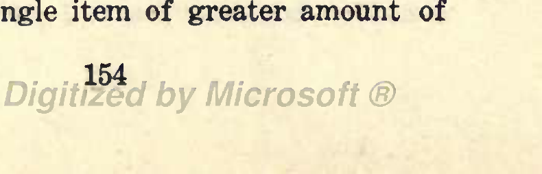

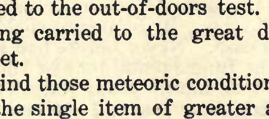

## VIOLIN TONE-PECULIARITIES.

tone, but "wolf" in an isolated tone is a different proposition for solution. Once I had been asked to remove "wolf" from the E-string of an old violin. 'Twas a case of "wolf" on g, and g sharp in alt. This old violin bore ample evidence that genera- tions had devoted their time to moving the sound- post. In this work, the right edge of the right exit has been worn away i inch; and both plates were bruised in a circle 1 inch in diameter by the shifting ends of the post. Not being able to de- termine the cause of "wolf" by use of the bow, I removed the sounding-board. To all appearances, the workmanship within this old violin was fault- less. I could not see any cause for "wolf;" yet, I positively knew "wolf" existed, and, as above in- dicated. Being curious to know the graduation of this sounding-board, I employed the calipers, and thereby found reasons for "guessing" at the cause of "wolf" tone in this case. Here is what I found by the use of the calipers: The builder, exercising the extreme of caution in reducing thickness of wood beneath the E-string, had gone beyond the limit of safety in such work; but, only a very little beyond. Under such meteoric conditions as here- tofore have been carefully and repeatedly describ- ed, the intensity of tone, belonging to the E-string of this violin surpasses all other E-strings which I have subjected to the out-of-doors test. The tone of this E-string carried to the great distance of 1480 lineal feet. [Bear in mind those meteoric conditions, because a change in the single item of greater amount of

154

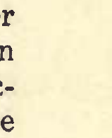

## VIOLIN TONE-PECULIARITIES.

water vapor present at the moment of making the long distance, out-of-doors test, might double, and even quadruple this distance.] The greater power of tone possessed by this E- string concentrates interest in two factors. (a) Graduation of sounding-board beneath the E-string. (b) Enlargement of the area of the right exit. Briefly, I will describe the graduation beneath this E-string: At the position of the bridge, thick- ness equals 7-64 inch; thence gradually diminishing down to 4-64 at a point half-way from the bridge to the upper end of the plate; from this point to the end of the plate, thickness gradually increases to 9-64. Evidently, this form of sounding-board results in the production of two tapering springs between the bridge and the upper end of the plate. Practically, these tapering springs are attached to each other at their thinner extremities. It is evident that the spring farthest from the bridge is the stronger. It is well known that the stronger spring acts with greater rapidity than the weaker spring. It is evident thdt action of either of these two springs must excite action in the other spring. Because of differing degrees of thickness, it is evi- dent that such action must vary in numbers per second; therefore, these two springs, striking upon contained air at differing number of blows per sec- ond, produce two simultaneous tones; and, these two tones, being pitched at inharmonious keys, op- erate to produce "wolf." There are two methods available for remedy: (a). Equalizing spring

155

## VIOLIN TONE-PECULIARITIES.

action by reducing thickness of the stronger spring, (b). Equalizing spring-action by short- ening the weaker spring. Because of the danger of weakening tone-power by the first method, therefore I chose the second. Should the second method prove unsuccesssul then I would know the necessity for employing the first. But, the second method proved successful. Practical application of the second method consisted in gradually mov- ing both the bridge and sound-post upward, or for- ward. A curious phenomenon appeared upon E- string tone as the bridge and post approached their final resting place. That phenomenon was present- ed by shifting of the "wolf" from g, and g sharp to g sharp and a, thence, to a and b flat, and, at the next move the "wolf" disappeared. [Enlargement of the right exit in this violin, not being in point, need receive no further notice at this moment.] I return to the Anderson violin. Upon opening this violin, the cause for "wolf" was not apparent at the first glance. Without employment of the calipers, I could determine that graduation of the sounding-board was not the cause; yet, upon the sounding-board must the cause be found. While looking at the interior surface, and feeling quite uncertain of success in this case, I noticed an unusual obliquity in position of the bar. [Sometimes the doctor's diagnois of an obscure malady must depend upon negation; 'tis not this, nor that, nor the other, and so on by exclusion un-

156

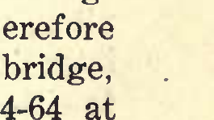

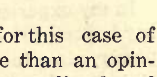

## VIOLIN TONE-PECULIARITIES.

til there remains but few, or but a single probable cause. But to the doctor, there's a difference be- tween the fiddle patient and human patient. In presence of the former, the doctor need not trouble himself to "look wise."] By measurements, I found that the upper end of this bar crossed the line of the G-string, crossed the line of the D-string, and reached a point be- tween the D and A-strings. Because of not find- ing any other detail appearing as a probable cause for "wolf" upon open G, I therefore removed this bar and placed another bar with the center of its thickness directly beneath the center of the left bridge-shank, and with an obliquity equaling obliq- uity of the G-string, not greater nor less. When again in playing order, there was no "wolf" whatever upon any string. In attempting an explanation for this case of "wolf," I can submit nothing more than an opin- ion. Thus: Believing that certain sounding-board fibers, beneath each string, act to produce all pos- sible tones upon each string, therefore, in this case, I think the great obliquity of the bar caused "wolf " upon the open G tone, and my reasoning is as follows: The graduation of this sounding- board, being a modification of Stainer, therefore greatest thickness was at the position of the bridge, and thence thickness diminished down to 4-64 at all points near the edges and at the ends of the plate. Thickness at the bridge equaled 10-64. Therefore the thinnest part of this sounding-board, beneath the G-string, lay above the bar; not above

157

## VIOLIN TONE-PECULIARITIES.

the upper end of the bar, the upper end of the bar lay at a point between the D and A-strings. Bear- ing in mind the great obliquity of this bar, it is evident that sounding-board fibers beneath both G and D-strings are shortened from left to right. Thus, the longer fibers are beneath the G, the shorter fibers are beneath a point between D and A. It is evident that when these varying lengths of sounding-board fibers are aroused to action producing sound, that there must be more than one sound, or one tone. I know no way to determine the exact number of these sounds. I surmise that some of them, being at an inharmonious pitch with open G, operated to produce "noise," or "wolf" tone thereon. The cure was complete. In my experience, increasing the length of the bar beyond 10 inches operates to diminish tone- power, also, to diminish duration of tone. This statement is made with the understanding that the amount of wood in both bar and sounding-board has been accurately adjusted for the production of the maximum of tone-power. Keeping this fact in view, I state that shortening the bar, other di- mensions remaining equal, operates to lower tone- pitch, to increase volume of tone, and to diminish intensity of tone; also, conditions as above, adding to either thickness, or depth of bar, operates to raise tone-pitch and to diminish tone-power. The position of the bar may operate to increase tone- power of the G-string, and, at the same time, to diminish tone-power of the D-string. Thus, when

158

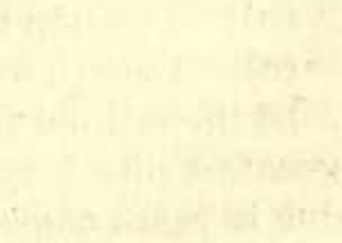

VIOLIN TONE-PECULIARITIES. the distance between the upper end of the exits equals 1 and 5-8 or 1 and 11-16, then, placing the left side of the bar flush with upper end of the ex- it operates to increase G-string power while dimin- ishing power of the D-string.

159

## VIOLIN TONE-PECULIAKITIES.

LECTURE X. GENTLEMEN: There are violin users who prefer such unequal tone-power. It is my experience that too great prominence of G-string tone is not most agreeable to the listening ear, especially when ap- pearing upon the solo violin. I deem this point to be of sufficient importance to warrant repetition of a previous statement that the beautiful harmony from evenly balanced strings, played in double-stops, is the chiefest attraction in solo violin music. (6) . The post is at once the most aggravating, powerful, indispensable, innocent appearing thing within or without, around or about the violin. It does not fall down so often as it makes us fall down. Had it but ability to laugh, 'twould be the chief "monkey." To the violin user, the post is the chief object of solicitude. Its power for good is angelic. Its power for evil is Satanic. Can this innocent-appearing thing command the power to diminish both volume and intensity of violin tone? Let it but fall down there you are! Because I enjoy frequent shots at this angel-imp, therefore, as a subject, it will not be exhausted at once. At this moment I will call up but three points connect- ed with the post which operate to diminish volume and intensity of tone: (a) . Mass of post. (b) . Position of post. (c) . Length of post. In the ordinary condition of the right exit, the greatest effect upon volume and intensity of tone, due to mass of post, cannot be demonstrated. En-

160

## VIOLIN TONE-PECULIARITIES.

largement of this exit affords an opportunity for entrance of a post having great mass. Although mass of post does not diminish tone-power to the same degree produced by some other factors, yet, such diminution is perceptible. I know of no hard- and-fast rule governing the mass of post. Like many other factors affecting violin tone, that mass of post which is best for each violin can only be determined by trial. (b). Position of post exerts greater influence upon tone-power than mass of post; that is, upon any mass which I have tried. In early life I re- member reading that the proper position for the post is i inch below the right foot of the bridge. In later life I learned to unlearn that lesson. I had to learn that the position for the post varies as the variations in sounding-board rigidity. All effects upon tone, due to the post, are manifested princi- pally upon the A and E-strings; and such effects may be largely directed upon either of these strings by position of the post. When that position is found which equally supports the A and E-strings, then, moving the post to the left operates to di- minish the tone-power of the E; and, per contra, moving the post to the right, diminishes tone-pow- er of A. Again, moving the post downwards, oper- ates to diminish tone-power of both A and E. Again, placing the post above the bridge operates to diminish tone-power of the A and E-strings in an amount equal to the re-inforcement due to sym- pathetic action between these strings and that part of the sounding-board beneath them. Placing the

161

## VIOLIN TONE-PECULIARITIES.

post above the bridge operates to transfer sound- ing-board action to the lower-half of the sounding- board; per contra, placing the post below the bridge operates to cause sounding-board action in the upper-half. I desire to be understood as refer- ring only to that sounding-board action aroused by action of the A and E-strings; also, that in either of these two positions for the post there is no per- ceptible change produced in the tone of the G and D-strings. [Upon a later occasion will appear a practical demonstration for the fact that the lower, right- quarter of the sounding-board does not act to pro- duce sound-waves when the post is placed below the right foot of the bridge.] Placing the post directly beneath the right foot of the bridge operates to diminish tone-power. In this position of the post, it is evident that a blow from the strings is expended equally upon both plates; yet, as I view this matter, the sounding- board continues to strike the greater blow upon contained air because of its greater proximity to the strings. This view is based upon the fact that sympathetic action diminishes as the square of the distance, or stated in the reverse way, proxim- ity augments sympathetic action. [To the violin tone-regulator there are experi- ences with humanity that possess more than pass- ing interest. Indeed, some of those experiences leave an impression upon memory equally as unfad- ing as the impression on "burnt wood." Thus: After you have carefully adjusted sounding-board

162

## VIOLIN TONE-PECULIARITIES.

thicknesses to respond to the action of the guage-2 strings, after the interior surfaces are carefully prepared, after the area of exits has received at- tention, after the finger-board has been carefully prepared and adjusted, after selecting and testing different densities in different bridges, after select- ing the choicest strings, after determining the ex- act position for bridge and post, after testing the tone for evenness of power in two octaves on each string, testing quality of double-stop tones, testing brilliance of tone, testing pizzicato tones, testing harmonics simple, harmonics melodic, harmonics a bassa, after pronouncing your work completed to the limit of your ability: Enter Mr. Addlepate. (Mr. A.) "I'm looking around for a first-class violin for my own use. Didn't know but I might find one at your place." Rather confidently, you place in his hands a com- pleted violin, telling him that this one is about as good as you can turn out. (Mr. A.) "May I take it home and try it? I'll take good care of it." "Certainly." After a month or two, re-enter Mr. A. (Mr. A.) "Say, this violin hasn't got just the tone I'm wanting think Sam Jones has got one a little better'n yours." As you glance at that violin your breath makes a gasp. Your carefully adjusted sound-post is gone. Standing in toward the center, and leaning backward, is a white-oak post, whittled down with a dull jack-knife; a deep notch is cut around near

163

## VIOLIN TONE-PECULIARITIES.

the upper end; in that notch is a doubled-and-twist- ed dirty cotton string tied fast with a square knot; either end of the string, passing out through either exit, is carried around behind the back, there tied in a bow knot; thence hangs 1-4 yard of festoon. "What makes you gasp so?" "Can't be that white-oak post?" "N-n-o!" "Possibly 'tis that festoon?" Under such provocation, there is but one way to manifest patriotism. That one way consists in di- recting an enthusiastic kick to the seat of Mr. Ad- dlepate's understanding. You can't miss it.] (c). Length of post, when so great as to bend the sounding-board upward, diminishes volume and duration of A and E tone, but, does not diminish intensity -in an equal degree. In fact, the post of too great length frequently operates to increase in- tensity of tone from these strings. Such augment- ed intensity of A and E-string tone is considered valuable by some violin users, especially by first- violin players in positions where sound-waves are propagated only with difficulty. The post of great length also operates to diminish power of G and D- string tone. Thus, the post manifests its power for good and for evil. (7. ) The bridge is a powerful factor in dimin- ishing both volume and intensity of tone; but, its greatest influence is manifested upon volume. The bridge possesses seven features of vast interest to the violin student:

164

## VIOLIN TONE-PECULIARITIES.

(a). Height. (b). Thickness. (c) . Span between shanks, or pedestals. (d). Density of fiber. (e) . Scroll work. (f). Maturity of wood. (g) . Position upon the sounding-board. (a) . Height of bridge may be either so high, or so low as to diminish both volume and intensity of tone. The problem of the bridge I am unable to solve without a partial solution for the finger-board problem. For the sake of clearness, it is first nec- essary to consider the finger-board insofar as prox- imity to the sounding-board is concerned. If the finger-board did not extend over the sounding- board, then the problem of bridge-height could be solved by itself. That part of the finger-board ex- tending over the sounding-board, may operate to diminish both volume and intensity of tone. This fact can be easily demonstrated. Thus: Upon a violin, having a height of arch equaling f inch, lowering the finger-board down to | inch from the sounding-board causes a weak and thin tone, even with a corresponding diminution of bridge-height. As I view this phenomenon, the reason for such loss of tone-power is as follows: Lowering the finger-board brings its surface line nearer to a par- rallel with the line of the sounding-board. It is apparent that, were these two lines perfectly par- allel, then all sound-waves, originating beneath the finger-board, would be reflected directly back upon the sounding-board; and, because of only traveling

165

## VIOLIN TONE-PECULIARITIES.

a short distance, those reflected sound-waves must strike upon the sounding-board with their initial force; a force great enough to diminish the ampli- tude of sounding-board oscillation. It is apparent that such diminished amplitude operates to dimin- ish the force of succeeding blows delivered by the sounding-board upon contained air. Hence the loss of tone-power. The problem of the finger-board involves the line of its under surface, and the placing of such line at the nearest distance from the sounding-board possible while preventing the reflected sound-waves from striking upon the sounding-board in such a manner as to diminish amplitude of its oscillation. As previously stated, I find the best lines on the under surface of the finger-board to be a straight line at the bottom of the hollow, and that the hol- low extends well towards the base of the neck. The latter point should be governed by the gradu- ation of the sounding-board, and the arching. Thus, when the graduation places the thinnest part of the sounding-board at a point half way from the position of the bridge to the upper end of the plate, then the hollow of the finger-board must not extend to the base of the neck, but should extend to a point 2 inches, or slightly more, from the base. [Upon a later date this form for the under sur- face of the finger board, together with this form for sounding-board graduation, slightly modified, will be described in the production of maximum tone-power.] It is plainly apparent that the set of the neck

166

## VIOLIN TONE-PECULIARITIES.

may operate to place the finger-board near to, or distant from the sounding-board. It is also appar- ent that when the point of widest sounding-board oscillation is nearer to the end of the plate, the greater must be the distance to the under surface of the finger-board, because the longer the hollow, the less the obliquity of the line of the hollow, the more direct the return of sound-waves to the sounding-board. There yet remains consideration of the high- arched plates. In these cases, the under-surface line of the finger-board, and its distance from the sounding-board must be quite the reverse; the low- er end of the finger-board must approach much nearer the sounding-board, while the under surf ace should be flat. At first thought, these facts seem incredible. I confess to astonishment when first seeing and playing upon a Carl Johann Flick- er. As you know, this violin is built upon enorm- orous waist-lines. The hollow at the lower end of the finger-board, (guessing at it) was less than i inch distant from the sounding-board. The height of the bridge was correspondingly lowered. Before applying the bow, I expected to hear a weak, thin tone. But, its volume was great enough, and, intensity seemed to be of the average degree for the arch. I had no opportunity to determine the height of arching given to the Flicker plates. I could see that the long arch was quite equally dis- tributed from the ends of the plates to the position of the bridge. Upon studying this situation, it be- comes apparent that to raise the lower end of this

## VIOLIN TONE-PECULIARITIES.

finger-board to a height enabling its under surface to reflect sound-waves towards the bridge is im- practical, not impossible, simply impractical; and because the prodigious height of the strings would cause too great difficulty in playing. The Flicker was not difficult of playing. Thus is shown the fact that the height of the bridge must depend upon the height of the finger- board, and the height of the finger-board should depend upon the height of plate- arching. In the case of the Flicker violin, the flat under surface of the finger-board, resting upon a high neck, operated to direct sound-waves towards the neck, and apparently, such is only the practical plan for violins having the greatest height of arch. The Flicker exits were unusually large, and appear- ed to be unusually close together. The spring of arch began directly within the purfing. To these facts do I attribute the unusual tone-power of this violin in comparison with the tone-power of other violins in its class. It is evident that increasing width of the finger- board increases the number of sound-waves reflect- ed'back to the sounding-board; therefore, such in- crease in width operates to diminish tone- power. The finger-board is a necessity, yet, with best'possible adjustment, the finger-board operates todiminish i violin tone-power. Thus, the width, the reflecting, under-surface line, and the distance of such 'line "from the sounding-board, are potenti- alities of the finger-board demanding the closest attention from the violin tone-regulator. Lack

168

## VIOLIN TONE-PECULIARITIES.

of such attention brings penalties. In the matter of distance between the sounding-board and under- surface line of the finger-board, hard-and-fast rules cannot apply only upon the condition that the arching and graduation of the sounding-board govern the rule. The desired height of the strings from the fing- er-board, and the position of the bridge upon the sounding-board govern the height of the bridge. Height of strings above the finger-board may quite safely be allowed some latitude to accommodate different taste. My own choice for this height is -b> clear, throughout. Some prefer a greater height for the G, and less height for the E, while some prefer a greater height throughout. I once knew a proficient violinist, having an unusual length of hand and fingers, who placed the strings i inch above the lower end of the finger-board. I asked whyfore? He replied, "Because of two reasons; one being the fact that my violin yields greater power of tone; the other being the fact that pizzi- cato tones are clearer." I do not find his first reason to hold good in all cases; but, on the con- trary, I have known tone-power to be weakened by thus raising the strings. Clear pizzicato tone is very desirable. The snap- ping pizzicato tone due to string-oscillation receiv- ing interference from the finger-board, is some- thing inadmissable. To secure clear pizzicato tone, while yet leaving the strings at or less, from , the lower end of the finger-board, I resort to the following treatment of the upper finger-board

169

VIOLIN TONE-PECULIARITIES. surface. With a small block-plane I dress away this surface until its line presents a slight curve from end to end. The least wood is removed from beneath the E, and the greater amount from be- neath the G, and because of the fact that amplitude of string-oscillation becomes wider from E to G. The lowest point in this curve, determined by the straight-edge, is not placed higher than c in alt, and because of the fact that shortening a string oper- ates to diminish amplitude of its oscillilation. Further consideration of the bridge will be re- sumed at the next hour.

170

## VIOLIN TONE-PECULIARITIES.

LECTURE XI. GENTLEMEN: Diminution of volume and inten- sity of violin tone by the bridge is resumed. (b) Thickness of the bridge may be so great as to become a potent factor in diminishing both vol- ume and intensity of tone. A demonstration for this fact is very easy of accomplishment. Although this fact comes within the daily observation of vio- lin students, yet, because only a small minority of such students trouble themselves with the philoso- phy involved in tone-modifiers, and, because ac- quaintance with certain physical laws is of value to the violin tone-regulator, therefore it seems ad- visable to give consideration to such laws. Certain physical laws are valuable to violin tone insofar as human ingenuity can apply them. In such appli- cation lies a difficulty. In all my long-time appli- cation there has been but a single result of marked value to violin tone following a priori reasoning. I find the problem of bridge-thickness to be com- plicated with four inevitable factors: (a) Height of finger-board (b) Height of arching. (c) Diameter of strings. (d) Density of fiber. (a) As previously shown, the height of the bridge is governed by the height of finger-board, yet, this statement is subject to modification. Be- cause two violins have precisely similiar height of finger-board, it does not follow, as a necessity, that the bridges have precisely similiar height. This fact is due to dissimilarity in height of arching

171

## VIOLIN TONE-PECULIARITIES.

at the position of the bridge. Doubtless many, if not all violin students have observed that some makers place the highest point in the arching at the position of the bridge, while other makers place the highest point upwards, or forwards from the po- sition of the bridge. It is evident that this dissim- ilarity necessitates dissimilarity in bridge-height. [Although not here in point, yet, fear of omis- sion makes me call attention to placing the highest point of the arch, (longitudinal arch) at position of the bridge, Within my observation, placing the highest point of arching at position of bridge, op- erates to increase tone-power' From my view point, the reasons for such increase are two in number, and thus: First: Diminishing height of bridge permits diminution of bridge- thickness; hence, diminution in the muting effects from a greater mass of wood in the bridge. Second: Placing the highest point in plate arching forwards of, or upwards from position of the bridge operates to diminish the amplitude of sounding-board oscil- lation beneath the strings; hence, diminished pow- er of tone.] It is evident that thickness of the bridge may operate to mute violin tone. It is also evident that diminution in bridge-height permits diminution in bridge-thickness. It is observable that diminution of bridge-thickness, down to the point of sustain- ing string-pressure without bending, operates to deliver upon the sounding-board a greater force from blows of the strings, Hence, both diminish- ed height and diminished thickness of bridge op-

172

## VIOLIN TONE-PECULIARITIES.

erate to diminish tone-power. [At a previous hour it was shown that proximity of vibrating bodies, susceptible to identical force, operates to augment sympathetic action. For this reason, loss of sympathetic action between the strings and that part of the sounding-board be- neath the strings might be considered as one of the modifiers operating to diminish volume and inten- sity of violin tone; but because the list of such tone- modifiers already reaches the number 12, and, be- cause of failure to find two more such modifiers, therefore I decline to permit sympathetic action, (with its number 13) a chance to "hoodoo" my work. (c) Diameter of violin strings largely, (not wholly) governs downward pressure upon the ' bridge. It is apparent that the smaller string-dia- meter causes less downward pressure upon the bridge by reason of less tension demanded in tun- ing. Therefore, to produce maximum tone-power from smaller strings requires diminution of bridge- thickness proportionate to diminution of string- diameter. The exception to string-diameter gov- erning downward pressure upon the bridge lies in plate-arching. It is evident that, with no arching whatever, downward pressure by the strings is at the minimum; and, because of the fact that the strings are at the least practical distance above a straight line from saddle to nut. At such straight line, the downward pressure being zero, it follows that every degree of bridge-height above this line operates to increase downward string-pressure.

## VIOLIN TONE-PECULIARITIES.

Therefore the higher the plate-arching, the greater is downward string-pressure upon the bridge. Therefore arching becomes a factor in determining bridge-thickness. Thus is shown the fact that hard- and fast rules cannot apply to violin bridge-thick- ness, (c) The span between bridge-pedestals, or shanks, while not being a potent factor in diminish- ing tone-power, yet it is a factor demanding atten- tion. By being either too great, or too small, this span operates to diminish amplitude of sounding- board oscillation, and therefore diminishes tone- power. There are two factors governing bridge-span: Position of bar. Distance between exits. According with my observation, failure in plac- ing the center of the left pedestal over the center of bar-thickness operates to diminish D-string tone- power. Again, placing the center of the right pedestal over sounding-board fibers cut off by the right'exit operates to diminish E-string tone-pow- er. The bridge, without pedestals whatever, possesses interest, thus: In those cases wherein a hollow tone of great volume, but of weakened in- tensity, caused by too great reduction of sounding- board rigidity in its central area, the bridge with- out pedestals, carefully fitted to lateral curve of the sounding-board, operates to augment A and D- string tone-power; not greatly, but perceptibly. Upon that sounding-board possessing sufficient rigidity in its central area, I do not find that the bridge without pedestals operates to either aug-

174

## VIOLIN TONE-PECULIARITIES.

ment or diminish tone-power of any string. In this respect I find the bridge without pedestals to operate precisely as the re-enforce block glued transversely upon the inner surface of the sound- ing-board at the position of the bridge. [In experimental work, I have placed such re- enforce block upon 17 different sounding-boards having varying degrees of rigidity in their central areas. The .benefit to tone therefrom was only manifested upon such sounding-boards as were reduced in thickness sufficient to cause weakened A and D-tone. Upon such sounding-boards as pro- duced strong A and D-tone, the re-enforce block neither operated to diminish nor augment tone- power of any string.] Density of fiber is a powerful factor in the bridge. Either softest fiber, or densest fiber operates to di- minish tone-power. Without doubt, this fact is due to failure in transmission of force from strings to the sounding-board. In the case of the violin, it is apparent that force from the strings can be only communicated to the sounding-board by the vibratory action of connecting media, as the bridge, and air. Such transmission is not confined to the bridge by any means. Sympathetic action between strings and sounding-board is wholly due to the presence of air as a connecting medium. The po- tency in sympathetic action I find to be eminently worthy of consideration by the violin student. I know of no easier demonstration for such potency than as follows: Remove the bridge, and, over the tail-block, place a bridge of sufficient height to

175

## VIOLIN TONE-PECULIARITIES.

maintain the strings at their usual height above the finger-board. [To make a precise test for the potency in sym- pathetic action, it is a necessary condition that the strings be not attached to the violin. In either method, tone-power from sympathetic action is surprisingly great when sounding-board rigidity corresponds to string-diameters, in other words, to string-force; but, when such rigidity is too great, then the power of sympathetic tone is diminished, and diminished because maximum sympathetic act- ion between two contiguous, vibrating bodies de- mands equal susceptibility to force. Such sympa- thetic tone is also diminished by area of the exits.] The greatest density in any bridge I have tried is found in one made of bone. The density in this bridge modifies tone in a peculiar manner; both volume and intensity of tone being greatly dimin- ished, while the little tone remaining is remarkably thin> and of an excruciatingly stinging quality. The bridge of softest fiber to which I have given trial, is selected from soft Michigan pine. This bridge operates to diminish both volume and inten- sity of tone, but, it also operates to diminish dis- agreeable quality of tone. Upon the violin of noisy tone, I have not observed failure of improvement in disagreeable tone-quality to follow employment of this soft wood 1 for the bridge. The thickness of such bridge cannot be reduced to the same degree as the maple bridge because of greater ease in bending under string-pressure. Asperity of tone may be greatly reduced by employing such soft

176

## VIOLIN TONE-PECULIARITIES.

wood for both bridge and post. Scroll-work upon the bridge has a more import- ant mission than mere ornament. It is my exper- ience that the "whole," or "solid" bridge, of any wood whatever, operates to diminish tone-power. Could thickness in the "solid" bridge be diminish- ed until its vibratory action becomes equally sus- ceptible to force as the scroll-cut bridge, then scroll-work would become merely ornamental. But, such diminution of bridge-thickness is imprac- ticable because downward pressure of the strings operates to bend the "solid" bridge when thus re- duced in thickness. It is a fact that bending the bridge operates to diminish the amplitude of its os- cillation; hence bending the bridge operates to di- minish tone-power, and, in precisely the same way as bending the sounding board. Obviously, thick- ness of the bridge must be great enough to hold the bridge erect under string-pressure. Because string-pressure varies with height of plate-arching and diameters of strings, and, because different samples of bridge-wood present differing degrees of rigidity, therefore hard-and-fast rules for bridge-thickness cannot apply. In this matter, I know of no successful rule other than the usual " rule, ' 'Cut-and-try. Experience demonstrates that the "solid" bridge, thick enough to stand erect under 25 to 28 pounds of string-pressure, possesses mass sufficient to appreciably mute the tone. Experience also demonstrates that some part of such mass may be safely removed from cer- tain parts of the bridge without diminishing rigid-

177

## VIOLIN TONE-PECULIARITIES.

ity to the point of bending. Such diminution in mass is secured by the famil- iar scroll- work: The location and extent of scroll-work upon the bridge by no means should be left to chance; and because mal-position and extent of such work may operate to cause unevenness in tone-power. Thus, after every other minute detail in construction, op- erating to produce evenness of tone-power, has re- ceived the limit of attention, yet, mal-position and extent of central scroll-work on the bridge may re- main to defeat the most skillful violin builder who- ever felt the impulse of ambition. As I hold this bridge up to your view, you ob- serve the location and extent of the central scroll, and also the scroll-work at either end. Near to either end, you observe an isthmus, or narrow neck between the central and end scrolls. As you ob- serve, these necks connect the upper and lower- halves of the bridge. It is apparent that all vibra- tory action in the bridge, aroused by action of the strings, must travel downwards through these nar- row necks. It is evident that diminution of these necks operates to modify transmission of vibratory action. It is also evident that inequality in the di- mensions of these necks operates to cause unequal susceptibility to force. It is also evident that force in violin strings varies as their diameter and weight. Hence, it becomes obvious that equality in the dimensions of these necks operates to dimin- ish tone-power of the smaller strings. Therefore, for production of evenness of tone-power, dimen-

178

## VIOLIN TONE-PECULIARITIES.

sions of the neck beneath the A and E-strings should be less than dimensions of the neck beneath the G and D-strings; and, such diminution in mass should be in the same ratio as the diminished diam- eters of the strings. Here is a dozen high grade bridges. With a machinist's rule I determine dimensions of their isthmi between central and end scroll-work. I find thickness of those isthmi to be i; but, in their width, I find variation, from equality, to be 1-16 inch. It is plainly apparent that such variation in mass may be turned to good account in the work of se- curing evenness of tone-power. Thus: Placing the larger isthmus beneath G and D-strings operat- es to equalize transmission of force. It is also ap- parent that diminishing thickness of these isthmi permits the bridge to bend under string-pressure; but, diminishing their width cannot cause such dis- astrous result. It is also apparent that the dimen- sions of those isthmi should be governed by string- pressure; and, because such pressure varies with varying degrees of plate- arching and string-diam- eter, therefore, for such dimensions, hard-and- fast rules cannot apply. (f ) Maturity of bridge-wood, (maturity of tree before jbeing felled) is a powerful factor in the list of tone-modifiers. Such maturity is of equal im- portance with maturity in sounding-board wood. In the absence of maturity from either lies defeat of tone quality. The reasons for taking sounding- board wood from that part of the log between heart-wood and sap-wood apply equally to bridge- wood.

179

## VIOLIN TONE-PECULIARITIES.

LECTURE XII. GENTLEMEN: (g) Position of bridge is an im- portant tone-modifier. So important is it that mal- position may utterly annihilate "richness" of vio- lin tone, even when all other factors are at their best. I recall that case of "wolf" which was com- pletely cured by position of bridge and post. I also recall the fact that harmonics a bassa, or resultant tones of the text-books, tones assisting in produc- ing "rich" violin tone, will become audible only when length of strings, (from bow to nut, not from bridge to nut) and the active length of sound- ing-board are equal. Thus: Because the bow practically shortens the strings by one inch, and because the greatest length of sounding-board ac- tivity, productive of audible sound, equals 12 inch- es, therefore, for production of the "rich" violin tone, the length of strings, from bridge to ' nut, must equal 13 inches. But, in tone regulation work, the above rule cannot be interpreted as a hard-and-fast rule. Within my observation, there is one point, and but one, for that position of the bridge yielding greatest richness of tone; and, by no means am I able to precisely pre-determine such position. Experiment on each sounding-board must be depended upon for precise determination of the best bridge-position. I close discussion of the violin bridge with the unqualified statement that all bridges of immature wood, (always sap-wood) are best disposed of as firewood. (8) The finger-board problem comes next in the

180

## VIOLIN TONE-PECULIARITIES.

list of factors operating to diminish volume and in- tensity of violin tone. Because of my inability to solve the problem of the bridge until after solving the problem of the finger-board, therefore the fing- er-board was given priority in presentation. At this moment I cannot call up anything further to say upon this tone-modifier. (9) The strings are a very important factor in diminishing violin tone-power. Their importance is clearly shown by the fact that sounding-board rigidity must be governed by string-diameters and weight. In my statement concerning violin strings, the wire string receives no consideration further than that it is an evil made necessay by evil situa- tions; that is, situations wherein excess of water vapor operates to quickly ruin gut strings. In all cases where sounding-board rigidity is determined by large strings, then substitution of smaller strings operates to diminish tone-power. It is my obser- vation that in all cases wherein sounding-board rigidity is precisely reduced to correspond with force in guage-2 strings, then substitution of larger strings operates to augment volume of tone while diminishing intensity of tone. Thus, at nearby distances, tone is greater; but is a failure at long distances. I find a satisfactory explana- tion for this phenomenon to be a matter of difficul- ty. As an aid to such explanation, I call attention to the fact that larger strings, played in double- stops, cause violent trembling of such sounding- board. It seems reasonable to suppose that trem- bling of the violin may be so great as to weaken

181

## VIOLIN TONE-PECULIARITIES.

tone in view of the fact that violent trembling of the horn operates not only to weaken tone, but also, perceptibly to lower tone-pitch. It is a fact of more or less frequent observation that the over- forced tone from any horn in a brass band is out of tune with other horns, and out of tune because of being- lowered in pitch. It seems to me that such lowered pitch is caused by the violent trembling of the instrument. That such tone is weakened in intensity is clearly perceptible. Again, in orches- tra ensemble, tone from the violently trembling violin may be totally annihilated by sound-waves from harmony instruments. For this fact there appears no reasoning so plausible as diminished in- tensity in the tone of such trembling violin. Again, in the chorus, when any member indulges in vio- lent tremolo, it is at once apparent that his, or her, (too often "her," more's the pity) voice is not only weakened, but, is so much out of tune as to be- come sickening to the musically trained listener. Again, strings of too great diameter operate to ac- centuate noisy tone-quality. Thus, whatever may be the correct explanation, the fact remains that employment of strings., having too great force for sounding-board rigidity, or for back-plate rigidity either, is but inviting disaster. From my view point, 'tis safer to err in the opposite direction be- cause smaller strings operate to diminish noisy tone-quality. The "twist" and number of "strands" in the strings may operate to diminish both volume and intensity of tone. Thus, the string of but a single

182

## VIOLIN TONE-PECULIARITIES.

strand operates to diminish tone-power. The rea- ' son is obvious. In such string, flexibility being at the minumum, therefore rapidity in winding and unwinding under bow-pressure is greatly diminish- ed; therefore diminished force in blows delivered upon the bridge must follow. Flexibility in violin strings operates to augment rapidity in winding and unwinding; hence the flexible string delivers a blow of greater force. Weight of strings may also diminish tone-power. To be equal in weight, the silk string must be given increased diameter, while the steel string must be given diminished diameter. In all cases evenness of tone is diminished by dis- proportionate diameter and weight of strings. As a violin tone-modifier, the subject of strings pos- sesses vast interest to the student of tone peculiar- ities. The tone of the finest violin ever built may be easily ruined by the strings employed. In my observation, the choice in metal for winding the G- string should be governed by the tone-peculiarities inevitable to each individual violin. In equal quan- tity, copper, silver and gold vary in weight. Whenever I have found a copper- wound string pre- cisely fitting the tone-peculiarities of a certain vio- lin, then substitution of either silver, or gold- wound G has proven to be a disappointment. In precise adjustment of the G-string, it is my method to make trial of such strings as have differ- ent diameters. After determining that diameter giving best results in double-stops, then I select one of slightly greater diameter and give it time to stretch. Then, while in position, and in tune, I

183

## VIOLIN TONE-PECULIARITIES.

proceed to diminish both weight and diameter with an inch-square piece of emery-cloth. With precis- ion as an object, the emery-cloth, folded once around the string, and firmly held by the thumb and fing- er, is made to travel from bridge to nut, then, slightly turned and made to travel back to the bridge. This operation is frequently interrupted by application of the bow, and for the purpose of knowing the moment when such reduction in diam- eter and weight has reached the desired point. When carefully done, this method largely removes certain rough inequalities of tone inevitable to all new G-strings. When this method is applied upon a G-string having correct diameter, the result is disastrous. Considering the vast value in beauti- ful G-string tone-quality, no amount of work thereon is too great. [Possibly I may be liable to the charge of fre- quent repetition; but I'll take such risk by again stating that beautiful double-stop tones are the sal- vation of the violin soloist. With salvation in view, the G-string must not be offensively prominent. It is possible that I may be hard to please in the matter of violin tone-quality; but, whatever I say upon this point is said only as the opinion of an in- dividual, and said with the acknowledgement that my opinion may be in error. In life I know of no fact more potent than the fact that musical taste varies as the number of people. In my opinion, the tone from a set of steel violin strings is only worthy of anathema. (10) That the condition of interior violin-surfaces

184

## VIOLIN TONE-PECULIARITIES.

may operate to diminish both volume and intensity of tone requires only a thought. Did I recommend spreading a carpet over the inner surface of the violin back, every reader would doubtless pronounce judgement upon me thus: ' 'That Castle is a fool, " or worse yet, "Castle is a fiddle crank." The worst of it is, the "coat would fit." Doubtless many readers think ' 'the coat fits" snug enough when I say that both volume and intensity of violin tone are augmented by a perfectly smooth interior surface. I do say that, and say it with all the earnestness at my command. This problem in vi- olin tone is solved to my satisfaction. If any good quality of tone were injured by the perfectly smooth interior surface, then by no means would this problem be solved to my satisfaction. The question of solving this problem to your satisfac- tion rests entirely with yourselves. I'd never give you the details for interior-surface work were I "out just for health." On the contrary, I'd keep to myself the secret of changing $5-fiddles into $100-violins. If necessary, I can give the names of several quite competent violinists whose $3-fid- dles, (wholesale) are now valued by them at sev- eral hundred dollars. Do not understand me as claiming all this change in tone-value to be due to a perfectly smooth interior-surface; but, you may understand me to say that, without such permanent- ly smooth interior-surface, the owners would not have attached those high prices. I can give the name of one such owner, living within 30-minutes ride of one of the world's largest violin markets,

185

## VIOLIN TONE-PECULIARITIES.

who positively declined to attach a price to his originally $10-flddle. "Did I give details to those owners?" "Certainly not." "Why not?" "Because of the very prejudice you entertain at this moment." Here's a "pointer" intended for your benefit: When any person guarantees the tone of his violin to "carry" 1250 measured feet out in the open and under identical meteoric conditions, and in identi- cal hours of the day, and with identical precaution against the presence of sound-wave reflectors that have been heretofore described, just trouble your- self to ascertain whether or not, the interior sur- face of that violin is permanently and perfectly smooth. 'Again, in all old violins which have not been "cleaned out," and many, very many used violins not yet old in years, I assure you of finding their interior surface covered with a "carpet." Such carpet will be found composed of wood-fiber, wood- dust, and dirt. Here is your chance to test aug- mentation in volume and intensity of tone without injury to any tone-quality, of which I have given assurance in these pages. To all violin users desir- ing-a violin possessing maximum tone-power, I rec- ommend careful application of the details for inter- ior surface*protection, together with other details herein submitted. With careful, painstaking work, I am confident of your success. (11) Area and position of the exits are the most

186

## VIOLIN TONE-PECULIARITIES.

powerful factors operating to diminish volume and intensity of violin tone. Area of exits alone, is more potent than all other factors combined. Startling as this statement may be, yet its correctness is of easy demonstration. Without exits whatever, the finest violins ever built will not, nor cannot yield more tone than the broom- stick fiddle. In such situation, the strings are left with nothing but unconfined air upon which to ex- pend their force. Hence, instead of concentration of sound-wave lines of travel, there is the widest possible dispersion of those lines. Again, in such situation, string force receives augmentation neith- er from direct sounding-board action nor from sym- pathetic action. Without exits, the sounding- board is motionless. Its power is not sufficient to compress confined air. Without exits, the violin descends to the broom-stick level. Hence, without exits without violin. But, a minute opening in the walls operates to permit some action of the sounding-board. In- stantly there follows perceptible augmentation of tone-power; and such augmentation follows placing the opening upon the- back, upon the ribs, upon the sounding-board, wherever you please, but such augmentation does not follow in equal degrees. Those curved walls operate to direct sound-wave lines of travel. As you look at a violin of good model, you instantly perceive that those interior curved walls cannot direct the bounding ball towards the ribs. Were those ribs of glass, no bounding ball would ever break them. Wherever

187

## VIOLIN TONE-PECULIARITIES.

the bounding ball goes, there, also, the sound-wave movement must go. But, there's a difference in the action of a single ball and countless number of balls touching each other. Air molecules, being balls possessing immense elastic energy, and not moving away from that position occupied at the instant of receiving a blow, operate to produce sound-waves by communicating elastic energy from one to the other; and such communication contin- ues until force in the original blow becomes ex- hausted. It is evident that increasing force in the original blow operates to increase the distance traveled by sound-wave movement. It is also evi- dent that sound-wave movement may be either dis- persed or concentrated; also, that concentration of such movement operates to augment both volume and intensity of tone, but, in unequal degrees; in- tensity being augmented in the greater degree. It is apparent that interior walls of the violin body not only prevent dispersion of sound-wave move- ment, but also because of longitudinal and trans- verse arching of the plates, operate to concentrate such movement. It is apparent that the point of sound-wave concentration within the violin must vary with varying degrees of plate-arching. To precisely determine such varying points is the des- pair of scientists. It is evident that placing the exits at points of greatest sound-wave concentra- tion becomes a powerful factor in the production of maximum tone-power; also, that placing the exits at a distance from such points of concentration op- erates to diminish tone-power.

188

VIOLIN TONE-PECULIARITIES. "How may we find those points? "Don't ask the scientist. " Not more can he tell you than Sam Jones can tell you where heaven is. By reason of experience alone, the violin builder will cut out the exits obliquely across the sound- ing-board and trust to luck for hitting those points. Thus, obliquity in position of the exits becomes of immense value to violin tone power. Could those points of greatest sound-wave concentration be pre-determined, then exits in parallelogram form might be employed to augment tone-power. As previously shown, the exit of small area per- mits but a limited degree of sounding-board action, therefore it follows that increasing the area of ex- its operates to permit increased amplitude of sound- ing-board oscillation; hence an increased force of blow upon contained air; hence an increased tone- power. We are now arrived at a point in violin construct- ion possessing intense interest to two classes of violin users; the one desiring quality of tone with moderate volume; the other desiring great volume of tone regardless of quality: From my point of view, interest in violin exits equals interest in sounding-board wood and model of plate-arching. Further consideration of the exits will be con- tinued at the next hour.

189

## VIOLIN TONE-PECULIARITIES.

LECTURE XIII. GENTLEMEN: In resuming presentation of violin exits as tone-modifiers, I take occasion to repeat the fact that the exits are more potent than all other factors combined. Therefore, to violin exits attaches intense interest. "Without exits, with- D^' violin," is equally truthful as, "without sun, with- out light." From pole to pole, all animate objects love the sunshine. From southern habitable limits to northern limits, humanity loves sweet sounds. All over the habitable world, the area and position of violin exits contributes to the sum of human happiness. In diminished area of exits the aesthet- ic violin lover may find solace. In enlarged area of exits, the lover of great volume may find enjoy- ment. In power to command beautiful tone-quality, vi- olin exits stand supreme and alone. Their power to suppress "noise" surpasses all other tone-modi- fiers combined. Blessed are they! Mr. Builder, in cutting out those exits, I pray thee to use occasionly that keen blade with a sparing hand. Sweet Music, keenly watching your work, will sweetly sing your praises in the ear of your cus- tomer. There are yet violin users who will give you an ounce of gold for every pennyweight of wood between the small and the large exit. [There is a large class of violin users preferring quality of violin tone above mere quantity of tone. Without hesitation, I confess membership in such class; but, do not understand me as condemning

190

## VIOLIN TONE-PECULIARITIES.

quantity of violin tone. On the contrary, I hold to the belief that quantity of violin tone is a necessi- ty in certain situations; and, in such situations, quantity of tone is equally valuable with a gun "out west;" either being a necessary evil for sal- vation. What I do condemn is the employment of "big tone" in all situations and upon all occasions. Next to the noisy violin, the violin of "big tone" becomes offensive when employed in other situa- tions than where it belongs; that is, in the large auditoria. Offensiveness of tone is a serious mat- ter, whether or not offense is due to too much or too little tone. It is my desire to assist in prevent- ing employment of the violin in situations arousing contempt for both performer and instrument. Thus: To carry an old violin, whose tone has gone down into dotage, into the larger auditoria and at- tempt to force its once willing tone to farthest expectant ear is not only an act of inexcusable idi- ocy, but, is also a display of heartless cruelty. Pos- sibly the later withdrawal of patronage may grow to become an efficient method for preventing con- tinuance of such distressing displays.] The most wonder-exciting phenomena connected with violin tone are due to area and position of the exits. Even the constancy of these phenomena ex- cites wonderment. There are seven of these phe- nomena, and four out of the seven do not depend upon inherent quality of wood for existence. Nor hard fiber, nor soft fiber nor no fiber at all exert any influence whatever upon those four phenomena. The existence of these four phenomena depends

191

## VIOLIN TONE-PECULIARITIES.

wholly upon air. The seven phenomena connected with violin ex- its are: (a) Position of exits may diminish or increase tone-power. (b) Increasing area of exits augments volume and diminishes intensity of tone. (c) Diminishing area of exits augments intensi- ty and diminishes volume of tone. (d) Diminishing area of exits lowers tone-pitch. (e) Enlarging area of exits raises tone-pitch. (f) Diminishing area of exits diminishes noisy

tone-quality. (g) Enlarging area of exits accentuates noisy tone-quality. In view of this display of facts, there is little wonder that great interest attaches to violin exits. Because of not having a satisfactory explanation for the phenomenon in raising and lowering tone- pitch by enlarging or diminishing area of exits, therefore none is offered; but, in advance, I offer thanks to anyone for such satisfactory explanation. (a) Position of exits may diminish or increase tone-power. This fact is susceptible of conclusive demonstra- tion. Thus: Placing the exits in the ribs of the middle bout, other conditions remaining as usual, operates to diminish tone-power. The reason for such diminution is apparent; the exits thus placed are not in the line of sound-wave concentration. This conclusion is proven by closing such exits, and placing others in the usual position. The

192

## VIOLIN TONE-PECULIARITIES.

striking increase in tone-power following such change in position is the measure of sound-wave concentration in that particular violin; but, is not a measure of such concentration for another violin having a greater or less height of plate-arching. Again, placing the exits nearer to the edges of the sounding-board operates to diminish tone-power, but, the degree of diminution varies with the height of arching; the lower the arch, the less di- minution in tone-power. It is obvious that increas- ing height of arching operates to increase sound- wave concentration in the direction of the center join of the plates; therefore, the higher the arch, and the nearer the exits are placed to the center join, the greater is tone-power. In practice, I find a variation of i in distance from center join to the exits operates to change tone-power when height of arch equals f or more; below f, the change in tone-power is less marked. In this matter, the pattern for exits should vary in width of curve at the ends as the degree of tone-power desired. Thus, with diminished width of curve, the exit may be placed nearer the center- join; width of curve increased, places the exit at a greater distance from the center-join. For position of exits, hard- and-fast rules cannot apply. (b) Increasing area of exits augments volume and diminishes intensity of tone. My explanation for this phenomenon begins upon a well made vio- lin, of good model and good wood, and having no exits whatever, but having other conditions as usual.

193

## VIOLIN TONE-PECULIARITIES.

In this condition, the plates remain motionless and toneless under vigorous bow pressure. Its ad- mirable sounding-board cannot act. Contained air will not permit it to act. Elasticity in air molecules within this violin body is a resisting force vastly greater than force in the strings. Only by per- mitting escape of part of this resisting energy can this sounding-board be excited to action. For the purpose of observing the effect upon this sounding- board, I shall permit escape of such resisting ener- gy in gradually increased degrees. If my reason- ing is sound, then sounding-board activity will increase as escape of resisting force increases. With this object in view, I outline the exits in their usual position, and cut out the smaller round at their upper extremities. Application of the bow now produces sound, but it is a sound of small vol- ume, of low pitch, and of marked intensity as com- pared with volume. It is clear at once that small volume of this sound is due to escape of but a small amount of molecular, elastic energy, but reason for the intensity of this tone is not so clear, while rea- son for its low pitch drives me into the region of mere supposition. I know the supposition of phil- osophers upon this point, but supposition lacks much of being satisfaction. That the varying lengths of air columns confined yield sound of equally varying degrees of pitch is amply demon- strated in organ pipes, horns, steam whistles, and all wind instruments; but, after enlarging these exits to one half usual area, how may we account for the greatly raised tone-pitch following? It is

194

## VIOLIN TONE-PECULIARITIES.

clear that the greater volume of sound following such enlargement is due to greater escape of mo- lecular, elastic energy; also, that such increased escape of energy, by diminishing resistance, per- mits wider amplitude of sounding-board activity; hence greater force in the blow delivered upon con- tained air; hence greater volume of tone. After enlarging these exits to their usual area, application of the bow determines another great addition to volume of tone. Again, after enlarg- ing these exits beyond their usual area, volume of tone is yet increased, tone-pitch is raised, but, in- tensity of tone is diminished, and noisy tone-qual- ity is accentuated. How far such increase in area of exits may be extended without complete ruin to tone-value is one of the demonstrations I have not made. It is evident that such increase has its practical limits. We know that total absence of confining walls per- mits dispersion of sound-waves equally in all direc- tions; that such dispersion operates to diminish in- tensity of sound to the minimum. It is apparent that area of the exits may 'be so great as to permit an amount of dispersion greatly dimiminishing intensity of tone. It is a well known fact in physics that the greatest volume of sound occurs in open air where no confining walls are present. In view of these facts, it is evident that diminishing the area of exits operates to diminish volume of tone, to increase intensity of tone, and to diminish noise. In the work of artistic violin construction, I know of no factor possessing greater importance than

195

## VIOLIN TONE-PECULIARITIES.

area and position of the exits. Considering good material and good model to be present, then area and position of the exits must be relied upon to satisfy the varying tastes of violin users. Thus, that builder who only desires to please the taste for great volume of tone, will place exits of large area as near to the center join as is practical; and, that builder who only desires to please the taste for diminished volume of tone, increased intensity of tone, and diminished noisy tone-quality, will place exits of small area at a greater distance from the center join. From my view-point, it seems but wisdom to be prepared for all varieties of tone- taste; therefore in the work of tone-regulation up- on violins intended for such as prefer quality be- fore volume of tone, it is necessary to cut the exits too small at first, and to increase their area only after application of the bow. In my experience, it is a fact standing out in strong relief that hard- and-fast rules for the area of exits cannot apply. Thus: If a sweet, intense tone is desired, then the exit of large area operates to defeat intention. Again, differing degrees of arching operate to cause differing lines of sound-wave travel; therefore, po- sition of exits must approach to, or recede from the center join as the variations in height of arch- ing; therefore, hard-and-fast rules for position of exits cannot apply. In this matter, as previously stated, the violin builder must rely wholly upon experience and ob- servation. There is no alternative. In this mat- ter, that colossal thing called "science," isashelp-

196

## VIOLIN TONE-PECULIARITIES.

less as an infant. In the case of the bar- rel-shape violin, we may rest assured that the exits are not in the line of sound-wave concentration. Such assurance is based upon the fact of feeble tone-power invariably existing in violins of such model. The tone-power from this rotund violin is but the tone-power of an infant; whereas, the tone-jjower from this flat-model violin, its every line a line of beauty, merely suggesting rotundity, sets every beam of the house into a rollicking two- step. Without a shadow of doubt, the exits of the latter violin are in the line of sound-wave concen- tration. I believe that continued trial might de- termine the precise distance of the exits from the center-join for each degree of arching. With the intention of producing maximum tone-power, such figures would possess value. Oft repeated demonstrations have firmly estab- lished the fact that increasing the area of exits op- erates to raise tone-pitch. I confess this phenome- non seems paradoxical. I cannot divest myself of an impulse to think that the contrary result to tone- pitch should follow enlarging the exits. [Here is a demonstration for the fact that pre- conceived ideas may lead one into error. Often upon arising in the morning at some strange place for which we had formed preconceived ideas of the different points of the compass, the sun seems not to rise in the east. It may appear to rise in the north, and even in the west; and, it may obstinate- ly refuse to rise in the east so long as we remain at that point. Thus am I affected by the phenom-

197

## VIOLIN TONE-PECULIARITIES.

enon of raising tone-pitch by enlarging area of exits. Again I offer thanks in advance for a satis- factory explanation for thus raising violin tone- pitch.] The small amount of such enlargement necessary to increase volume of tone, and, raise tone-pitch is a matter for profound surprise. Removal of but a single shaving from the inner edge of an exit is sufficient to change these two qualities of tone. The philosophy for diminishing or accenuating "noise" in violin tone by diminishing or increasing area of exit is not difficult of explanation. The cause for "noisy" violin tone, as previously shown, is due to small areas of greater thickness of wood located in sound-producing parts of the sounding-board; and, because of such limited tone- producing area, it is apparent that the tone there- from possesses but feeble power. It is also appar- ent that any agent operating to diminish violin tone-power, might operate to annihiliate the feeble noise- wave. Hence, diminishing area of the exits augments sweetness of violin tone; also, when the cause for "noise" exists, increasing area of the exits operates to accenuate such noisy sound. Feebleness of the noise- wave is easy of demons- tration. Take the noisiest violin out in the open and apply thereto the utmost vigor of the bow, while the listener retires to a distance. As dis- tance increases, noise diminishes, while musical sound yet remains distinct. Position of exits ex- erts considerable influence in producing that rum-

198

## VIOLIN TONE-PECULIARITIES.

bling character in violin-tone so aptly described as "tone-all-inside." Although faulty interior lines of the plates are the chief factors in producing this character of tone, yet, position of the exits may add to or subtract from such rumbling sound; but, in cases where such rumbling sound is marked, the position of exits cannot be relied upon to effect complete cure. Indeed, there seems to be no cure for serious cases other than building new plates having correct interior lines; that is, lines which continually, and with precise regularity, direct sound-wave movement in the direction of the exits instead of directing such movement away from the exits. To produce the maximum tone-power, when interior lines operate to direct sound-wave move- ment from the exits, is an utter impossibility; also, with such lines absolutely perfect, placing the exits away from lines of sound-wave travel defeats max- imum tone-power. In the production of maximum tone-power, interior lines of the plates become prodigious factors; whereas, exterior lines exert no influence whatever. Therefore, in producing maximum tone-power, it becomes necessary first to establish interior lines of the plates, and thereafter reduce thicknesses by work on exterior lines. Thus, the highest point in the longitudinal arch, viewed from the interior, may be placed at the po- sition of the bridge; thus, sound-wave movement cannot be directed away from the exits when exits are placed at the nearest practical distance to the center- join. (12) Depth of ribs is the last factor in the list of

199

## VIOLIN TONE-PECULIARITIES.

tone-modifiers for consideration. The chief effect upon violin tone from depth of ribs is manifested upon tone pitch; yet, the effect of this factor upon volume, intensity, and brilliance of tone is worthy of consideration. Other dimensions remaining equal, diminishing depth of ribs operates to demin- ish volume of tone, while intensity and brilliance of tone are increased. In experiment upon this factor I have diminished depth of ribs from 1 and i inches, down, by degrees of 1-16, to a depth equalling I inch; and from this depth, have rebuilt such ribs, by additions of i, to the depth of 1 and f inches. Such changes in depth, being given to one particular violin, afford conclusive proof that shortening length of perpendicular air columns within the violin body operates to raise tone-pitch, and vice versa, to lower tone-pitch. In diminish- ing depth of ribs to I inch, violin tone undergoes remarkable changes in character; volume of tone is greatly diminished; tone-pitch is greatly raised; and intensity and brilliance of tone are greatly in- creased. Next to the area and position of exits, depth of ribs is the most potent tone-modifier in the list. At the extreme depth of 1 and k inches, volume of tone is greatly increased, while intensity and brilliance of tone are greatly diminished, and tone-pitch is greatly lowered. In my observation, variation of 1-32 inch in depth of ribs perceptibly operates to change pmMtiUn these tone qualities. In cases of hollow, weak tone, caused by too great diminution of sounding-board thickness, I have added greatly to tone-value by simply dimin-

200

## VIOLIN TONE-PECULIARITIES.

ishing depth of ribs; and, the amount of such di- minution is always governed by the degree of tone- weakness in each case. Such diminution may equal 1-32 or 1-16, or i inch when arching equal and depth of ribs equals 1 and i inches. In this , work, the point is to diminish volume of tone, and to increase intensity of tone, brilliance of tone, and to raise tone-pitch. Such effects upon tone follow with certainty, even while all other dimensions re- main equal. It is my observation that "noise" dis- appears from violin tone as weakness of tone in- creases; and no matter whether weakness is caused by too great thickness or too great diminution of sounding-board wood, or by diminished area of the exits, or by application of a mute to the bridge. Thus the hollow, weak tone is never a noisy tone. [There are situations where volume of tone may be of greater value than intensity of tone. Such situations are found where music is drowned by noise from shuffling feet, from loud conversation, from clinking glasses, from popping corks, and from clinking sound of silver coin; situations where music is wasted on desert air I mean "smoky air" situations wherein the only hope of aestheticism is centered in the snowy crown of carbonic oxide overtopping the graceful schooner. In such situa- tion you are advised to increase the area of the ex- its.] Extraneous factors operating to diminish violin tone-power are: (1) The mute. (2) Bow-hair.

201

## VIOLIN TONE-PECULIARITIES.

Philosophy involved in the mute is the only feat- ure of interest that the mute possesses for the student of violin tone-peculiarities. The mute clearly demonstrates the amazing value of the bridge to violin tone; and such demonstration places in a clear light the fact that the bridge, in trans- mitting force to sounding-board, operates by vibra- tory action. Because the mute diminishes such vi- bratory action, therefore, the mute is of value in demonstrating the fact that rigidity of bridge- wood fiber may be so great as to diminish tone- power. The mute is also of value in demonstrat- ing the fact that the noise- wave disappears first in diminished tone-power. Thus, no matter what the degree of accent given to noise by any violin, appli- cation of a mute to the bridge operates to annihil- ate such noise. Therefore, when a case of "nerves" exist in the neighborhood of a noisy vio- lin, the mute is raised to the degree of benefactor. Vivid recollections suggest that two benefactors might be better than one. (2) Bow-hair, and the stick itself, may operate to diminish both volume and intensity of tone. I recollect an astonishing occurrence connected with worn out bow-hair. A certain player gave himself the trouble of taking a day's journey to consult me about an unaccountabe loss in the tone-power of his violin. As he presented his violin and bow to me, he remarked, ' It used to have a good, strong tone." Upon attempting to draw tone from his violin, I at first thought his bow-hair had been smeared with grease, for it slipped across the

202

## VIOLIN TONE-PECULIARITIES.

strings without producing as much tone as follows the employment of the mute. Nor did increased pressure help the matter. Examination of the hair disclosed two conditions operating to diminish tone- power. First: Diameter of the hair was of the smallest variety. Second: The barbs or scales upon which dependence is placed for exciting string-action, were worn entirely away. Laying aside his worthless bow, I applied one of mine. His violin did possess a good, strong tone. Ques- tioning brought out the fact that he had given much employment to steel E's. How any one, having sufficient intelligence to read music, could fail to know the cause for loss of tone-power in this case is a problem in human peculiarities for which I offer no explanation. Without doubt, had this party paid a good price to a good violin maker for a good violin, he would now be condemning such maker as a fraud. Un- der such provocation, the "old masters" might be excused for restlessness. To-day it seems scarcely necessary to state that bow-hair should be coarse and strong; that the best hair is obtained from the male equine; that, because the barbs thereon point in one direction, therefore, to secure equal force to up and down strokes, one-half of such barbs should point up- ward and one-half downward; that, when those barbs become worn by friction upon the strings, and worn by friction upon lumps of "rosin," then the "hank" should be turned over; that, when again worn, the whole "hank" should be thrown

203

VIOLIN TONE-PECULIARITIES. away. There is truth .in saying, ' ' Tis more difficult to find a good bow than to find a good violin." In approaching dotage, I repeat that saying. But two times in fifty years use of the violin do I re- collect of holding in hand what I call a good bow. During those years, I have held in hand many good violins. What I call a good bow is one that bal- ances at a point seven inches from the frog; that springs back into the position of rest with the ce- lerity of tempered steel; that has the lowest point of the "cambre" in its upper third, and well up toward the tip; one that seems instinctively to hug the strings. At the next hour, the subject of maximum even- ness of tone-power will be presented.

204

## VIOLIN TONE-PECULIARITIES.

LECTURE XIV. GENTLEMEN: I am now to present maximum evenness of violin tone. I confess to no little dread in approaching this problem. Perhaps dread causes me to defer its presentation until near the close of our course. Perhaps the fact that my solution for this problem has received but a single demonstration operates to increase my dread. I know full well that one swallow does not make summer. I also know full well that the most misleading writers upon the violin are such as write up tone-peculiarities of but a single violin. To present the tone-peculiarities of a single violin as facts existing in all violins ought to make the writer liable to criminal prosecution upon the charge of conspiring to defraud. Only such factors as depend upon the action of air may be relied upon as constant factors influenc- ing violin tone; whereas all such factors as depend upon the action of wood are not reliable, not con- stant, but, on the contrary, are capricious in action from first to last. 'Tis such capricious action that prevents application of hard-and-fast rules to violin construction. 'Tis plainly evident that the market would be glutted with "best" violins could hard- and-fast rules apply to violin construction. 'Tis capricious action of wood which makes the violin stand in a class by itself. 'Tis quite within possi- bility to tone-regulate all other musical devices in such uniformity as makes the tone of one precisely like the tone of another; whereas, no degree of human skill can make two violins sound precisely

205

## VIOLIN TONE-PECULIARITIES.

alike except at rare intervals. Hence, whoever writes up the details of a single good violin as being details infallible in tone-results is chargeable with fraud, whether intentional or not. Again I state that only such violin tone-mod- ifiers as depend upon the action of air can be relied upon as infallible factors. Bearing this fact in mind myself, I ask that you also bear the same fact in mind when either study- ing or applying my details for maximum evenness of violin tone. That these details may fail at times and succeed at other times is as much of a certainty as the capricious action of wood. With no desire whatever to enlarge upon my own achievement, I state that these details for evenness of violin tone- power were traced on paper as a result of a priori reasoning. This fact operates to humble my pride. The fact that I devoted a lifetime to the study of violin tone and only succeeded in securing but a single beneficial factor thereto by & priori reason- ing is humiliating. Yet, from no authority what- ever, can I find another factor beneficial to violin tone which was traced on paper prior to the fact. All along the violin's 400-year path no fact is so prominent as the fact that every factor beneficial to violin tone is due directly to experiment alone. Hitherto, the tracing on paper of every such factor has been a result of post facto reasoning. Practi- cally, to the violin there is no difference in favor of either method for tracing beneficial factors. The only benefit lies with the violin student; and, such benefit consists wholly in encouragement. If

206

## VIOLIN TONE-PECULIARITIES.

thought can secure one factor of benefit to violin tone, then thought may secure two such factors. There's the point! To say, "The violin reached perfection 200 years ago," is profoundly discour- aging to all who accept it as the truth. Happily it is now generally understood that this saying, in late years, originated with the old-violin-trade- promoter. Application of details for maximum evenness of tone-power was accomplished upon only a single violin; since when, this three- wheel-chair, whence I address you, has occupied my attention. So marked was evenness of tone-power in this single demonstration that I feel encouraged to ask that you take my solution where I leave it; and, should my solution prove correct, then will I be amply rewarded. Without diagrams, I am confronted with an un- usual degree of difficulty in the selection of words to describe accurately the details for maximum evenness of tone-power; therefore, you may find concentrated thought necessary to an understanding of their description. In such case, I know of no other way than repeatedly going over the ground. Such repetition is work, but, for such work I offer you encouragement. As a means for assistance in making the details for evenness of tone-power stand out in a clear light, it is first necessary to present the lines of reasoning which led up to the fact. Only by slow steps and concentrated thought could I follow those lines to a conclusion; and even thus proceeding, I

207

## VIOLIN TONE-PECULIARITIES.

found necessity for bridging one yawning chasm with a mere "guess." As you may have observed in emergencies, ' 'guessing' ' quite often becomes a necessity. Every musical device possesses a fundemental, or lowest tone peculiar to itself; and, in all musical devices, except the strings, provision is made for the production of tones, higher in pitch than the fundemental tone. In all wind instruments, such provision is based wholly upon the action of air; whereas, with the strings, such provision is bas- ed partly upon the action of the air, and partly upon the action of wood and strings. This difference places the string family in a class by itself; also, this difference immensely complicates the problems involved in production of string- tones; also, this difference defies human skill to produce precise uniformity in string-tone values. Although the piano is a stringed musical device, yet; because every one of its tones is a fundament- al tone, while the violin has but four fundamental tones, therefore there exists but a remote relation- ship between these two devices. Because piano tone depends upon the direct blow of a hammer, therefore, the piano belongs in the class of percus- sion devices, notwithstanding employment of a sounding-board to augment tone-power. The tone of the violin depends upon the winding and un- winding of strings, and employment of a sound- ing-board for augmentation of power. Hereat ter- minates similarity in these two devices. The sounding-board of the piano must be lengthened,

208

## VIOLIN TONE-PECULIARITIES.

shortened, widened and regulated in thickness to accommodate each and all of its fundamental tones, whereas, that particular part of the violin sound- ing-board, augmenting the fundamental tone of each string-, must also augment all other possible tones upon each string. This dissimilarity oper- ates to permit evenness of tone-power in the piano and to cause unevenness of tone-power in the violin. Concentrated thought and experiment, directed to the piano scale, (comparative length of strings and sounding-board) has resulted in a quite satisfy- ing evenness of tone-power. In this quality of tone, the violin sounding-board yet remains faulty. Nat- urally, the question arises, "Can concentrated thought and experiment improve the violin sound- ing-board in the matter of greater evenness of tone-power?" In solving this question, it is first necessary to definitely point out errors in dimensions of the vio- lin sounding-board. Naturally, those who believe that the violin reached perfection 200 years ago will decline to admit that imperfections exist in the 200-year sounding-board; or, that imperfec- tions exist today in sounding-boards precisely sim- ilar to the 200-year sounding-board. Possibly, no evidence whatever can change such belief. As a successful method for maintaining error, there's none quite so successful as refusal of* evi- dence. In calling upon the piano sounding-board for evidence of error in the violin sounding-board,

209

## VIOLIN TONE-PECULIARITIES.

there's bound to be some who will decline to re- ceive such evidence for fear of being convinced against their will. Here follows such evidence: (1) The piano sounding-board is heaviest be- neath the larger strings. (2) The piano sounding-board is lightest be- neath the smaller strings. (3) The piano sounding-board is longest be- neath the larger strings. (4) The piano sounding-board is shortest be- neath the smaller strings. In the Strad sounding-board there's no difference in length of sounding-board activity beneath the strings. In the Strad sounding-board there's no difference in thickness beneath the strings. From these facts, it is clearly evident that the violin sounding-board of 200 years ago had not reached perfection. [In the matter of producing evenness tone-power, some of the Joseph Guarnerius sound- ing-boards reached much nearer perfection than any sounding-board of the Stradivari.] Because the piano sounding-board of today pro- duces the greater evenness of tone-power, it is evident that error lies in the violin sounding-board; and, such error becomes apparent in attempting to produce two octaves of tone, having even pow- er, upon any of the four violin strings. Even with the aid of increased bow-pressure, such attempt is a failure. The reason for such failure is apparent; the same length and thickness of sounding-board, engaged in augmenting the fundamental tone,

210

## VIOLIN TONE-PECULIARITIES.

must also be employed to augment the tone from the shortened, and consequently weakened string. For this fact, there is but one conclusion; that is both length of sounding-board activity, and rigidity of sounding-board are too great for the weakened blow from shortened string. Starting with the fundamental tone of any violin string, and count- ing half-intervals, there are twenty-five tones within two octaves to be augmented by an identi- cal set of sounding-board fibers. Upon the piano, each of these successive tones is augmented by a sounding-board of diminished length, and diminish- ed thickness. Upon the violin, such diminished length _ and diminished rigidity of the sounding- board, for each successive tone, is manifestly im- possible. Indeed, equal evenness of violin tone- power with the evenness of piano tone-power would be a forlorn hope were it not for the aid from increased bow-pressure. It is apparent that production of even tone pow- er throughout two octaves upon each violin string is a problem beset with difficulties. It is also ap- parent that a solution for such problem is of value to violin tone; and in all conscience, to claim im- provement upon the best sounding-board methods of Stradivarius and Joseph Guarnerius is apparent- ly sufficientl cause for hesitation. During 200 years, those methods have been faithfully copied by the most ambitious violin builders throughout the civilized world; and, in all the world, I've known of none, nor heard of none claiming im- provement upon the best from those two famous

211

## VIOLIN TONE-PECULIARITIES.

experimentalists. Yet, notwithstanding the fact that none are found making such claim, I know of modern violins equally as beautiful in tone as any Strad I've ever heard, and, while equally sweet in tone, possess greater evenness of tone-power. Why not claim the due? I cannot see any harm in claiming such due when the claimant has the goods to show! Tis true, 'tis best to never claim more than is due; and, 'tis best to be modest in making any claim for onesself but, 'tis of no avail to hide one's light under a bushel. ; The world is ever ready to accord merit at the moment of conviction that mer- it is due; but, the world rightfully demands proof before judgment. By all considerations, submit the proof. In submitting such proof, there's none to fear except the old- violin-trade-promoter; and, it is now quite generally understood that he is booked for that port where willful liars are consigned. As we elderly students of the violin vividly re- member, Ole Bull could draw four octaves of quite even musical tone from each string of his '"Jos- eph." As all students of the violin know, 'tis a fallacy to claim such merit to lie wholly with the performer. No matter who the performer, he first must hold the goods in hand. It *is my own observation that the "Joseph," among old violins, remains unequaled as a solo violin in the larger auditoria; and, such opinion is based upon the fact that the "Joseph" possesses both greater pow- er and evenness of tone-power. 'Tis but natural for

212

## VIOLIN TONE-PECULIARITIES.

'What the student to ask, ' causes greater power and greater evenness of tone-power in the "Joseph?" During many years, I have tried to answer this question, but, for same reason left to conjecture, precise data for the ''Joseph" are kept as a valu- able personal asset. Human nature yet remains very human. Concerning data for the "Joseph," Honeyman states thus: "The "belly" is thickest at the edges, and thinnest throughout the central areas." From such indefinite description, but lit- tle can be learned. Even a writer, so thoroughly equipped by education, by thorough training in violin construction, and, by opportunity for obser- vation as Ed. Herron Allen, refers his readers to the Strad data for thickness of the "Joseph" ta- bles, although claiming to have had M. Sainton's Joseph from which to obtain data. Strange! Here's one yet more strange. I sent to Paris for M. Simoutre's book and charts because among those charts was one of the Joseph. I received that book with the Joseph chart cut out. "Diable!" From a friend, I obtained a copy of a chart of the "Joseph." The original of this chart was made in the studio of Vuillaume. From the chart I received, and from Honeyman' s indefinite de- scription of the Joseph, I gave much time to re- peated experiment. Today I'm not mourning the loss of Simoutre's chart; and, because of the opin- ion that is impossible for any one to give more time to experiment upon the possible varieties of violin

213

## VIOLIN TONE-PECULIARITIES.

plate. thickness than I have given. Charts for the Stradivari, of several different varieties in plate thickness, are quite easily obtained. I have not only given repeated trial to all Strad varieties in plate thickness, but have also given many trials to the obtainable data for the Joseph. Between these two great genii, I unhesitatingly place the credit for greater tone-power, and greater evenness of tone-power to Joseph Guarnerius. For the greater duration of tone, and for the greater sweetness of tone, I place the credit to Stradivarius. The method of plate-thickness finally adopted by these two successful experimentalists is presented for the purpose of making my lines of reasoning, leading to a partly new method, stand out in a clear light. Thus: In experiments upon the Joseph method, it was clearly demonstrated that greater tone- power followed placing the thinnest point in the sounding-board half-way from position of the bridge to ends of the plate. Observe the two following facts in the methods of Strad and Joseph: (1) Thinnest point beneath all the strings is equally distant from position of the bridge, regard- less of difference in weight and diameter of strings. (2) Equal thickness of the plate beneath all strings, regardless of the difference in weight and diameter of strings. At this moment I call only brief attention to the differences between this method for sounding- board thickness and the method, (my method) for

214

## VIOLIN TONE-PECULIARITIES.

yet greater evenness of tone-power. The favorite method of Stradivari is: (1) Thinnest point in the sounding-board is at the greatest practical distance from the bridge for all strings without regard to differences in weight and diameters of strings. (2) Sounding-board thickness is equal beneath all strings without regard to difference in weight and diameter of strings. Comparing the new method, thus: (1) Thinnest point beneath the G-string is at greatest practical distance from position of bridge. (2) Thinnest point beneath the D-string is less distant than for the G. (3) Thinnest point beneath the A-string is less distant than for the D. (4) Thinnest point beneath the E-string is less distant than for the A. (5) At position of the bridge, greatest sound- ing-board thickness is beneath the G. (6) At position of bridge, less sounding-board thickness for D than for G. (7) At position of bridge, less sounding-board thickness for A than for D. (8) At position of bridge less sounding-board thickness for E than for A. This new method is based upon both fact and theory. The fact is: Strings vary in weight and diame- ter; hence, force in string action varies. Theory is: Sounding-board thickness beneath each should vary as the diameter and weight of

215

## VIOLIN TONE-PECULIARITIES.

strings; and, length of sounding-board activity be- neath each string should vary as the pitch of tones demanded from each string. For this fact, no proof is needed; it is self-evident; but the theory needs proof. As such proof, I first offer in evidence the fact, and a demonstration for the fact, that each string largely (not wholly) de- pends upon sounding-board activity directly be- neath for augmentation of tone. For such demon- stration, I offer this violin as a sacrifice. True, 'tis offering up but the one for the benefit of the many, yet, somehow I feel very much like a ' 'wood butch- er," that is, granting any feelings to the "wood- butcher." With this thin blade, I proceed to split the sounding-board of this violin in various places, and, shall continue such work until the tone of all strings is completely ruined. (1) Beginning at the lower extremity of the right exit, I split the sounding-board down to the purging. Application of the bow shows no damage whatever to tone of any string as following this split. (2) Beginning at a point near to, and below the post, I split the sounding-board down to the lower end-block. Application of the bow again shows no damage' to tone upon any string. (3) Beginning near to, and below the bridge, I split the sounding-board along the center-join down to the lower end-block. Again, no damage to tone of any string. (4) Beginning at the lower extremity of the left! exit, I split the sounding-board down to the

216

## VIOLIN TONE-PECULIARITIES.

I purng. Again, no damage to tone. (5) Beginning at point even with the bridge, and to the left of the bar, I split the sounding- board down to the lower end-block. Although not what might be called complete ruin, yet, both G and D-tone now show serious damage. (6) Beginning below the bridge, and to right of bar, I split the sounding-board down to lower end-block. Damage to G and D-tone is increased, but yet no injury to tone appears on A and E. (7) Beginning at a point even with the bridge; and one inch to the left, I split the sounding-board upward to the purnhg. From this split, there is only slight additional damage to G-tone, but, there follows no additional damage to D-tone. (8) Beginning at the bridge, near to, and to the left of the bar, I split the sounding-board upward to the end-block. G-tone is now completely ruin- ed, while D-tone, although injured, yet, is not to- tally ruined. (9) Beginning at the bridge, and beneath the D, I split the sounding-board upward to the end- block. D-tone is now completely ruined, while A-tone, although injured, is not totally ruined. (10) As before, splitting beneath A completely ruins tone of that string, while E-tone is but par- tially ruined. (11) As before, splitting beneath the E com- pletely ruins tone of that string. Thus is clearly demonstrated the areas of sound- ing-board activity upon which each string depends for augmentation of tone-power; and their definite

217

## VIOLIN TONE-PECULIARITIES.

location proved to be of immense value to the pro- duction of even tone-power. It is evident that such location of areas pemits of precision in reduc- tion of sounding-board thickness beneath each string proportionate to the diameter and weight of each string. Thus far, proof is conclusive; but, the next step is a step in the dark. The question is, "What shall be the ratio of lengths for sounding-board activity best augmenting the tones of each string?" The ratio for shortening the piano sounding- board cannot apply to the violin; nor in the entire range of musical devices can I find a ratio which may apply to the violin. In stumbling through a text-book devoted to the philosophy of musical sound, I found a ratio for fifths of the major scale. This ratio at once at- tracted my attention, and, because it not only points out the difference in the number of vibra- tions per second for two or three consecutive fifths, but, for all possible fifths in the major scales. It is a constant ratio, That's the kind of ratio I now am wanting. The book states that multiply- ing the number of vibrations for any tone by 3-2, finds the number of vibrations in its fifth above. Wishing for certainty in this matter, I proceed to test the constancy of this innocent-looking ratio, 3-2. Helmholtz states you know Helmholtz he must be German I think so anyway because he tells us more about the philosophy in musical sound than all other philosophers from all other countries jumbled together Helmholtz states that open G,

218

## VIOLIN TONE-PECULIARITIES.

violin at concert pitch, vibrates 200 times per sec- ond; therefore, if 200 be multiplied by this easy ratio, 3-2, 'twill find the fifth above open G; 200, times 3-2 equals 300; 300, times 3-2 equals 450; 450, times 3-2 equals 675. These figures do represent the open tones of the violin, G, D, A, E. How easy! This philosopher business isn't much after all. Anybody can run it. Yes, if 3-2 works for music, it certainly ought to work all right for the violin; yet, I do recollect cases wherein there appeared no visible ratio of any size between mus- ic and the violin. But, as I'm wanting a constant ratio for lengths of sounding-board activity be- neath violin strings, and, as no other ratio than 3-2 appears taiit the violin, therefore I'm bound to try 3-2. Thus : Considering the greatest length of sound- ing-board activity beneath G to be 12 inches, there- fore all that's needed to find such length for D is to use this innocent-looking ratio, 3*2,.-- upon , 12; and, 12 multiplied by 3-2 -equals 18 what! 18 inches of sounding-board activity for D! Wish I" could see Helmholtz for a minute. - In life there is a thing called misplaced confi- dence. Its location may be with others at times; at other times it may be with ourselves. The latter is the worst kind we can't cuss Jones. ' Yet, notwithstanding the fact of being led away by 3-2, I gave many a'long month to search for a ratio which would apply to the length of sounding- board activity beneath the strings. But, in both waking and sleeping hours, wherever and when-

219

## VIOLIN TONE-PECULIARITIES.

ever I looked for such ratio, there stood that 3-2 like the proverbial ghost. It would neither down, nor get up, nor go away; but remained as unruffled as a wooden Indian. I grew to hate 3-2; but, the more I hated it the more I had of it. In despera- tion, I searched for precedents giving relief from phantoms. I recalled successful treatment of oth- ers who were suffering from "phantoms," but, mine was not that kind. Late one sleepless night my long-looked-for precedent came. It was the precedent afforded by the captain of a Mississippi scow. This captain hearing about a new-fangled invention which was capable of fortelling approach of storms, invested good money in a barometer, and installed the same near the steering gear. Soon thereafter a great windstorm threatened to send this particular scow to the bottom. The bar- ometer, not being in the wind-storm business, calm- ly rested in an indifferent manner. To the captain, the difference between a wind-storm and a thund- er and lightning rainstorm cut no ice. Feeling himself the victim of misplaced confidence, the captain seized upon that impassive barometer and turned it up-side down. Here was my preced- ent. Because that captain thereafter made a successful "tie-up," therefore I jumped up, seized upon this impassive 3-2 and turned it up-side down. Then I slept. I confess that this new ratio, 2-3, is a mere whim; but, the violin itself is a product of whims. Dur- ing its first 200 years of development, the violin owes everything to whims; then; because two

220

VIOLIN TONE-PECULIARITIES. lucky whim-ers became genii, luck seems to have abandoned the class; that is, did we but trust the old violin promoter. I think by the 200-year prec- edent, 'tis now time for more luck.

221

## VIOLIN TONE-PECULIARITIES.

LECTURE XV. GENTLEMEN: Maximum evenness of violin tone -is resumed. It is a wise provision of law that proof must precede conviction. It is sometimes wise to suspend judgement upon mere assertions until after presentation of proof, except those cases wherein proof is self-evident. Thus the statement that errors in graduation of the violin sounding- board operate to cause uneven tone-power is an assertion needing proof, because proof is not self- evident. The experienced violin tone-regulator understands such proof; but, as there are many interested in the violin without having any experi- ence in tone-regulation work, therefore such proof is here presented. In connection with the statement and proof that errors in sounding-board operate to cause uneven tone-power, it is interesting to note the wide vari- ations in such thicknesses employed by the cele- brated builders of 200 years ago; also, to note the wide variations by different writers concerning such thicknesses. From the evidence thus obtain- ed it is clear that extremes in plate thickness were represented by Stainer, for greatest thickness, and by Stradivarius, and Joseph Guarnerius for least plate thickness, thus: Stainer, at the position of bridge, 5 mm, down near the edges to 1 mm. Stradivarius, at the po- sition of bridge, 2 and 8-10 mm, down near the edges to 2 and 7-10 mm. These figures are given by Simoutre, Paris, 1885, violin maker and collec- tor. But, it is clearly in evidence that we should

222

## VIOLIN TONE-PECULIARITIES.

not consider these figures for plate thicknesses by Stradivarius as being the only figures employed by this tireless experimenter. Simoutre's figures are for a Strad of 1707; whereas Honeyman gives fig- ures for plate thicknesses of a Strad, 1708, as 1-8 throughout the entire plate. It is thoughtful of anyone, when referring to a particular Strad violin, to give its date, because the date assists in making clear to the reader both model and plate thickness- es. To the experienced tone-regulator, it is at once apparent that the difference in plate thickness- es of the Strad, as given by Simoutre and Honey- man, operates to cause a difference in tone-pitch, and, in duration of tone. Thus, from Simoutre's figures, tone-pitch will be the lower, duration of tone greater, also, permitting use of lighter strings. Although this difference in plate thickness is but slight, yet it is ample to cause perceptible change in tone-pitch, duration of tone, and volume of tone, because plate thickness is down near to the limit of safety. By "limit of safety" is meant that degree of thickness below which weakness of tone follows. There is another 200-year fact which seems worthy of presentation with the lighter 200-year sounding-board. Thus: Two hundred years ago, concert pitch varied according to locality, from A, 405 vibrations per second at Paris, to 451i at Milan. It is but natural to connect the fact of low concert pitch at Paris with the fact that at Paris the Strad violins at once acquired a degree of favor never acquired in Italy. I mean violins of Strad 's third period. This statement is based up-

223

## VIOLIN TONE-PECULIARITIES.

on evidence of Italian musicians given to me per- sonally. "Tis but little more than a decade since "normal" pitch, or diapason normal, or in- ternational pitch was established with A at 435. It is a noteworthy fact that reducing concert pitch to A, 435, greatly accommodates those worn, weaken- ed, originally light 200-year sounding-boards yet in use. 'Tis but natural for the student to ask, "When those old sounding-boards are gone, will concert pitch be raised?" This question possesses interest for every violin tone-regulator. When a violin is carefully adjusted in sounding- board rigidity, bridge rigidity, quality, mass, and position of post for guage-2 strings tuned to A, 435, thereafter tuning A to 450, is but inviting disaster to tone- values. Again, when a violin sounds equally well at either pitch, such violin is not tone-regulat- ed with care. From any point of view, 'tis but wisdom to settle down upon a universal pitch for all concert instruments, because then the violin builder might do tone-regulation with precision, thereby avoiding unmerited adverse criticism for putting out violins which will not stand at various pitches at the caprice of various conductors. Neither in any 200-year sounding-board, nor in any later sounding-board have I found a method for graduation based upon the self-evident fact that force in violin strings varies as their diameter and weight. Considering evenness of tone-power to be a valuable feature of violin tone, and know- ing that no 200-year violin builder made provision in sounding-board rigidity for diminished force in

224

## VIOLIN TONE-PECULIARITIES.

the lighter strings, I therefore discredit the oft- repeated statement that the violin reached perfec- tion 200 years ago. In proof of correctness in my position, I now present a method for sounding-board graduation based upon two facts, thus: 1. Force in violin strings varies as string diam- eters and weight. 2. Augmentation of high-pitched tones demand both shorter and lighter sounding-board fibers be- neath them. The violin world has stood still, and with its gaze fixed upon Cremona, while the piano sounding- board has developed such evenness of tone-power and such quality of tone as threatens to rob "the king" of its title. In this connection, the piano sounding-board possesses interest for the violin student. Its shortened fibers and diminished thick- ness from beneath bass strings to beneath the lightest and shortest strings is a broad hint to such violin devotees as can see nothing but "Cremonen- sis faciebat." At a previous hour, a practical demonstration was submitted as showing that each violin string largely depends upon sounding-board fiber directly beneath for augmentation of tone. These three violins, designated by M. N. R. incidentally afford corroboration for the above fact; but at this mo- ment, these violins are submitted as proof that un- evenness in violin tone-power is caused by errone- ous graduation of the sounding-board. Each of these sounding boards is graduated after a diff er-

225

## VIOLIN TONE-PECULIARITIES.

ent method. For a purpose, the sounding-boards on M and N are given slightly exaggerated reduc- tion in thickness. The sounding-board of R is giv- en a thickness of i throughout. Violin M, graduated thus: At bridge, beneath G and D, 9-64; thence down at ends to 4-64. At bridge, beneath A and E, 4-64; thence down at ends to 4-64. Violin N, graduated thus: At bridge, beneath G and D, 4-64; thence down at ends to 4-64. At bridge, beneath A and E, 9-64; thence down at ends to 4-64. Violin R, graduated thus: Thickness of sounding-board throughout i. I will first apply the bow upon A and E strings of violin M. Beneath these strings, sounding- board rigidity is greatly reduced from position of bridge to ends of plate. It is apparent that a great- er length of fiber-activity cannot be given to the 14 inch sounding-board. You observe that the fun- damental tones of these strings are characterized by unusual volume, by low tone-pitch, by feeble intensity, and by freedom from noise. These ef- fects upon tone are expected by the experienced tone-regulator; and, the explanation is found in the fact that diminishing thickness of a tone-pro- ducing agent, other dimensions remaining equal, lowers tone-pitch; that lengthening perpendicular, confined air columns lowers tone-pitch; that, as volume of tone increases, intensity of tone dimin-

226

## VIOLIN TONE-PECULIARITIES.

ishes; that as power of tone diminishes, noise dis- appears. But, the next tone-phenomenon on these strings goes begging for an explanation. I now draw out two octaves upon each of these strings. As you observe, each successive, higher tone is characterized by increasing loss of power. "Mr. Tone-regulator, please explain?" "No?" I know not where others may turn for this ex- planation; but, I turn to the modern piano sound- ing-board, and to the modern piano designer. I ask him, "Why do you constantly shorten fiber- activity beneath succeeding tones of higher pitch?" I am not surprised at his elevated eyebrows as he asks me, "Are you from Cremona?" At this moment, G and D- string tones, violin M, have no further interest than baritone character and fair duration. Violin N, sounding- board graduated the reverse of M, greatly changes tone-character of its G and D. The tone from these strings is also character- ized by low pitch, by great volume, by feeble in- tensity, and by freedom from noise. Of these three violins, R possesses much the greater tone-value. Only its altissimo tone-pow- er is here in point. As I draw two octaves from this E, you observe perceptible diminution in pow- er from successively higher tones. From the tone of these three violins, I reach the following con- clusions: 1. In violin M, length of fiber-activity beneath A and E-strings is too great, and rigidity too great-

227

## VIOLIN TONE-PECULIARITIES.

ly reduced. 2. Ditto, violin N, beneath its G and D. 3. Violin R, rigidity too great beneath its A and E. From my point of view, these violins afford conclusive evidence that erroneous graduation of the sounding-board causes unevenness in tone- power. These violins also afford conclusive evidence that each string depends upon fiber-activity directly be- neath for augmentation of tone; also, that length of fiber-activity should vary as the pitch of tones; also, that rigidity of the sounding-board fibers should vary as the force in strings. Standing out in a clear light, these reasons led me to work out a method for sound-board graduation intended as a practical demonstration for its value in securing maximum tone-evenness. As previously stated, this method was applied to but a single violin be- cause my time for work came to an abrupt termin- ation; but, you have my assurance that the results are encouraging in a high degree. I give assur- ance that, as a solo instrument, there is a vast dif- ference in tone-values favoring that sounding- board having provision in rigidity for varying force in strings, and having provision in length of fiber- activity for tones of higher pitch. By no means do I claim that the following details reach perfection; and I not only grant permission, but also request younger students to improve upon them. I do not claim 2-3 to be the best ratio for diminishing lengths of fiber activity beneath violin strings. I only claim 2-3 to be a ratio stumbled

228

## VIOLIN TONE-PECULIARITIES.

upon in an effort to banish that 3-2 ratio for fifths in our present-day major scale. Having presented the principles leading up to details for maximum evenness of tone-power, I now present such prin- ciples and details in condensed form. These principles are: 1. Greatest thickness beneath G. 2. Thickness diminished from G to D. 3. Thickness diminished from D to A. 4. Thickness diminished from A to E. 5. Length of fiber activity greatest beneath G. 6. Length of fiber-activity diminished from G toD. 7. Length of fiber-activity diminished from D to A. " 8. Length T of fiber-activity diminished from A to E. ^1 Thus, one of these principles refers or is applied to sounding-board thickness beneath each string; the other principle applies to length of fiber-activi- ty beneath each string. In practical application of the latter principle, it is evident that fiber-activity beneath G, must be determined first. Here is an- other chasm across this path which I bridged with surmise or "guess." As you may have observed, there are emergencies besetting life's path for which the only recourse is ' 'guessing. " Of a truth, such emergencies may be found in the violin with- out use of the field-glass. In the matter of deter- mining the precise length of fiber-activity in each violin sounding-board, I know of nothing reliable. From the evidence afforded by varnish

229

## VIOLIN TONE-PECULIARITIES.

phenomenon No. 1, I "guess" that one inch at each end of the sounding-board does not act with suffi- cient energy to produce audible sound. Basing conclusion upon this guess, the greatest possible length of fiber-activity is 12 inches. Taking this length of fiber-activity beneath G as a starting point, and, applying thereto the ratio 2-3, finds length of fiber-activity beneath the D, to equal 8 inches. Again, applying 2-3 to 8, finds length of fiber-activity beneath A, to equal 5, and 33-100 inches. Again, 2-3 of 5 and 33-100 equals 8 and 77 100 inches as the length of fiber-activity beneath E. Condensed thus: Fiber-activity beneath G, 12 in. Fiber-activity beneath D, 8 in. Fiber-activity beneath A, 5 and 33-100 in. rr Fiber-activity beneath E,-8and 77-100 m. -3 loo In using the term "fiber-activity" there is diffi- culty in making my meaning clear. It is clear that 12 inches of fiber-activity beneath G, is practically the limit; and, to secure this length, sounding- board thickness must gradually diminish from bridge-position to ends of the plate, and diminish down to a thickness which is the limit of safety. In the well known Stainer method, thickness at this point is reduced to 1 mm, or, 1-25 inch, and this point he places equally distant from the bridge beneath all strings. In my details herein present- ed, thickness at this point is only reduced to 4-64, or, ,1-16 inch; and, this point varies in distance from the bridge by the ratio 2-3. Therefore, by the

230

## VIOLIN TONE-PECULIARITIES.

term "fiber-activity," I mean the distance above and below the bridge between two points of great- est reduction in sounding-board thickness. Thus, in the case of fiber-activity beneath D, one-half of the length, or 4 inches, is above, and one-half be- low the bridge position; ditto A, and E. But, be- cause of placing the bridge 8 inches from upper end of plate, therefore bridge-position is not at the half-way point in the length of fiber-activity be- neath G, 7 inches of such length being above, and 5 inches being below bridge-position. Condensed thus: Above bridge, fiber-activity beneath G, 7 in. Below bridge, fiber-activity beneath G, 5 in. Above bridge, fiber-activity beneath D, 4 in. Below bridge, fiber-activity beneath D, 4 in. Above bridge, fiber-activity beneath A, 2 and 66-100 in. Below bridge, fiber-activity beneath A, 2 and 66-100 in. Above bridge, fiber-activity beneath E, 1 and 38-100 in. Below bridge, fiber-activity beneath E, 1 and 38-100 in. (Obviously, those fibers beneath G and D, must receive identical treatment above and below the bridge; but, those fibers beneath A and E, do not necessarily need identical treatment above and be- low the bridge, because the post prevents action of those fibers from passing its position as previously demonstrated by splitting the lower right-quarter of the sounding-board. However, 'tis but natural

231

## VIOLIN TONE-PECULIARITIES.

to give identical care to thickness throughout the

plate.) Thus, the details for lengths of fiber-activity be- neath the strings are presented. The difficulty in making these details stands out in a clear light, without aid of diagrams, is apparent. In this mat- ter, failure will cause me no surprise; but, you may understand my willingness to be "interviewed." Tis the best I can offer. Next come details for thickness. First, thick- nesses are established at bridge-position. Before giving figures for thickness, it is necessary to ex- plain that the grain of this sounding-board possess- es slightly too great density to yield the "rich" tone; that they are faultless in every other feat- ure; that this sounding-board has been in the ser- vice of two generations; that its shrinkage is com- pleted; and, that its spring-action is superlative. Without these facts, the following figures for thick- ness might appear to pass beyond the limit of safe- ty. By no means do I advise adopting these fig- ures as thickness for all samples of sounding-board wood. With wood of softer grain, and with less time from the builder's hands, I would hesitate be- fore reducing thickness to 4-64 at the ends of fib- er-activity beneath the A and E, as per details. In this case, desiring the baritone character for the G, thickness, at bridge-position, is reduced to 9-64; next, thickness, at bridge-position, beneath E, is reduced to 7-64; and, thickness is gradually diminished from G to E. Thus, immediately at bridge-position, some degree of provision is made

232

## VIOLIN TONE-PECULIARITIES.

for diminished force in the strings. Although the following table gives precise figures for thickness beneath each string at bridge-position, yet, change in thickness beneath the strings is not abrupt, but, is shaded down gradually. Condensed thus: Plate thickness beneath G, 9-64. Plate thickness beneath D, 9-64. Plate thickness beneath A, 8-64. Plate thickness beneath E, 7-64. (In sounding-board wood of soft grain, I have observed the thickness of 1-8, at bridge-posi- tion, to pass beyond the limit of safety, as shown by weakened tone-power in the D-string, often in both D and A. This phenomenon is worthy of at- tention. As a remedy for such weakened tone- power, I have met with considerable success from gluing a block of pine across the inner surface of the plate at bridge-position. The dimensions of the block are: Thickness, 1-8; width, 3-8; length, 3-4. Whenever weak tone in D and A; is caused by light sounding-board, this block operates to raise tone-pitch, and increase tone-power of the D and A, but, in nowise affecting tone of G and E. It is my conclusion that lightness of wood at bridge-position operates to lengthen fiber-activity beneath D and A, thus permitting action to pass between bridge-pedestals. Evidently, the block arrests action at bridge-position.) In this experiment, thickness is equal at the ends of fiber-activity throughout; that is, 4-64. Refer- ring to the table for lengths of fiber-activity, it is

233

## VIOLIN TONE-PECULIARITIES.

observed that, beneath E, the distance each way from bridge-position to the point where thickness reduced to 4-64, is but 1 and 38-100 inches; beneath A, but 2 and 66-100 inches. I confess that such reduction at these points re- quires "nerve;" at least in my own case. But, I am careful that the thickness of 4-64 does not ex- tend along the fibers to exceed 1-2 inch. Because these lengths of fiber-activity are determined by a constant ratio, therefore a line, drawn across their extremities, runs obliquely across the plate; and, along this line, thickness is reduced to 4-64; and, from bridge-position, thickness gradually diminish- es down to such extremities. From 4-64 to ends of the plate, thickness gradually increases to 9-64. Thus is the description of details which vary from customary details in sounding-board graduation. Treatment of the bar, being the same as hereto- fore described, is not here in point. Doubtless, further experiment will discover a better ratio for lengths of fiber- activity. Had I been permitted more time for work, trial would have been given to 3-4 as such ratio. However, 'tis but wisdom to trust that bridge which permits us to pass safely over it. The ratio 2-3 did serve me well, for equal evenness in violin tone-power mine ear hath not heard. Good luck to you, little ratio. May you meet your 200-year relatives in Cremona heaven.

234

## VIOLIN TONE-PECULIARITIES.

LECTURE XVI. GENTLEMEN: At this hour the subject of maxi- mum violin tone-power is presented. Today the greatest power in violin tone attracts great- er attention from violin users, violin build- ers, and violin students than at any other period in violin history. The cause for this fact is found in the increased seating capacity of the mod- ern auditoria. Man is a gregarious animal, and a lover of music; and, for some occult reason, his en- joyment of music is as the square of his numbers. Without doubt, this fact is due to the geometric progression of sympathetic mental action. Thus, when but a single listener is present at rehearsal, sympathetic action remains at zero; a fact demon- strated by conspicuous absence of demonstration. Upon addition of another listener, sympathetic ac- tion develops as the square of two; whereat, the single listener becomes conscious of added enjoy- ment. To the musician, such increase in enjoy- ment by the listener is a greater stimulus than the stimulus of fine gold. 'Tis ever an object of human ambition to accom- plish great feats. 'Tis the violin soloist's ambition to please his patrons in the larger auditoria equally with the patrons in the smaller auditoria. Such ambition is laudable, but, the difficulties are rapid- ly approaching the unsurmountable. Hence the "big" price for violins of big tone. But, the pres- ent demand for violins of "big" tone is an unnec- essary weakness in violin users. From the thous- ands devoting their utmost energy to the violin,

235

## VIOLIN TONE-PECULIARITIES.

but a limited number ever will be called upon for an appearance in the larger auditoria. Only genius combined with almost superhuman drudgery can command widest patronage for the violin soloist of today. Thus, there is but a limited employment for violins of "big" tone; but, 'tis our weakness to bestow an admiring glance upon that party who says, "Your violin has a big tone." "Pis said ' 'we should take humanity as we find it;" but because of implied permission not to leave humanity as we find it, therefore I say that it is a compliment of vastly Tour greater value when a compe- tent party says, ' violin has a beautiful tone. ' ' Such statement is based upon the fact that music is nothing if not beautiful. I do not mean that ' 'big" violin tone may not be beautiful; but, do mean that distance of the listener should be pro- portionate to "bigness" of tone. In the smaller auditoria, in studio, or in apartment, "big" tone causes distress to the cultivated ear, no matter what the skill in bowing. These conclusions are bas- ed upon the general understanding of the meaning in the word "big" as applied to violin tone. Thus employed, "big" tone means marked volume of tone combined with marked intensity of tone. This combination is rare; and, to the best of my observation, is rare because of the rarity of sound- ing-board wood possessing superlative spring-ac- tion. This statement is based upon repeated fail- ures to produce "big" tone at will. Thus, with every other factor at its best for augmenting vol- ume and intensity of tone, yet, lack of superlative

236

## VIOLIN TONE-PECULIARITIES.

spring-action in sounding-board wood may defeat "big" tone. In situations where space is proportionate, "big" violin tone may become agreeable. It is a fact that noise is disagreeable as its proximity. It is also a fact that the noise-wave, from all violins, travels only to comparatively short distances, ex- cept in cases of woody tone-quality. Because vio- lins of marked woody tone-quality have no 'value, therefore such violins are not included in my mean- ing when saying that the violin soloist need not fear to appear in the larger auditoria with a modern violin possessing "big" tone, even when such v tone is somewhat noisy in close proximity. There are some modern violins combining "rich" tone with marked volume and intensity of tone. When heard at a distance, it is my observation that but few ears are sufficiently acute to distinguish any difference between the tone of such modern violins and the tone of old violins yet possessing power. Violin tone has ever and, and undoubtedly will ever remain separated into two classes by reason of two irreconcilable factors, as: The business factor. The aesthetic factor. For its existence, the business factor has no oth- er object than profit; and its income is reckoned in hundredths of a dollar. The sethetic factor exists alone for human pleas- ure in beautiful sound; its income is a donation, and never reckoned at all. The difference in these two factors is as wide as the East is from the West.

237

## VIOLIN TONE-PECULIARITIES.

The business factor dates from the mists prior to the time of Da Salo. The aesthetic factor dates from Cremona. The business factor always has been, and yet is numerically the stronger. The business factor demands the greatest possible vol- ume, and the greatest possible intensity of violin- tone. The aesthetic factor demands greatest pos- sible beauty in violin-tone; yet, to satisfy the aes- thetic factor is a difficult matter. Violin aesthetic- ism reckons not the cost. To ordinary mortals, violin aestheticism seems sometimes to run into madness. Potency in violin aestheticism is second only to potency in religion. The potency in violin aestheticism created the Thomas Hall. 'Tis not at all necessary to state that said Hall is located at Chicago. The world learned of this fact by electric current. Nor in New York, nor in Boston, nor in London, nor in Paris, nor in Berlin, nor in Vienna, nor in Milan, nor in the wide world is there a parallel object lesson for the potency in old violin aesthe- ticism. Only the potency in religion can pick up a simil- ar million partly from beneath the feet of scrub women; and, such women exist only in Chicago. Quartered many years in the Auditorium, the Thomas Orchestra found nothing for complaint ex- cept the fact that a large part of its patrons could not hear first- violin tone. Such complaint was well founded. At distant seats, conspicuous ab- sence of first-violin tone was ample for disappoint- ment; and, my heart cried out against the heart-

238

## VIOLIN TONE-PECULIARITIES.

lessness displayed in forcing these old violins into a situation exciting contempt for their weakened tone-power. There are three remedies for avoiding such dis- appointment, thus: 1. Replacing the deadening carpet of wood-fiber, wood-dust, or dirt within these old violins with a permanent, and perfectly smooth surface. 2. By substitution of modern violins having ad- equate tone-power. 3. By diminishing seating capacity of the audi- torium. With but an increase of 35 per cent in intensity of first-violin tone, the Thomas orchestra might have remained at home in the Auditorium for an indefinite period, thus avoiding acceptances from scrub wt>men. Naturally, substitution of modern violins having . adequate tone-power suggests itself as the first remedy for the disappointment in not hearing first- violin tone. Herein lies the. whole difficulty in this case. This suggestion points to the employment of the modern violin for interpretation of Haydn, Mozart and Beethoven scores, a possibility not ad- mitted by Dr. Thomas. Over his signature, Dr. Thomas states that ' 'the best of Cremona violins, together with the Tourte bow, inspired the master works of Haydn and Mozart." To this statement there is no dissent; 'but, to his statement that the Cremona violin is yet a necessary vehicle for the intepretatibn of master scores, there is dissent; and, such dissent comes from every disappointed

239

## VIOLIN TONE-PECULIARITIES.

patron. Were those older composers present at rehearsal in the Auditorium doubtless they also would join in such dissent. Perhaps there is nothing concerning the "best'* of the Cremona violins, (the Stradivari, to which Dr. Thomas particularly alludes, ) more firmly es- tablished than the fact that the "best" are worn out by those disintegrating forces, heat and moist- ure; and, that "next best" are so nearly worn out as to possess but little value as vehicles for inter- pretation of either great or small compositions. It is safe to assume that none of these old violins pos- sesses the same tone-vigor as on the day when in- spiring the Haydns, Mozarts, and Beethovens of an hundred years ago. The third remedy for removal of disappointment was chosen. This example of devotion to a de- lusion cost a round million; but, that million cost nothing more than stooping to pick it up. By all the logic in history and philosophy, another decade- and-a-half will bring yet another necessity for di- minishing seating capacity. In view of the abundance of modern violins pos- sessing "rich" tone combined with ample tone- power, the statement of Dr. Thomas concerning 200-year violins as "necessary vehicles" seems to me like violin aestheticism run mad. This digression is made for a purpose. First: To make clear the error in claiming the 200-year violin to be a "necessary" vehicle for interpreta- tion of 100-year compositions. Second: To make the fact clear that the listener is in the better posi-

240

## VIOLIN TONE-PECULIARITIES.

tion to judge first-violin tone-values. Basing con- clusions upon Dr. Thomas' statement, we are com- pelled to suppose that further interpretation of Haydn, Mozart, and Beethoven scores must cease with "the best of the Cremona violins." It is my conviction that this position by Dr. Thomas is the result of old violin aestheticism'run mad; and furth- er, that his position will be proven untenable in the near future. That Dr. Thomas' statement op- erates to excite contempt for the modern violin is clearly apparent; also, that his insistence in em- ploying none but old violins by the Thomas orches- tra operated to cause contempt for "the best Cre- monas" as is in evidence by the disappointing ex- periences of an army of patrons. There is no ques- tion about interpretations by the large orchestra being intended for the pleasure of the entire audi- ence, and not intended for the especial pleasure of the conductor and occupants of the front rows. There is also no question about disappointment coming upon the listener at not hearing first violin tone in the ensemble. I only speak for myself when saying that non-appearance of first-violin tone in orchestra ensemble is a non-artistic interpretation, whether the score be 100 years old, or but one hour old. In speaking thus, I do not mean that an of- fensive over-balance may be permitted to the strings. Mere loudness of violin tone without sweetness is offensive in both solo and orchestra violins. What I consider as the most valuable fea- tures in violin tone is moderate volume combined with sweetness, evenness of power, and marked

241

## VIOLIN TONE-PECULIARITIES.

intensity. Such combination of tone-qualities can- not become offensive to the listening ear; and, there is an ample supply of modern violins possessing such combination of tone- values for the needs of large orchestras called upon for interpretation of Haydn, Mozart, and Beethoven scores, or the scores of any master composer whatever. This point brings us to details for the production of maximum violin tone-power. From my observation, each of the following fac- tors must be at its best for the production of max- imum violin tone-power: 1. Sounding-board wood: Superlative spring- quality. 2. Graduation: Form securing greatest force of blow upon contained air. 3. Back: Density, fine texture, sufficient rig-

idity. 4. Arching: Form producing maximum concen- tration of sound-wave movement at the exits. 5. Bar: Medium density, modeled for greatest spring-action, position. 6. Exits: Area, position. 7. Interior surfaces: Permanent smoothness. 8. Ribs: Depth, rigidity. 9. Blocks and linings: Solidity. 10. Post: Mass, density, length, fitting, position. 11. Cubic capacity of body. 12. Varnish: Quantity, quality. 13. Bridge: Mass, density, height, span, scroll- work, position. 14. Finger-board: Length, width, height, obli-

242

## VIOLIN TONE-PECULIARITIES.

quity of under surface to exterior surface of sound- ing-board. 15. Strings: Diameter, proportion, number of strands, twist, material. 16. Bow stick: Length, weight, balance, cam- bre, spring-action. 17. Bow hair: Male equine, evenness, method of assembling. 18. Rosin: Quality, quantity. 19. Meteoric conditions: Moderate temperature, normal humidity. 20. Elevation above sea level. 21. Bow arm: Length, condition, training, en- thusiasm. From this list of factors, I place sounding-board wood at the head; and this conspicuous position is wholly due to the fact that I have not been able to produce maximum violin tone-power without sounding-board wood possessing superlative spring- action, and also, because I have not been able to find such wood every month, nor every year, nor every decade. In fact, but a few times in fifty years search have I found such wood; whereas, the finding of hard wood possessing density, and fine texture has been comparatively a very easy matter. Only limited observation is necessary to deter- mine that neither softest wood nor hardest wood yield maximum resonance; but, widest observation cannot pre-determine that any given sample of wood will yield maximum resonance in the com- pleted violin. Only after completion and trial can the degree of resonance be known for any violin

243

t

## VIOLIN TONE-PECULIARITIES.

from the hands of any maker whatever. Two samples of sounding-board wood may appear pre- cisely similar; yet, in the completed violin, there may be a wide difference in resonance, even when details of construction are similar. Thus, the pro- duction of maximum violin tone-power becomes a matter of difficulty; and, such difficulty is charge- able to inherent variations in the spring-action of wood. It is of interest to note the fact that violins of maximum resonance combined with "rich" quality of tone are rarities, even after 400 years of effort to produce them. Manifestly, there is some obstacle preventing production of such violins; otherwise, such violins would be in abundant supply. The cause for such rarity may not appear to others as it appears to me; but, all can agree upon the fact that such violins command a high price. In view of the fact that such violins are scarce today, we may safely presume that such violins will be scarce tomorrow, and remain scarce to an indefinite period. It is self-evident that the cause for such scarcity is something not subject to the command of man. It is a fact of every-day demonstration that spring-temper, either in wood or metal, is some- thing known only as a result of action following trial; and, such result cannot be pre-determined. Although the temperer of steel springs can pro- duce either "high," or "low" degrees of temper at will, yet, to produce any given number of steel springs possessing precisely similiar action is a

244

## VIOLIN TONE-PECULIARITIES.

matter of difficulty; and, such difficulty arises from two causes: (1) Variations in molecular arrange- ment in different samples of steel: (2) Inability to pre-determine such variations. In practice, it is clearly demonstrated that imperceptible variat- ions in density, or hardness of the steel spring, pro- duces perceptible variation in spring-action. Al- so, that value of the steel spring depends upon its temper, or hardness, or density, whichever term may be chosen. Naturally, we wonder what would be the result could violin sounding-board wood be given "tem- per" to the limit of desire. Shade of Colossus! Why then, the present-day violin of "big" tone would 'nt do for the baby; and, the largest auditor- ium would' nt do for a stage; and, the gender of Music would needs be changed to "he;" 'twould kill "her;" and, "he" must needs be deaf . Find users? Believe it. As I view this matter, Nature wisely limits man's possibilities in the violin. What I shall say about appearances of sounding- board wood promising maximum resonance of tone, combined with "rich" quality of tone, is presented only as the observation and conclusion of one indi- vidual; and, such conclusion is in nowise presented as a hard-and-fast rule. Upon the matter of re- sonance in sounding-board wood, I am bound to confess that infinite surprises have awaited my bow. It is observed that maximum resonance of

245

## VIOLIN TONE-PECULIARITIES.

tone is combined with richness of tone. I desire that this combination be kept in the foreground; because, loudness without sweetness reduces vio- lin tone- value to insignificance. No fact concern- ing violin tone stands more clearly in my view than the fact that sounding-board grain may be so dense as to make "rich" tone an impossibility; whereas, mere loudness of tone follows with ease. From the softer grades of pine, "rich" tone may be secured with considerable certainty; but, from those grades, marked power of tone is impossible. Again the fact is noted that great volume of tone does not mean great intensity of tone. Great vol- ume of tone may be obtained from the softer wood; but never great intensity of tone. The vast difference between volume of tone and intensity of tone is brought out into the lime light by the long-distance test in open air. This test de- monstrates conclusively that great volume of tone is not neccessary for great power of violin-tone. Indeed, I have not observed great volume of tone and great intensity of tone existing together in the same violin. In my observation, the physical appearances of sounding-board wood yielding the maximum re- sonance combined with "rich" tone-quality are thus: Genus pine. Maturity of tree before being felled. Sample free from heart-wood and sap-wood, knots, curls, cracks, and discolored spots. Grain perfectly straight, uniform in width, neith-

246

## VIOLIN TONE-PECULIARITIES.

er wide nor extremely narrow. Color, yellowish red. Connective tissue, between dense parts of grain, rather soft and flexible. Hard part of grain distinctly marked. Wood easily subject to splitting. Splits follow a straight line. Shavings rather brittle than tough. Shavings easily split up into threads. Difficulty in securing a smooth surface. Medium transmission of artificial light. Plate rather pliable than rigid. Bent plate returns to its point of rest with celer-

ity. Unprotected, heat and moisture rapidly develop a carpet of wood fiber. Disintegration comparatively rapid. Medium density of grain. Thus are the physical qualities of my ideal sound- ing-board wood. Such wood, with correct models of arching, correct graduation, correct area and po- sition of exits, and with permanent and perfectly smooth interior surfaces yields ample intensity of tone for all practical uses of the violin, besides yielding "rich" tone. As you remember, "rich" violin tone depends upon the presence of harmonic overtones, and harmonics a bassa, or resultant tones', and, that such harmonic tones cannot be coaxed in- to an appearance by the sounding-board of dense grain. There are degrees of density between the medi- um and the extremely dense which possess consid-

247

## VIOLIN TONE-PECULIARITIES.

erable value; and, in situations where noise abounds, the sounding-board of more than medium density possesses the greater value. In such situ- ations, those ethereal tones called harmonics are annihilated; even the principal tone may have to struggle for existance; therefore, the sounding- board possessing greatest power in spring-action gives the greater satisfaction in the presence of noise. But, I do not find increasing density of sounding- board wood to be continually followed by increas- ing power of tone. On the contrary, I find weak- ened tone-power following extreme density. This result might be pre- supposed; and, because increas- ing density is followed by increased rigidity; and, increased rigidity is followed by diminished ampli- tude of oscillation; and diminished amplitude of os- cillation delivers a blow of diminished force upon contained air; hence weakened tone follows. Method of graduation has much to do with vio- lin resonance. At this moment, graduation of the sounding board is in point. Thickness of the sounding-board may be so great or so reduced as to cause weakness of tone. As precise figures for violin-plate thickness are unreliable guides, therefore such figures are not presented. In my experience, it is clearly demonstrated that sound- ing-board thickness, producing greatest force of blows upon contained air, vary with each sample of sounding-board wocd; and, for this rea- son, hard-and-fast figures for thicknesses are un- reliable guides more frequently leading to disaster

248

## VIOLIN TONE-PECULIARITIES.

than to success. It is apparent that rigidity of the sounding-board should be determined by the force in the strings, since blows of the strings must be the only reli- ance for arousing sounding-board action. There- fore, the gauge of strings must be first determin- ed, and thereafter, rigidity of sounding-board, in each violin, must be reduced to that degree deliv- ering the maximum blow upon contained air, and, such degree of rigidity can be determined only by trial. Manifestly, for certainty in this matter, there is no alternative. The point is to know when each sounding-board is delivering its maximum blow. For this matter, I know of no hard-and-fast rule, unless it be the rule that experience must govern. I can truly say that much experience in reducing sounding-board rigidity leads one to err on the safe side rather than incur disaster by too great reduction of rigid- ity. It has been my experience that, when the ex- act degree of rigidity is secured, the further remov- al of thinnest shaving weakens the force of blow upon contained air. For securing the maximum blow upon contained air it is necessary that the extent of both normal and transverse vibratory action in the sounding- board be given most careful consideration. (See Appendix for explanation of normal and transverse vibration. ) As these actions are aroused by blows of the strings, and, as the strings vary in diameter and weight, therefore, rigidity of the sounding-board

249

## VIOLIN TONE-PECULIARITIES.

must vary with the force of the strings for produc- tion of maximum tone-power. As force in the fi- shing is less than that of the A, A less than D, and D less than G, therefore, it is not reasonable to expect maximum vibratory action to follow that method of sounding-board graduation giving equal rigidity of wood to all strings alike. In discussing that vibratory action which travels across sounding-board grain, the terms "trans- verse" and "tangential" may be interchangeably employed, since practically, each term has the same meaning. In practice, increasing the dis- tance traveled by transverse vibration in the violin sounding-board operates to increase volume of tone; and, such increase in volume of tone may be car- ried to a degree causing loss to intensity of tone. In the production of maximum tone-power this point is of great importance; because great volume of tone does not mean great power of tone. Great power of tone means the distance traveled by tone. In the violin sounding-board, the distance travel- ed by, transverse vibration depends upon three factors: 1. Power of strings. 2. Rigidity of the plate along lines at a right angle with the center-join. 3. Density of grain. Manifestly, it js necessary to determine first up- on the size, or ; gauge of strings. Second, to dimin- ish rigidity along lines at a right angle with the cen- ter-join to that, degree permitting the strings to .propel transverse vibration as far from the center-

250

## VIOLIN TONE-PECULIARITIES.

join as desired. Some violin makers reduce rigidi- ty along these lines to a degree permitting force of the strings to propel transverse vibration to the edge of the plate. This plan invariably operates to increase volume of tone; but, it also operates to diminish intensity of tone; and, the reason for such loss to intensity is clearly due to dispersion of string-force. It is my observation that, to produce maximum violin tone-power, string-force must be concentrated rather than dispersed; and therefore I limit the distance traveled by transverse vibration. [It is necessary to bear in mind the fact that I employ the gauge-2 string, because, were larger strings employed, greater force would be present; hence greater distance of travel might be safely permitted to transverse vibration.] There are two methods for determining the dis- tance to be traveled by transverse vibration in the violin sounding-board after its thickness has been nearly reduced to the final degree, thus: 1. By removal of wood from the interior surface before assembling. 2. By removal of wood from the exterior sur- face after assembling and stringing up. With the first method, results depend upon guess-work when working upon new and untried wood. With the second method, results are cer- tain; because with the strings in tune, their force may be tested until transverse vibration reaches any desired point upon lines at a right angle to the center- join. For concentration of string-force upon the sound-

251

## VIOLIN TONE-PECULIARITIES.

ing-board, the following 1 method for diminishing thickness has been the most successful in my ex- perience; because, with this method, I could limit the distance traveled by transverse vibration at the point yielding what I call sufficient volume of tone without the greater dispersion of string-force; and, the result has been moderate volume of tone with marked intensity of tone, a combination in- variably reaching the greater distance in the out- of-doors long-distance test. Thus: Greatest thickness at bridge-position; thence, thickness diminishes gradually to a point half-way from bridge-position to ends of plate; from such point, thickness increases gradually to ends of the plate; and, from such half-way point, on lines at a right angle with the center-join, the same thickness at such point is secured along such lateral lines to a point one and one-fourth inches to the right, and to a point one and one-fourth inch- es to the left of the center-join; and, from these points also thicknesses gradually increases in eith- er direction from these lateral lines. Next, the violin being assembled, and the strings in tune, the force of the strings is tested. Inten- tionally, the sounding-board is too rigid as assemb- led, as a matter of precaution. Now comes work in which science cannot become a substitute for musical sense; neither can the world's wealth purchase one grain of musical sense. Musical sense is in nowise a commercial commodity. Musical sense cannot be borrowed. There's the trouble.

252

## VIOLIN TONE-PECULIARITIES.

I can borrow my friend's books, and promptly forget to return them; but, I shall never have the chance to forget the returning of his musical sense. Upon testing the tone from the newly assembled violin, and finding duration of tone to be too short to suit my taste, then I increase the distance trav- eled by normal vibration; and, accomplish such re- sult by diminishing the thickness of the sounding- board from the half-way lateral line noted to ends of the plate; and, if I find volume of tone yet too small, then I increase distance traveled by trans- verse vibration; and accomplish this result by di- minishing thickness at, above, below, and outside of the lateral points noted; and, to give an equal chance for the force in the A and E-strings, thick- ness immediately beneath those strings is dimin- ished. In working upon new and untried wood, I repeat notice of the wisdom in erring upon the safe side rather than diminishing thickness until weakness of tone follows. This precaution is made necessary by increased flexibility of connective tissue inevit- ably following use. I have known such increase of flexibility to ruin tone-values in two years use. In the work of regulating sounding-board thick- nesses with the object of maximum tone- power in view, it is of importance to bear in mind the fact that sympathetic action between vibrating bodies diminishes as the square of the distance; therefore, thicknesses in the lower half of the sounding- board should be less than in the upper half. So far as work upon the sounding-board itself is

253

## VIOLIN TONE-PECULIARITIES,

concerned, these details include the main features; but, as the previous list shows, there are many other factors necessary in the production of maxi- mum violin tone-power. Because the more import- ant factors in the list have been presented upon preceeding pages, therefore extended notice of them is unnecessary at this moment further than to say that, in my experience, no factor in the list can be neglected without inviting disaster. There are numerous examples, other than the violin, showing the disastrous effects due to dispersion of force. The horn, too light in metal, yielding, trembling, "buckling" before the force from the player's lungs, loses tone-power. Instead of con- trolling the elastic energy of air molecules within, it is itself controlled. Again, the steam whistle yields but a harmonic tone when the pressure of steam greatly exceeds rigidity of the whistle. Again, the piano, with sounding-board too light, delivers but a weak tone; a result clearly due to dispersion of force. Again, the ball, thrown against the hanging can- vass, falls straight to the ground; a result due to dispersion of force. Again, the loud voice, directed upon the tele- phone diaphragm, causes indistinctness at the re- ceiver; a result due to dispersion of force. Again, the orator, in open air, can be heard only at limited distances owing to dispersion of force. Again, the fowling-piece, recoiling, loses range. Of these examples, it may be said, force is too

254

VIOLIN TONE-PECULIARITIES. great. True, from one standpoint, not true from anoth- er standpoint. The violinist, never wanting great- er tone-power than that produced by the weight of his bow, is not pleased with the violin requiring vigorous bow-pressure. To please such violinist, the violin maker must make a violin of light weight; and such violin is not pleasing to the vio- linist whose bow-arm possesses vigor and enthus- iasm, because the light-weight violin, subjected to vigorous bow-pressure, trembles to that degree permitting too great dispersion of string-force; a degree of dispersion resulting in weak tone. Loss of power is not the only affliction brought upon the violin by too light wood. A more disas- trous affliction is woody tone quality; the kind com- ing from hard wood when its rigidity is too greatly reduced. I have seen violins, built with the best of inten- tions, yet ruined by too great reduction of rigidity in the hard-wood plate. Such violins, under light bow-pressure, and with light strings, may yield a quality of tone to be tolerated; but, under vigorous bow-pressure, the tone is intolerably woody. As a musical instrument, such violin sinks below insig- nificance.

255

## VIOLIN TONE-PECULIARITIES.

LECTURE XVII. GENTLEMEN: Philosophic reasons for the perm- anent and perfectly smooth interior surface of the violin are clearly defined and easily comprehended. After long- years of observation upon this subject, it seems to me unnecessary to present the reasons for protecting interior surfaces of the violin from such disintegrating forces as heat and moisture. It also seems unnecessary to present reasons for aug- menting tone-power by the perfectly smooth inter- ior surface; but, remembering my own doubts upon these points previous to observations, therfore I assume that others, who are considering these points for the first time, may also entertain similar doubts. At first, my own doubts would not permit trial of this experiment upon violins of value; nor did I try it upon violins of value until after several years of observation. At this moment, I find myself wondering why the violin world should fear protec- tion for interior violin surfaces more than for ex- terior surfaces. That such fear exists to a wide extent is well known; but the reasons for such fear are not altogether clear; some holding to one ob- jection, some to another. Perhaps the most uni- versal objection is due to fear that interior protec- tion may be disastrous to tone-quality. The owner of a violin possessing superior tone-quality cannot be blamed for entertaining such fear, and, because violins of superior tone-value are comparatively rare, Were such violins as common as violins of inferior tone-quality, then the case would be differ-

256

## VIOLIN TONE-PECULIARITIES.

ent. Again, the case would be different could vi- olin users live long enough to see new violins wear out under their own bows. Thus, at the moment of knowing a valuable violin to be on the down- grade, the owner would willingly adopt any reason- able method for prolonging its usefullness. But, the wearing out of a violin within a single life-time is a rare occurrence. Basing calculations upon equal use, no argument is needed to determine that of two violins, built from the same sections of hard- wood and soft-wood logs, the one lighter in wood is destined to -the briefer period of usefullness. It is my own vivid recollection that when sounding-board rigidity is reduced to that point producing greatest augmen- tation of tone, thereafter but slight loss of wood by disintegration operates to diminish tone-power; and such loss, steadily continuing, because disinte- gration steadily continues, may bring ruin to superior tone- value within a single lifetime. Thus, we may expect immediate diminution of tone- value from such new violins as possess superior tone-power at the moment of leaving the builder's hands. Again, and for the very reason of steadily continuing disintegration upon unprotected interior surfaces, we may expect increasing tone-power from such new violins as are slightly heavy in wood at the moment of leaving the builder's hands, 'Tis but human to desire immediate superiority in violin tone-values. Life is too short to wait for slow disintegration. Once possessing superior violin tone-values, 'tis

257

## VIOLIN TONE-PECULIARITIES.

but human to mourn for the loss of them. To prevent such loss is but simplicity itself. I feel a pang of regret at every thought of those wrecked gems strewn along the violin's path; and, because nearly everyone of these wrecks, due to disintegration on interior surfaces, might have been preserved to an indefinite period. The details for violin interior surface protection, as best known to me, have been presented upon previous occasions; but, in such presentation, I hes- itated to discuss the principles of philosophy in- volved therein. My hesitation was due to the fact that but comparatively few violin users care for the philosophy involved in either the production or preservation of violin tone. It is quite safe to assume that all violin users are keenly alive to find brief and positive assertions that this thing or that thing, this method or that method infallibly pro- duces certain results in violin tone. It is my obser- vation, that even today, after the violin has been an object of attention during 400 years, none can formulate infallible rules for the production of greatest tone-values. When the day of such infal- lible rules arrives, violins of greatest tone-values will be as common as are violins of inferior tone- values today. The cold fact remains that, to make violins of faulty tone is of the utmost ease and cer- tainty; whereas, to make violins of faultless tone is a matter of the utmost difficulty and uncertain- ty. Such uncertainty is due to the impossibility of formulating rules governing all phenomena in vio- lin tone. Concerning the cause for such impossi-

258

## VIOLIN TONE-PECULIARITIES.

bility, there is disagreement between philosophers of 50 years ago and philosophers of today. Today, the majority hold the opinion that such impossibil- ity is due to the capricious action of sounding-board wood. My own experience decidedly lends corrob- oration to this opinion. It is my belief that today, given sounding-board wood of best quality, violins of best tone- values might be produced indefinitely. It is self-evident that the builder, even when given the best of wood, must necessarily be master of all other factors operating to modify violin tone. In my work upon the violin, it has been an object to separate and classify all factors concerned in the production and modification of violin tone thus: Class 1. Factors constant in tone-results. Class 2. Factors not constant in tone-results. The following tone-modifying principles, being constant in results are placed in Class I, thus: 1. Lengthening a tone-producing agent, other dimensions remaining equal, lowers tone-pitch. 2. Shortening a tone-producing agent, other di- mensions remaining equal, raises tone-pitch. 3. Increasing thickness of a tone-producing agent, other dimensions remaining equal, raises tone-pitch. 4. Diminishing thickness of a tone-producing agent, other dimensions remaining equal, lowers tone-pitch. 5. Lengthening perpendicular, confined, air columns lowers tone-pitch. 6. Shortening perpendicular, confined, air col- umns raises tone-pitch.

259

## VIOLIN TONE-PECULIARITIES.

7. Position of violin exits, distant from points of sound-wave concentration, diminishes volume of tone, and intensity of tone, and noisy tone-quality. 8. Increasing area of violin exits raises tone- pitch, increases volume of tone, diminishes inten- sity of tone, and accentuates noisy tone-quality. 9. Diminishing area of violin exits lowers tone- pitch, diminishes volume of tone, increases intensi- ty of tone, and diminishes noisy tone-quality. 10. Roughened and carpeted interior surfaces of the violin diminish volume of tone, intensity of tone, and noisy tone-quality. 11. Perfectly smooth interior surfaces of the vio- lin increase power of tone, and accentuate noisy tone-quality. The following tone-modifying factors, not being; constant in action, are placed in Class II, thus: 1. The finger-board. 2. The bridge. 3. The sounding-board. 4. The post. 5. The back. 6. The.bar. 7. The'blocks. 8. The ribs. 9. The linings. Some of the modifiers in Class II nearly approach constant action, or lack of action rather, as the finger-board, blocks, ribs and linings; but, because of lacking constant effects upon tone in any de- gree, therefore they are placed in this class. [At the moment of making up the list in Class II, I

260

## VIOLIN TONE-PECULIARITIES.

discovered that the effect upon tone, due to the ribs, linings and blocks, has not heretofore received at- tention. Because of this omission, I am now think- ing there yet may be other omissions. The difficul- ties under which I work are offered as an excuse. It is my observation that the benefit to tone from the ribs, linings and blocks consists in preventing violent trembling of the violin. Because such trembling weakens tone, therefore weight and rigidity in these modifiers is their measure of value to tone; and, this measure is therefore a measure for their lack of action.] It is observed that all tone-modifiers in class I, depend wholly upon the action of air; therefore, without the shadow of doubt, their constant effect upon violin tone is due to the fact that the action of air is a constant quantity. The first six tone- modifiers in class I, affect only the single tone- quality of pitch; the seventh affects three qualities of tone; the eighth and ninth, four tone-qualities each; the tenth and eleventh, three tone-qualities each. At this point, it is interesting to note the num- ber of tone-qualities at the absolute command of the builder. I find this number not great enough to be flattering. Enumerating tone-qualities en- tering into "rich" violin tone, I find their number to equal 12, thus: Pitch of tone, volume of .tone, intensity of tone, evenness of tone, freedom from dissonant overtones, or noise, sympathy in concert, responsiveness to bow-pressure, agreeable double- stop tones, harmonic tones, resultant tones, or

261

## VIOLIN TONE-PECULIARITIES.

harmonics a bassa, brilliance in velocity, human quality of tone. [Nobility of tone, and liquidity of tone strongly appeal for place in this list, but, as nobility of tone depends upon tone-pitch and volume of tone; and, liquidity of tone depends partly upon tone-pitch and partly upon brilliance of tone, therefore they are not given place as individual tone-qualities.] Out of the 12 individual tone-qualities given, I have found but two which are absolutely at com- mand of the builder at all times. Those two are the qualities of pitch and volume. Thus, no mat- ter what the tone-value of wood may be, violins equal in tone-pitch, and, equal in volume of tone may be reproduced indefinitely. To reproduce the remaining 10 individual tone-qualities at will, and at all times is wherein lies a great difficulty. Of the remaining number, I find three which are ap- proximately at command of the builder, namely, intensity of tone, evenness of tone-power, and freedom from dissonant overtones. Intensity of violin tone is found to be a product of four factors, thus: 1. Arching of plates. 2. Position and area of exits. 3. Condition of interior surfaces. 4. Inherent spring-action of sounding-board wood. It is apparent that three of these factors are at command of the builder at all times; but, the fourth factor is not at command at all times. Inherent spring-action of sounding, board wood, being a ca-

262

## VIOLIN TONE-PECULIARITIES.

pricious quantity, operates to defeat equality in the carrying power of different violins. Only in an approximate degree can the experienced worker in sounding-board wood predetermine the tonal- quality of any given sample. Tonal quality of wood can be determined only by trial; but, the build- er can secure considerabe intensity to violin tone by arching, by area and position of exits, and by con- dition of interior surfaces. Even with sounding- board wood lacking much of possessing superlative spring-action, it is my observation that greater tone-intensity can be secured by the perfectly smooth interior surface than with sounding-board wood possessing superlative spring-action while interior surfaces remain rough and carpeted with wood-fiber, wood-dust and dirt. But, the 80 per cent, increase in intensity of tone, as recorded, should not be taken as an amount of increase whol- ly due to the perfectly smooth interior surface. This record was secured to six common violins se- lected from a general stock, and their average carrying-power was first determined without change of their conditions; and, the 80 per cent increase in carrying-power was secured after such tone-modifiers as graduation, bar, post, depth of ribs, linings, blocks, condition of interior surfaces area of exits, finger-board, bridge, varnish, and strings had received my utmost attention. Thus, the per cent of increase in intensity of tone, due to the perfectly smooth interior surface alone, does not appear in the record, nor have I made experi- ment with this factor alone. The precise value of

263

## VIOLIN TONE-PECULIARITIES.

this important factor for augmenting intensity of violin tone ought to be determined, because of its interest to owners of old violins having tone-quali- ties right in every way except in the quality of in- tensity. Although removal of the dust-carpet from inter- ior surfaces of the violin, by such agents as shelled corn, wheat, or oats, is better than no removal at all, yet, there are violin owners who have not the courage even to permit entry of these harmless agents into that sacred interior. So far as my ob- servation extends, such fear is caused by the ex- pectation that noisy tone-quality may follow. It is a fact that there are cases wherein such fear has good ground for existence. Thus, when a violin is afflicted with noisy tone-quality, placing a carpet upon its interior surfaces does operate to "im- prove" the tone; and, because whatever operates to diminish tone-power may operate to annihilate noise. This phenomen in tone is due to the fact that the noise-wave is inherently weaker than the music- wave; hence, the noise- wave is first to disap- pear. The permanent, and perfectly smooth interior surface appeals only to such violin users as desire greater intensity of tone. To them, the philoso- phy involved in this question possess interest; and, to them I now address myself. In discussing the principles of philosophy per- taining to violin interior surfaces, it is interesting to note certain facts concerning air itself, thus; In all countries, philosophers agree that air, sur-

264

## VIOLIN TONE-PECULIARITIES.

rounding earth, exists as gases; that such gases are in the form of spheres; that each sphere is a molecule; that such molecules are too small for measurement; that they touch each other as shot; that they are compressible; that when released from compression, they resume the spherical form with energy; that force is communicated from mol- ecule to molecule by their expansion and contract- ion; that, in unconfined air, energy is dispersed equally in all directions; that such lines of disper- sion may be concentrated by confining walls; that concentration of such lines increases distance trav- eled by the energy in the original blow; that such energy may be reflected from solid, smooth sur- faces without loss of force; that such energy is not only arrested, but, may be totally annihilated by striking upon soft bodies; that force of the origin- al blow travels at a right angle to the striking sur- .f ace; that such line of travel, striking upon a solid, smooth surface, is reflected at an angle equal to the angle of incidence; that volume of sound is proportionate to the number of molecules affected by the striking agent together with the amount of force in its blows; that intensity of tone, (carry- ing power of tone, ) is proportionate to the force of blow and the degree of concentration given to lines of sound-wave travel; that the distance traveled by sound-waves may be diminished by conditions of reflecting media, and by meteoric conditions. Other qualities of air, not being in point are omitted. Each of these facts concerning air is di- rectly connected with the production of violin tone.

265

## VIOLIN TONE-PECULIARITIES.

The infinitely small size of the air molecule possess- es vast interest to the violin student. This inter- est centers in the fact that unprotected, interior surfaces of the violin cannot be made perfect re- flecting media for lines of sound-wave movement. Beneath the magnifying glass, and at the limit of polishing, these surfaces yet present ridges, valleys, and open mouths of caverns. It is self-evident that each of those ridges and valleys operate to abruptly deflect lines of sound-wave movement; in other words, to defeat equality in the angles of incidence and reflection; that those open caverns operate to annihiliate sound-wave movement; that those disintegrating forces, heat and moisture, op- erate to sharpen those ridges, to deepen those val- leys, and to increase the capacity of those caverns; that all of such agents acting upon interior surfaces of the violin, combine to diminish concentration of sound-wave movement at the exits; that such di- minution defeats intensity of tone; that all of this effect upon tone is due to the infinitely small size of the air molecule, and to the infinitely rough, un- protected surfaces within the violin. From the permanent and perfectly smooth inter- ior surface, the value to intensity of violin tone- power is plainly apparent. It is also apparent that to secure such surface, dependence must be placed upon a protecting agent susceptible of taking a high polish. Aside from intensity of tone, there are, in this connection, other effects possessing interest to such violin users as desire maximum tone-power. I al-

266

## VIOLIN TONE-PECULIARITIES.

lude to such effects as are produced by: 1. Times of sound-wave reflection before reach- ing the exits. 2. The solid, or yielding back as a reflecting medium. 3. Condition of the striking surface. It is my observation that the number of times sound-waves are reflected before reaching the ex- its exerts very perceptible influence upon both brilliance of tone, (meaning distinctness of tone in rapidity of succession,) and power of tone. Obvi- ously, times of reflection may be so great as to di- minish force in any projectile; also, it is obvious that times of reflection operate to delay any projec- tile in reaching a given point. In the violin, these principles are demonstrated by the method of sounding-board graduation. Thus, when reduction in thickness places the point of widest amplitude of oscillation near to ends of the plate, then both brilliance of tone, and power of tone are diminish- ed. It is self-evident that the greatest force in- blows from the plate is found at the point of widest amplitude of oscillation; also, that times of reflection of sound-waves increases as the distance from point of origin to exits. Oft repeated exper- iment in locating the point of widest oscillation has led me to the conclusion that to this method of sounding-board graduation, maximum power of tone is an impossibility. In such experiments, it was conclusively shown that placing the point of widest oscillation half way from position of bridge to ends of plate produced maximum tone-

267

## VIOLIN TONE-PECULIARITIES.

power. From my view point, the increase in tone- power following the latter method of graduation is due to two facts, thus: The widest oscillation, possible to sounding-board fibers, can be secured only at a point half-way from the bridge-position to ends of the plate; and, shortening the distance from the point of origin to the exits, by diminish- ing times of reflection, diminishes both delay and and loss of force to the sound-waves receiving the greater blow; hence, greater brilliance of tone, and greater tone-power. It is an easy matter to demonstrate on paper that, as arching increases, times of sound-wave re- flections diminish. Indeed, this proposition is self- evident, thus: In the box fiddle, the plates are parallel, hence, sound-waves, originating at the top plate, and traveling at a right angle to the .striking agent, according to the law, must touch the back at a point perpendicular to the point of origin; therefore, the reflected wave must travel .back to the top plate directly upon the line of incidence; hence, there is no progression of sound-wave movement toward the exits. If the top plate alone be given but the slight arching of i then sound-waves, originating therefrom, will not touch the back at a point perpendicular to the point of origin, but, will strike at a ' point nearer the exits; and, will be.reflected at an angle equal to the angle of incidence according to law. Thus, sound-wave movement, at each reflection, approach- es the exits; but, in this case reaches the exits on- ly after many times reflection. If now the back

268

## VIOLIN TONE-PECULIARITIES.

be given an arching of 1-8, times reflection are di- minished by 1-2. It is thus apparent that times reflection diminish as the height of arching; but, it does not follow that tone-power follows an in- definite degree of arching because increasing the heighth of arching increases resistance; therefore the arching of violin plates may be so great that force in the strings cannot overcome such resist- ance. Experience, and but experience, determines that when widest oscillation of sounding-board fibers is placed near the ends of the plate, the arching, at bridge-position, should not be less than t to secure satisfactory brilliance of tone; and, when the point of widest oscillation is placed half-way from bridge- position to ends of the plate, then arching should not be less than i inch. It was previously shown that the less the heighth of arching, the greater the susceptibility to force, therefore heighth 7 of arching becomes a factor in the production of max- imum tone-power. As the sounding-board strikes the blow upon contained air to produce sound, therefore its strik- ing surface possesses interest in this connection. It is evident that force in any blow may be diminish- ed by a soft carpet upon the face of the striking medium. Thus, when the interior surface of the sounding-board is covered with a carpet of finely slivered wood-fiber, force in its blows upon con- tained air is diminished in proportion to the thick- ness of such carpet; or, stated in the reverse way, force in its blows is augmented by the permanent,

269

## VIOLIN TONE-PECULIARITIES.

and perfectly smooth interior surface. In this connection, the back plate possesses interest aside from the condition of its interior surface. As pre- viously stated, I find myself able to secure greater intensity of tone by treating 1 the back solely as a reflecting medium. Thus, rigidity in the back, sufficient to stand firmly against the force in charg- ing sound-waves, becomes a feature of value. But, whether or not the strong back stands still in the presence of such charge, I do not know. I only know that violent trembling of the back operates to diminish intensity of tone, as is easily demon- strated by the long distance test in open air. Right here is a fact possessing double interest, thus: In making the long-distance test for carrying power, powerful bow -pressure is employed; therefore, the back is called upon to stand before the limit of force within that particular sounding-board; and, yielding of the back to such amount of force oper- ates to diminish the recoil in air molecules. It is apparent that such recoil diminishes as the yielding of the back, and as yielding of the back diminish- es with the diminished force in charging sound- waves, therefore, with diminished bow-pressure, such violin displays greater carrying power than with greatest bow-pressure. This phenomenon may be observed frequently. So far as assistance in orchestra ensemble is concerned, such violin is worthless; and worthless because its tone is smoth- ered by sound-waves from harmony instruments. Many times have I demonstrated the fact that re- placing such weakened backs by others possessing

270

## VIOLIN TONE-PECULIARITIES.

rigidity operates to increase intensity of tone. It seems clear to me that rigidity in the back should equal the limit of force in the sounding-board, even when the sounding-board is aroused to its widest oscillation by action of the open strings under greatest bow-pressure; and, because only thus may the limit of bow-pressure be employed without dis- aster to carrying-power. I will demonstrate the reason for such conclusion by the action of this elastic ball as it rebounds from yonder brick wall, and, from yonder partition wall of light wood, As the ball is thrown against the brick wall, the distance to which it recoils is proportionate to its force at the instant of impact; thus, the greater its force, the greater its recoil. But, from the partion wall of light wood the result is widely different. Beginning with moderate force to the ball, and gradually increasing until its force equals rigidity in the wood, the distance of recoil in- creases as the amount of force; but, upon giving to the ball an amount of force exceeding rigidity in the light wood, the distance of recoil is greatly diminished. It is apparent that yielding of the wall robs the ball of its elastic energy. Air molecules are elastic balls; and, the yielding violin back robs them of a chance to display their elastic energy; hence, diminished carrying power. But, did rigidity in the wall exactly equal the greatest force given to the ball, then the distance of recoil would have exceeded former distances, because elastic energy in the wood, added to elastic energy in the ball operates to increase the distance

271

## VIOLIN TONE-PECULIARITIES.

of recoil. Form the action of the partition wall, it is apparent that such great increase in distance of recoil is possible only to one certain amount of force in the ball; a less amount of force not being able to arouse the same degree of energy in the wood; while a greater amount of force in the ball causes yielding of the wood with its disastrous results. Right here is a point of vast interest to the violin student. 'Tis the old question of regulating violin tone- power by work upon the back plate. The follow- ing conclusions, although based upon repeated practical demonstrations, are presented only as the conclusions of one individual; and, such conclus- ions may have to stand without support from oth- ers. It is my observation that rigidity of the back may be so determined as to augment the funda- mental, or open tones of each string; but, in no in- stance have I observed equal augmentation follow- ing for any other tones. The reason for this phe- nomenon seem clearly indicated by action of the ball and the light partition wall. Thus: When force in the ball exactly equals spring action in the wall, then recoil of the ball reaches the maximum, but, with less force in the ball, recoil diminishes. Applied to the violin thus: Development of great- est force in the strings demands employment of their entire length; therefore, shortening the strings operates to diminish force; therefore, when rigidity of the back exactly equals force in the en- tire length of strings, it follows that tones produc- ed by shortening the strings cannot be equally

272

VIOLIN TONE-PECULIARITIES. augmented. It goes without saying that such vio- lin as possesses powerful open tones, while marked weakness of tone follows successive shortening of the strings, is a violin of but insignificant tone- val- ue. Thus maximum violin tone-power, and perfect smoothness of violin interior surfaces are insepar- ably linked together; and perfect smoothness of violin wood is an impossibility.

273

## VIOLIN TONE-PECULIARITIES.

LECTURE XVIII. GENTLEMEN OF THE VIOLIN STUDENT CLUB The : present hour marks the close of our course. Here are two pieces of wood possessing interest; this one is soft Michigan pine; the other is Michigan white cedar; and both are presented for the purpose of demonstrating the fact that oil may be applied up- on even soft wood without being followed by pene- tration. In works upon the violin, we may often read that employment of oil as a protecting agent is hazardous because oil penetrates the wood. Again, we may read that permeation of the wood by Cremona varnish is the reason for tone values in the Cremona violin; also, that Cremona varnish is excuse me Mr. Promoter was an oil varnish. Because of the conflicting evidence in works on the violin, I could not reach a conclusion upon this im- portant point without a test being made under my own observation. It is apparent, without any test whatever, that penetration of oil must operate to diminish the ra- pidity with which the wooden spring returns to its point of rest; hence, penetration of oil into the sounding-board must operate to diminish violin tone-power. I reasoned thus: If oil can be ap- plied to these two samples of soft wood without penetration, then oil can be applied in safety to any violin. To make such test reliable, I employed raw oil, because it dries more slowly than boiled oil; also, with raw oil, I mixed gum mastic, the slowest drying gum known to me. Nothing else was put in this mixture. The surface of the wood

274

## VIOLIN TONE-PECULIARITIES.

was made smooth, but, no filling was employed. Application of this mixture was effected with the rubbing pad, and in attenuated layers. Each lay- er was given time to dry before application of succeeding layers. It is now more than ten years since these two pieces of soft wood were thus finished. With a knife, I scrape off the finish down to the wood for the purpose of showing that enough of this mixture was applied for protection. With this sharp-cutt- ing blade, I now remove a thin shaving immediate- beneath the finish. As you observe, the wood is bright; and without any discoloration whatever. I attribute this fact to the manner of application. It is my observation that a layer of oil dries with a degree of rapidity proportionate to its thickness. Thus, the attenuated layer, possible to the rubbing pad, dries in much less time than the lightest lay- er possible to the brush. Applied in attenuated layers, it is my belief that less penetration of wood follows application of oil varnish by the rubbing process than the penetration of alcohol following application of spirit varnish by the brush. My reasons for preferring oil varnish upon the violin are thus: 1. Less penetration of wood. 2. Greater attenuation. 3. Greater elasticity. Sadly I now take a parting shot at the post. This innocent appearing thing is an ever ready butt for both the pen and the tongue. Although the post is at once an object of jeers, scoffs, rail-

275

## VIOLIN TONE-PECULIARITIES.

ings and maledictions, yet its worth defies compu- tation. Its adjustment and readjustment occupy idle moments of every violin user on earth. Al- though kept; "on the move," the patience of the post is endless. Having such anatomical parts as "latete," (the head) and "la pied" (the foot) yet, the post stands equally well upon either end. In superlative fancy, the French surpass all other peoples by naming the post "1'aime" (the soul.) Oh thou Post! Thy very name Doth make us think thou art but tame; Yet, thou art the very thing Conferring title to the king.

Small thou art, of little space, Nor worth appears upon thy face, Yet, thou art a precious thought By India's wealth 'twere never bo't. To name thee "soul" doth harm to none, 'Tis A thine by right of giving tone To and E which we do hold Above the worth of Croesus' gold. We are now well across the "dry district." As you remember, we were promised something for parched lips at this moment; and, if your minds are as my mind, we will celebrate this occasion by introducing our feast of the pass-over. Have we not passed over impregnable difficult- ies? Are we not also "dry?" Verily, this dust along the violin's path is chok- ing. 'Tis not best to give our entire time to dryness;

276

## VIOLIN TONE-PECULIARITIES.

for without an occasional smile, life is scarcely worth the living. If real work is enjoyment of play, then, in all conscience, we are prepared for a moment of recreation. In amount of work, I k,now of no occupation surpassing the mastery of violin possibilities. Even the reading of it is tire- some. Although 400 years have been given to con- sideration of those possibilities, yet, this question remains new to each succeeding generation. Will it ever remain new? There's no doubt. There's a bewitching power in the enchantment of violin tone surpassing the figures in arithmetic. The daily offering of wealth to the "king" surpass- es all offerings to all other sorcerers combined. Although the germ theory of today covers the earth; although the germ hunter invades the very springs of life for his "cultures;" although he has segregated and named countless pathogenic and saprohytic micrococci, yet, in an unaccountable way, he has neglected to focus on the violinicus universalis. Considering the epidemic proclivities of this germ, such neglect is astounding. It is found all around the earth, and in all latitudes. It knows no prejudice for creeds, nor races, nor col- ors. Possibly, its neglect by the microscopist may be due to the fact that this germ is visible by sun- light, by moonlight, by starlight, self-luminous in darkness and never suffers eclipse. The violini- cus universalis is ineradicable. In all climates, its presence is manifested by uniform symptoms, to- wit; intoxication and indifference to wealth. Nor

277

## VIOLIN TONE-PECULIARITIES.

wealth, nor rank, nor position whatever secures immunity from this irrepressible germ. The mil- lionaire and the beggar jostle each other for seats beneath the artist's bow. Watch them at the mo- ment when the first sweetly tender, soulfully in- tense tone reaches their hearing. From that mo- ment, neither moves, neither breathes. Were eyes closed they remain closed. Were lips parted they remain parted. Both are drinking drinking in the sweetest sound on earth. Intoxicated? Ask yourself. Moreover, the more they drink, the more they want. Music! Beautiful Music! All around the world, from hut to palace, thou art welcome. Thy lang- uage is understood by the whole world. As the sunshine, thy presence brings warmth. Thy pow- er to touch human heart hath no parallel. Thy eloquence commands silence, and silence is willing. Thy subjects pass beyond mankind even unto the animal kingdom. Thy worship is boundless, and endless, even as the throbbing of hearts. What is music? For one thing, it is a demonstration for J^ the ease with which the grinning idiot may question the sage. Thinking perchance you may be a sage, and not seeing danger ahead, you begin with: "Music is something built from nothing tangible; a product of genius working in ether for aBstheticism; an en- tity unknown but to hearing; matter without pond- erosity; inconceivable material from intangible

278

## VIOLIN TONE-PECULIARITIES.

realms of thought and and ." As you glance at the broadening grin of yonder idiot, you avert your face in discomforture. By the record, antiquity of music is great. The record carries the student back almost to the day when Adam, in Eden, became manager of opera. Genesis iv:21. Speaking of the descendants of Cain: And his brother's name was Jubal. He was the father of all such as handle the harp and organ. Thus we claim descent from Jubal. We are proud to know that our root handled the harp, for the harp is of strings. [We do but glance sidewise upon the organ.] We do especially delight in such of Jubal 's de- scendants as handle the strings. We are pleased with their soft voices and quiet ways. They live in a world by themselves and converse with the eyes and the strings. 'Tis true, they are distant- ly related to Cain; 'tis also true that "blood will tell;" yet, they never "murder music," neither do they "raise Cain." [Can I ever be forgiven?] Than the growth of music, there is nothing in history showing equal deliberation. Tis true that things of slower growth last the longer. Among other assets, Solomon possessed a band of four thousand trumpeters. From the best light obtain- able, the scores interpreted by this magnificent band were limited to four tones. Developement of our major and minor scales required the time from Ju- bal to Palestrina in the 16th century of the Christ-

279

## VIOLIN TONE-PECULIARITIES.

ian era. We owe much to Palestrina. Prior to Palestrina, that wonderful thing, called "har- mony" did not exist, nor could it have been em- ployed had it existed. In scale building, the gen- ius of Palestrina made the modern orchestra a pos- sibility. Today, loss of the symphony orchestra would put the world in mourning. Six thousand years from Jubal! Verily, as an example of slow growth, music permits no rival. But, development of music is not equally distributed. There are yet localities where the method of six-thousand-year Jubal re- mains in pristine purity. I know of nothing poss- essing greater interest than the moment when Ju- bal is brought face to face with an interpretation of music by the symphony orchestra of today. You remember the recent presentation of the South Sea Islander's theater its one-piece orches- trathe one hollow log drum its one drum head the one drum stick the one son of Jubal who handled the stick his inimitable look of ecstacy? After mastering his da capos, and dal segnos with my very dolcissimo I asked him, "Would you please change the tonic?" He answered never a word. There was no need. His soul-lighted eyes looked into my eyes, and from his eyes came signals older by thousands of years than the signals of Solomon. Within those illumined orbs I easily read, "'Tis all the key I know." Our musical sense is the product of six-thousand-

280

## VIOLIN TONE-PECULIARITIES.

year culture. The musical sense of this son of Ju- bal is yet at the zero point. To him, the dreary monotone from his primitive instrument of percus- sion, (probably the organ, Gen. iv:21) is sufficient to translate him into the regions of sweet dreams; and, from his dreamland point of observa- tion, the change to our major and minor scales, the change to the wide range of melody tones, the change to 24 keys, the change to harmony parts, the change to interpretation by a score of varying devices is to him but a change to incomprehens- ible noise. Of such in heaven, to him 'twere hell. To us, his ''organ" is hell. Yet, heaven cannot be denied him. There is but one alternative petition petition that distances in heaven be great enough to accom- modate all such as handle the harp and organ. Thus all may remain in the union. But yet, there's another matter for serious thought. Those very distances and planes for which we petition may cause trouble to ourselves. Thus: While here below, one trait of humanity is egotism; and, when seized of egotism, we are sure to attempt seizure of the highest seat. As egotism is blinding to introspection, therefore disappoint- ment awaits some of us who think that we can handle the harp. The "maestro" may feel certain of entering at the highest gate; but, do earthly standards compare with heavenly standards? That's the question. Even the bow of the "wa2sro" may be too rough for angel ear. That

281

## VIOLIN TONE-PECULIARITIES.

we shall try the highest gate is possible. That some of us will be turned down is probable. The "maestro" here may only enter a lower gate up there. That the violin will enter at the highest gate, we may feel assured, because, only the strings can accompany angel voice. But, we have assurances for hope. These assurances point to cer- tain guide-boards; and, these guide-boards point the way. Thus, the "msestro" may at least arrive at the highest gate; that he will enter therein de- pends upon precautions. If the world owes much to Palestrina, it owes more to the church which, never for a moment, relaxes her fostering care for Beautiful Music. The brave deserve to live. The modern violin builder's 200-year fight for life has no parallel in history. Considering that only two human traits have been the cause for this prolonged struggle, we are astounded at the vast height, and the vast depth of those two traits. Specifically, those traits are: Greed for profits. Credulity of consumer. Upon this occasion, greed for profits is much less in point than credulity of consumer; and, be- cause of the fact that equal greed for profits is equally displayed in other lines of commerce; but, equal credulity is not found in any other consumer. No fact is more patent in violin history than the fact that human credulity is colossal. Since Stradi- varius and Joseph Guarnerius pointed to the way, countless numbers of violins, equal in tone-value,

282

## VIOLIN TONE-PECULIARITIES.

have been built; but the builders have received no credit whatever. The cause for such builders not receiving credit for violins of tone-value equalling the best Strad, or the best "Joseph" is a matter worthy of thought. For this cause, there are but three classes upon which responsibility may be laid, thus: 1. The violin promoter. 2. The violin consumer. 3. The violin builder. The violin promoter interests himself only in the product of such builders as have acquired fame, and because otherwise, profits are insignificant. For large profits, the promoter depends upon con- sumers' sentiment alone; and, consumers' senti- ment is as consumers' credulity; and, consumers' credulity is colossal. Next come the builders them- selvesa procession a funeral procession appar- ently yes, in reality. Why for such mourning? Mr. Violin Builder, because of friendliness for you, my scalpel is bent upon reaching the seat of your trouble. Don't wince. 'Tis for your good. Therefore, I diagnose the cause of your mourning to be that fatal malady called ' 'imitation. " 'Tis imitation that buried your hopes. J. B. Vuillaume leads your procession. When the Strad violin came into demand, Vuillaume built Strad violins; sold them; sold them to experts in tone- values; proof enough that the Vuillaume pro- duct equalled the Strad product. Fatal mistake!

283

## VIOLIN TONE-PECULIARITIES.

Had those violins been honestly labeled, "J. B. Vuillaume, a Paris," then Paris today would be equally famous with Cremona. From Vuillaume, the procession lengthens rapid- ly; consequently Strad violins are found in every village throughout Europe and North America, and, lately they are heard from in China. When the credulous find themselves duped, credulity is followed by wrath; and, when wrathy, the dupe will not accept your imitation as a gift, even did its tone-value excel the best ever. The brave deserve to live; and the day is rapidly breaking for those courageous violin builders dar- ing to place their names upon labels. Even in high places, merit for the modern violin is now admitted, and the hand of the old- violin promoter is losing its nerve. From such accredited authority as Chas. Reade, London, comes the statement that the best Strad, stripped of its varnish, is worth today but $125. This is an acknowledgement that violins of equal, or even greater tone-value than the Strad are existing in abundance. Indeed, new violins are commanding prices undreamed of 200 years ago. The fate of the Cremona ' 'gusher" is a sad feat- ure accompanying this change in sentiment. As the word "gusher" is applied to different objects, 'tis therefore necessary to state specifically that its employment in this connection does not indicate those mammoth geysers in Yellowstone Park, but does indicate the "Cremona gusher." There's a difference. The Yellowstone gusher displays ac- tion of deep water. The "Cremona gusher" dis-

284

## VIOLIN TONE-PECULIARITIES.

plays action of shallow water. If anyone ever had an occasion to pray for deliverance from friends, 'tis Antonius Stradivarius. A man is a man nev- er more sometimes less. Soon the Cremona "gusher" will lose his occupa- tion; and, for his fate, my pen sheds tears of inky blackness. With nothing upon which to expend his imagination, the Cremona "gusher" must die of appolexy. Sadly we turn away from the ' 'gush- er's" sickening exhibition of shallowness; and, our degree of nausea is exactly proportionate to our degree of esteem for the object of his "gush." An account in detail of Cremona "gush" is too much 'twould be an overdose inadmissable. Doubt- ing the ; ability of my pen to give the Cremona "gusher" new pointers, yet, because of its desire, 'twill be permitted trial. In such trial, 'tis but necessary to call up a single specimen of "gush." This specimen reads, "He, (Stradivarius) married the wealthy widow, Signora Capra, and thereafter pursued his chosen vocation from a purely artistic standpoint. ' ' Certainly! Ditto every poor devil of a fiddle maker when lifted above the pinching demands of quick-return fever. Although not intended by the "gusher," yet this statement virtually declares that Stradi- varius knew the pinching demands of quick-return fever prior to his adoption by that benevolent widow. My pen points to the fact that the "gusher" has entirely ignored the Signora Capra's equity in

285

## VIOLIN TONE-PECULIARITIES.

Strad's glory. A Joseph Guarnerius in jail! And in jail for a paltry debt! Tis sad reading today in view of the fact that the modern violin builder is taking but little notice of $500 for a single violin; but, the neglect of the "gusher" for the jailer's daughter surpasses mere sadness. It does seem that even the Cremona "gusher" might understand that the "divinity which doth shape our ends," in lack of a benevo- lent widow, placed Joseph in jail for the purpose of giving him the services of the jailer's daughter in procuring the finest material. As a "regular," I am prepared to prescribe for you poor fellows, thus; As a reliable, anti-febrile treatment for "quick return" fever, take a rich widow a la Stradivarius. I sincerely hope that the Cremona "gusher" may yet retrieve lost opportunity to grant justice to the silent partners of Cremona's genii; but, for the sake of the living I sincerely pray that the ' 'gush- er" may grant rest to Stradivarius the honest, con- scientious, ambitious, tireless, violin-loving, violin- playing, violin-making man nothing more 1644 1737 equaled every day in the year One Thous- and Nine hundred and Five. 'Tis said the superior violin is a product of gen- ius. The Hon. W. E. Gladstone said the evolution of the violin cost more thought than evolution of the steam engine. In all human activities, I know of none possess- ing equal difficulty in commanding superiority of

286

## VIOLIN TONE-PECULIARITIES.

product with the art of violin making. I know of no route to superiority of violin production other than experience combined with intense application. To me, the superior violin appears as a product of su- perior mechanical skill combined with superior musical sense and intense application, all directed upon superior material nothing more nothing less. Than the art of violin making, I know of no hu- man activity possessing equal temptation for fraud. Within the violin lies much of the work upon which value depends; and, because much of its interior is hidden from view, fraud steps in. None can look only upon the exterior of a violin and determine that fraud does not sit within; yet, every purchaser believes that the violin always im- proves with age and use. 'Tis the universal be- lief that the violin always improves with age and use. The universal belief in this delusion makes my heart ache. Such belief is an ignis fatuous daily leading its victims into the Slough of De- spond; and, the procession thereto is a multitude. All around the world, in daily increasing volume, the tenderest feelings of human hearts are poured out at the feet of Beautiful Music. That fraud is permitted to thrive upon such tender feelings makes the devil wild with joy. You who have carefully read these pages are prepared to comprehend the difficulties surround- ing the path of the conscientious violin maker. You are prepared for the fact that the most skill- ful workman, try as he may, occasionally must

287

VIOLIN TONE-PECULIARITIES. meet more or less of defeat. From history, you learn that, even to the superior workman, apprec- iation is slow in coming. In the presence of this fact, and, in the presence of pinching want, and, from my own view-point, that violin maker who resolutely turns his back upon temptation to de- fraud is a person cast in heroic mold. Of such stuff are heroes made. As you remember the past, as you honor justice, and, as you love music, wherever and whenever you find such hero, you will hasten to place the crown of merit upon his brow while he yet lives; and, in the bestowal of honors, as you honor fair dealing, you will not forget the equity due his si- lent partner. Throughout the gloom of waiting days her voice has been his cheer. Grant her hon- ors. Beautiful Music! Thou canst save When others fail. To me thou gave The pow'r, th' will, th' tho't to move From put th' stubborn sinner's groove. Beautiful Music! Thou art th' leav'n Op'ning wide the door to heav'n. Love I thee? E'n to th' end, With thee to heav'n, my way I wend. Thou, Music! At thy feet, my tribute lies.

288

## VIOLIN TONE-PECULIARITIES.
