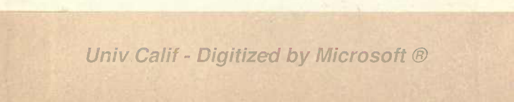
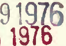
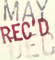
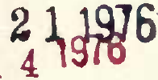
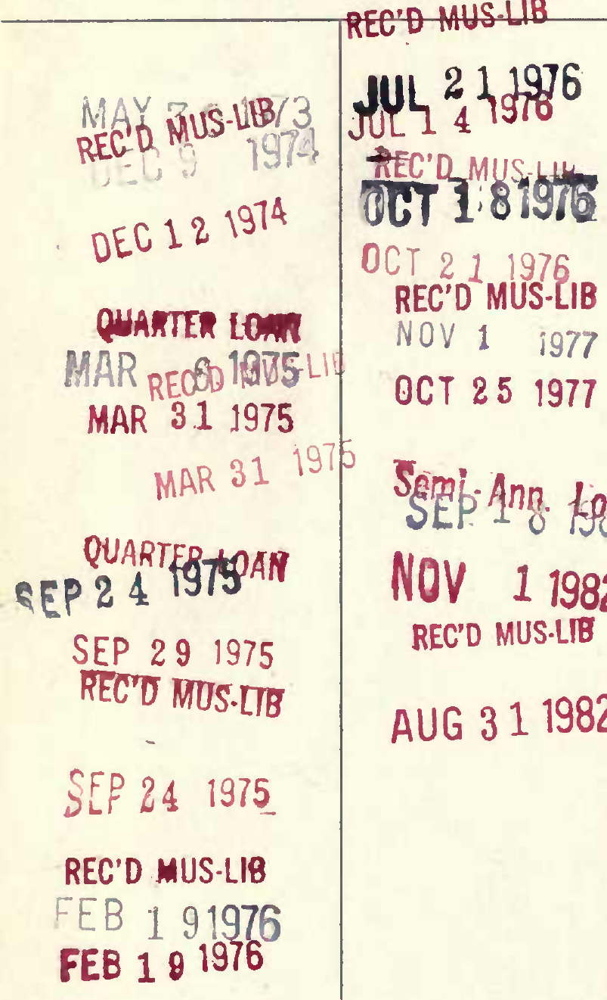
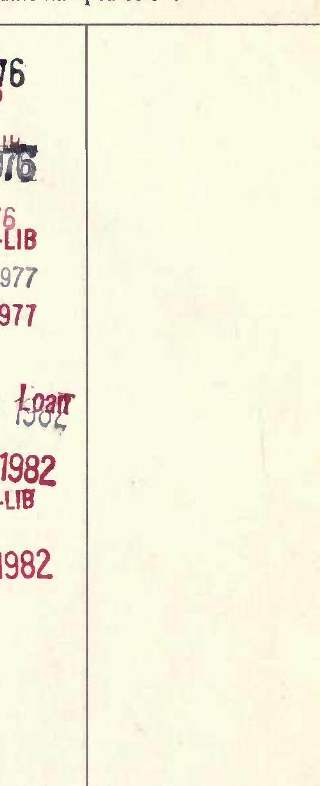
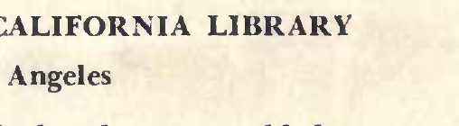
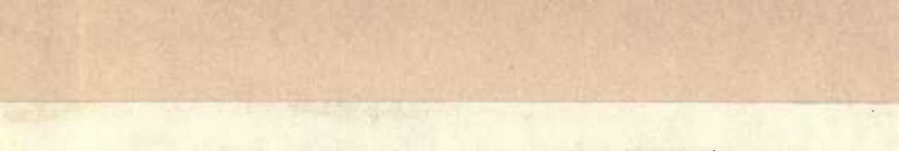

# Univ Calif - Digitized by Microsoft ®

UNIVERSITY OF CALIFORNIA LIBRARY Los Angeles This book is DUE on the last date stamped below. REC'D MUS-UB I

OCT 21 REC'D MUS'LIB 1 NOV 1 J977 OCT 25 1977 MAR 31 1975 IWR

NOV 11982 SEP 29 1975 REC'D MUS-L1B AUG 3 1 1982 4 1975

REC'D MUS-LW FEB 1 FEB 1 9 Form L9-Series 4939

UC SOUTHERN REGIONAL LIBRARY FACILITY i mil mil linn 111 mil ill! 111 MUSIC LI3RARY A 000754194 9 ML

C2?9v
